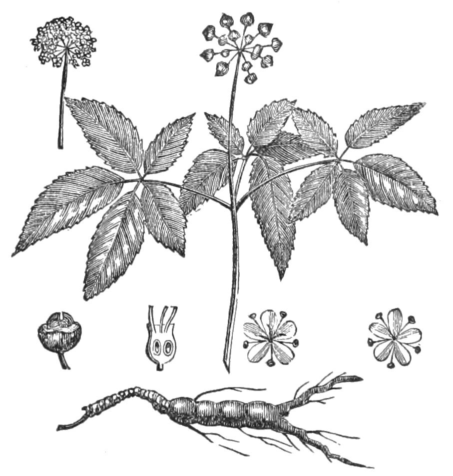

"Wild" on a ginseng label is doing the same job "ancient" does on an adaptogen label. It is selling you a scarcity story and hoping you will hear a potency story.

This draft does not treat, cure, or prevent any disease. It is not medical advice. It is a sketch of a political economy in which a root became too valuable to remain common.

<figure class="blog-figure">
  
  <figcaption><strong>Figure.</strong> Wild ginseng scarcity is older than the adaptogen aisle — a popular-science engraving when the root was already a trade object. <em>Popular Science Monthly</em> (1891), public domain, via Wikimedia Commons.</figcaption>
</figure>

Wild *Panax ginseng* in the Chinese and Korean mountain imagination is not a lifestyle product. It is a hunted object: slow, picky about shade, morphologically suggestive, historically tangled up with tribute and with bans. I am speaking at the level of a general historical picture, not as a field botanist who can take you to a slope. The picture is consistent enough across secondary accounts to say this: **rarity was noticed, priced, and policed.**

Tribute is the sharpest version. A court that wants wild roots is a court that can make a forest into a tax. Hunters, middlemen, counterfeits, and exhausted stands follow. You do not need a pharmacology paper to understand that sequence. You need a sense of how luxury works. Pearls and fur and incense know the sequence too.

Garden ginseng — the farmed root that actually fills most modern boxes — is a different object wearing a related name. It has its own craft (years in the ground, steaming, grading by shape). It can be an honest food-and-gift crop. It cannot be the wild mountain thing, and a history that pretends otherwise is a catalog. Korean and Chinese grading systems that obsess over form are, among other things, **technologies of trust** in a market that expects fraud. Trust technologies are ethnobotany too.

American *P. quinquefolius* entered this economy as a rival export, a woods-grown and wild-harvested story of its own, with conservation consequences that U.S. and Canadian regulators still have to think about. I will not turn this paragraph into a CITES explainer I am not current on. I will say: when a plant is worth more than a day's wage, the plant's politics become more interesting than its marketing adjectives.

What does this have to do with *adaptogen*?

The Soviet program needed **kilos**. Wild *Panax* is a terrible program plant. Eleuthero is a better program plant. The wild-ginseng economy is therefore part of why the type specimen of the English adaptogen story is not the prestige root. Scarcity pushed the noun onto a shrub. That is an institutional fact, not a slight against either plant.

The aisle then tried to have it both ways: the prestige of wild ginseng and the scalability of "adaptogen blends." You will see photographs of man-shaped roots on the same page as a proprietary mix that could not possibly be built from those roots. The photograph is a relic of the tribute imagination. The mix is a factory.

A claims fence has to watch scarcity stories because they are **proxy efficacy claims**. "So rare it must be strong" is a disease claim that forgot to bring a disease. I will not honor it. Rarity tells you about human desire and ecology. It does not tell you that a farmed root is "weaker" in a clinical sense I refuse to name, and it does not tell you that a wild root is a treatment.

There is also a conservation ethics that does not need a health payoff. If a wild population is in trouble, the trouble is enough. You do not have to believe a medical story to want a plant to remain a plant on a mountain. This folder can say that without becoming a campaign, and without becoming a shop for "wood-grown alternatives" I am not selling.

When you see *wildcrafted adaptogen*, ask two questions. Wildcrafted *which* species, *which* part, *whose* land? And which noun is doing the selling — the ecology or the 1960s class? If the answer to the second is "both, nicely blended," you are looking at a caption, not a forest.

I have a personal dislike of the man-shaped root as a mascot, which I might as well admit. It makes a plant into a little homunculus, and homunculi attract sympathetic-magic talk that then gets laundered into modern indications. A root can look like a person and still only be a root. The look is part of why courts wanted it. The look is not a reason for you to want it as a medicine I will not describe.

History's job here is to keep the **price, the police, the garden, and the photograph** in separate folders. The Soviet noun can sit in a fifth. When they are allowed to merge, you get a fairy tale about ancient wild adaptogens. Fairy tales are for children. Labels are for statutes. This page is for the unmerged file.

## Claims box

- Political economy of rarity and farming, not a potency ranking.
- This draft does not treat, cure, or prevent any disease.
- "Wild" is a scarcity story; it is not a disease claim we will finish for the seller.
- Not medical advice. Not a permission slip for wild harvest.
