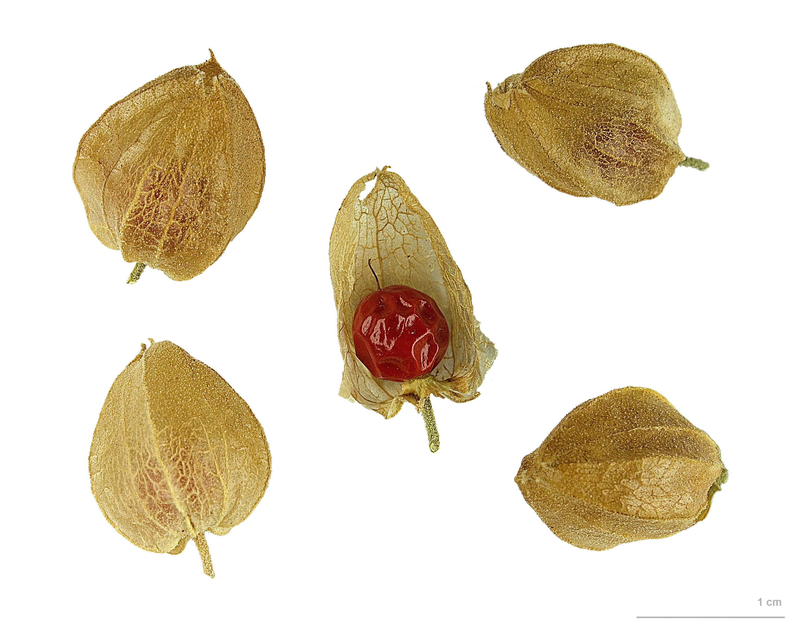

This is the draft the rest of the South Asian file depends on. If you let it fail, ashwagandha, tulsi, and shilajit will all fall into the same drawer by dinner.

*Rasayana* is a Sanskrit term of art inside Ayurvedic literature: a shelf, a set of procedures, a vocabulary about *rasa* and rejuvenation language that has its own arguments, its own contraindications in that system, its own relationship to *dinacharya* and to physicians who trained in a lineage. *Adaptogen* is a mid-century Soviet functional wager that later went shopping. They are not a translation pair. Treating them as one is the most common **category crime** in English-language herb writing.

This draft does not treat, cure, or prevent any disease. It is not medical advice. It is a refusal to let a glossary do violence.

<figure class="blog-figure">
  
  <figcaption><strong>Figure.</strong> Rasayana literature and modern ashwagandha marketing are different filing systems — herbarium specimen for botanical context only. Ercé / Muséum de Toulouse, Wikimedia Commons (CC BY-SA 3.0).</figcaption>
</figure>

Why do people pair them? Because both sound like "long-game nourishment rather than a single-symptom attack." That resemblance is real as a *mood*. Moods are not equivalences. A mood can pair *rasayana* with Chinese *shang pin* superior herbs, too, and with a grandmother's tonic wine. If we merged every mood-neighbor, we would have one word for half of human material culture.

Ayurveda has other shelves. A plant can be *rasayana* in one context and something else in another. It can be food. It can be a formula ingredient with a *rasa*, *virya*, *vipaka* that do not survive a capsule. It can be contraindicated for a person the system would describe as already too *ushna* or too *ama*-laden — I am using those words lightly, as flags that a system has **internal brakes**, not as a diagnosis I am offering. A Soviet definition whose first clause is "almost non-toxic" and whose third is "normalizing" does not have the same brakes. It has a hope.

There is a postcolonial flavor to the pairing that I will not overplay but will not skip. After English-language reviews made *adaptogen* sound like an internationally scientific class, it became tempting to say that Ayurveda had "had adaptogens all along." The sentence looks like respect. It is also a way of saying that a knowledge system becomes real when it matches a Russian-English review article. Rasayana literature was real before 1969. It does not need a stamp.

The opposite sentence — "rasayana is unscientific, adaptogen is scientific" — is just the crime in a lab coat. A functional class that the EMA would not accept as an authorisation term is not a throne from which to judge the *Charaka Samhita*.

How to write instead:

- "Ashwagandha appears in rasayana talk in Ayurvedic sources" — a historical sentence.
- "Later Western writers filed ashwagandha under adaptogen" — a later historical sentence.
- "Therefore ashwagandha is an adaptogen, therefore it manages stress, therefore it is relevant to your diagnosable condition" — a slide this folder cuts.

The slide is the thing. Translation is where the fence usually breaks, because translation feels like a service. I am arguing for **friction**. Leave the Sanskrit in the sentence long enough that the shopper has to ask what it means. If they ask, they might find a practitioner of that system instead of a blend.

I am not a vaidya. This draft will not teach you rasayana procedures. Procedures include time, diet, purification talk, and a person. A capsule that says RASAYANA ADAPTOGEN on the same line has skipped the person and kept the prestige.

There is a practical test. Take a sentence and swap the words. "Brekhman developed a rasayana concept in Vladivostok." The sentence should sound wrong. If "Sushruta listed adaptogens" does not sound equally wrong, your ear has been trained by the aisle.

I will use *rasayana* in the next drafts as a **system tag**, the way I use *bu qi* and *bencao*. I will use *adaptogen* as a Soviet-and-after tag. If both tags appear on one plant, that is a fact about later writers, not a fact about a unity of knowledge.

If this seems severe, good. Severity is for the place everyone else is casual. Casual translation is how disease claims get imported without anyone typing *cure*. A rasayana text that talks about aging language is talking in its own cosmology. Aging language in a U.S. supplement ad is a structure/function style under a statute. Those are not the same sentence with different fonts.

Keep the fonts different. Keep the words different. The plants can survive the separation. The marketing cannot, and that is not my problem.

## Claims box

- A translation refusal, not a ranking of medical systems.
- This draft does not treat, cure, or prevent any disease.
- *Rasayana* stays a Sanskrit term of art here; it is not a synonym stamp.
- Not medical advice. Not an Ayurvedic protocol.
