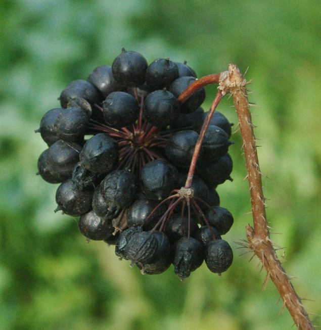
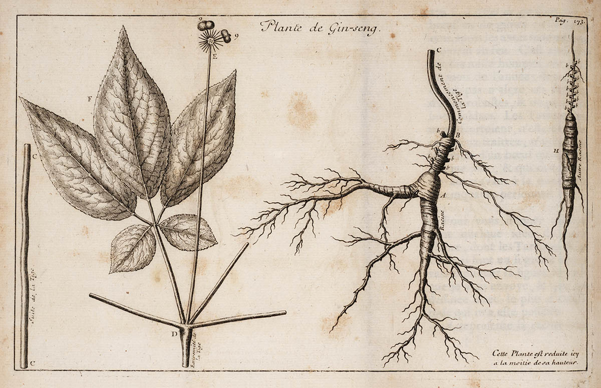
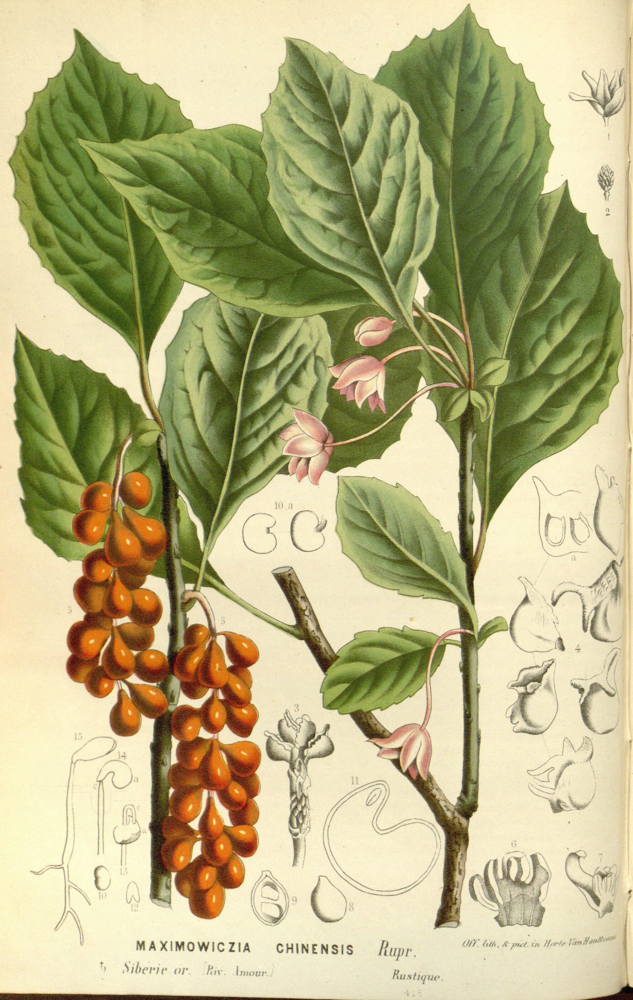

# Staged figure embeds (adaptogens pack)

Paths are relative to each draft under `stage-*/`. Each block uses captioned `<figure>` markup for SEO and accessibility.

---

## 03 — Tonic, stimulant, adaptogen

```html
<figure class="blog-figure">
  
  <figcaption><strong>Figure.</strong> Three vocabulary lanes from different medical rooms — not interchangeable synonyms. <em>Schematic; not a plant taxonomy.</em></figcaption>
</figure>
```

---

## 04 — Dating problem

```html
<figure class="blog-figure">
  
  <figcaption><strong>Figure.</strong> Anchor dates cited in secondary literature and regulator documents — not a complete chronology. <em>Schematic timeline; not to scale.</em></figcaption>
</figure>
```

---

## 11 — Eleuthero type specimen

```html
<figure class="blog-figure">
  
  <figcaption><strong>Figure.</strong> Botanical cousinhood made the Soviet metaphor easy; it is not a substitution claim in the body. <em>Redrawn schematic.</em></figcaption>
</figure>
```

```html
<figure class="blog-figure">
  
  <figcaption><strong>Figure.</strong> <em>Eleutherococcus senticosus</em> (eleuthero) — specimen photograph for botanical context only; not cultivation or dosing advice. Photo: Stanislav Doronenko, Wikimedia Commons (CC BY 2.5).</figcaption>
</figure>
```

---

## 15 — Panax in the bencao

```html
<figure class="blog-figure">
  
  <figcaption><strong>Figure.</strong> Ginseng as drawn for European readers after Jesuit botanical reporting — historical plate, not modern identification. Pierre Jartoux (1713), public domain, via Wikimedia Commons.</figcaption>
</figure>
```

```html
<figure class="blog-figure">
  
  <figcaption><strong>Figure.</strong> Ginseng in a popular-science engraving era when the root was already a trade object. <em>Popular Science Monthly</em> (1891), public domain, via Wikimedia Commons.</figcaption>
</figure>
```

---

## 19 — Schisandra

```html
<figure class="blog-figure">
  
  <figcaption><strong>Figure.</strong> <em>Schisandra</em> in a nineteenth-century horticultural plate — naming and illustration history, not a efficacy claim. Louis van Houtte, <em>Flore des serres</em>, public domain, via Wikimedia Commons.</figcaption>
</figure>
```

---

## 27 — Ashwagandha

```html
<figure class="blog-figure">
  
  <figcaption><strong>Figure.</strong> <em>Withania somnifera</em> herbarium specimen — botanical record only. Ercé / Muséum de Toulouse, Wikimedia Commons (CC BY-SA 3.0).</figcaption>
</figure>
```

---

## 34 — 2008 EMA reflection

Reuse the Soviet timeline figure with an EMA-forward caption:

```html
<figure class="blog-figure">
  
  <figcaption><strong>Figure.</strong> The 2008 HMPC reflection sits at the end of this schematic — a committee statement about marketing language, not a verdict on plants. <em>Educational timeline; not to scale.</em></figcaption>
</figure>
```
