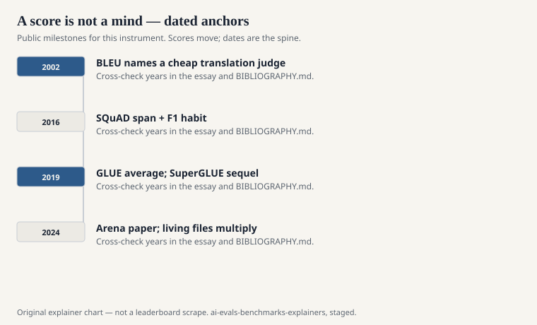
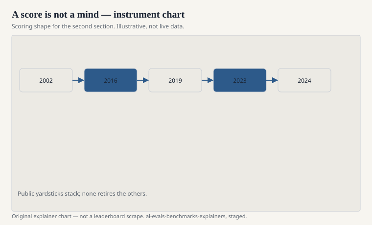

A benchmark is a file, a rule, and a rumor that the file measures something larger than itself. The file is public. The rule is usually a paper. The rumor is hallway speech: this model “is a 90,” that one “wins Arena,” a third “cracked MATH.” The rumor is where the trouble starts.

This series is a set of explainers for the public instruments the field actually uses — GLUE and SuperGLUE, MMLU and MMLU-Pro, LMSYS’s Chatbot Arena, Stanford CRFM’s HELM, BIG-bench, HumanEval, GSM8K, SWE-bench, and the rest of the yardsticks named in `INDEX.md`. It is not a ranking. Rankings rot. The instruments remain.

## What belongs here

<!-- graphics-pack:v1 -->

<figure class="eval-figure">

<figcaption>Figure 1. Dated public anchors for this piece. Years follow the essay; verify against BIBLIOGRAPHY.md before print.</figcaption>
</figure>

## How to read the pack

<!-- graphics-pack:v1 -->

<figure class="eval-figure">

<figcaption>Figure 2. Scoring shape for this instrument — protocol, not a weekly rank.</figcaption>
</figure>

## A short history of wanting a number

Before transformers had a consumer audience, evaluation was already a profession. Kishore Papineni’s group at IBM published BLEU at ACL 2002 because translation workshops needed a cheap stand-in for a bilingual judge. Chin-Yew Lin published ROUGE in 2004 because summarization workshops needed the same bargain. ImageNet (Deng et al., CVPR 2009) and the ILSVRC contests taught computer vision that a yearly error rate could move a field. SQuAD (Rajpurkar et al., EMNLP 2016) taught question answering that a span and an F1 could do the same for English paragraphs.

GLUE inherited that habit and applied it to “general language understanding,” which was already a promotional phrase. SuperGLUE (Wang et al., NeurIPS 2019) arrived when the first average had been climbed. Then the models got large enough that a nine-task English suite felt like a spelling test. The 2020s answered with volume (MMLU), with difficulty theater (GPQA, FrontierMath, Humanity’s Last Exam), with human preference (Arena, MT-Bench, AlpacaEval), and with work that looks like a job (SWE-bench, GAIA, WebArena). None of those answers cancelled the others. They stacked.

## What a number is allowed to mean

A published score is allowed to mean: on this file, under this prompt template, with this decoding, the model produced strings that matched this key at this rate. That sentence is already long. The press version is shorter, and worse.

A number is not allowed to mean that the model understands, that it is safe, that it will behave on your ticket queue, or that last week’s ranking is a scientific constant. HELM’s authors said the quiet part in the open: accuracy is one metric among several, and models had not even been run on the same scenarios. Chiang’s Arena paper said another quiet part: people will tell you which reply they prefer, and preference is not a theorem.

## Two collisions worth naming early

The field reused the word ARC. Peter Clark and colleagues at the Allen Institute published the AI2 Reasoning Challenge in 2018: grade-school science questions, Easy and Challenge sets. François Chollet published “On the Measure of Intelligence” in 2019 and, with it, the Abstraction and Reasoning Corpus — later discussed as ARC-AGI. They do not share items, authors, or a theory of intelligence. If a slide says “ARC” without a citation, ask which one.

The field also reused the feeling of ImageNet. A large public set, a contest, a cliff in an error rate, a press cycle. Fei-Fei Li’s group built a vision yardstick. Later language leaderboards borrowed the social form and not the photographs. That borrowing is part of the story. It is not an accusation. It is a habit.

## How this series fails if it is careless

It fails if it invents a paper title. It fails if it prints a live Elo as if it were a physical constant. It fails if it treats LMSYS, LMArena, and “the chatbot site” as three unrelated civilizations, or as one noun that never changed. It fails if it dumps a private architecture into a public explainer and calls the dump context.

It succeeds if a reader can finish the GLUE piece and know what CoLA and MNLI are for; finish the Arena piece and know why a pairwise vote is not an exam; finish the HELM piece and know why a single average was the thing the authors refused.

The file is public. The rule is a paper. The rumor is optional. Start with [What a benchmark is, and what it pretends](what-a-benchmark-is.md).
