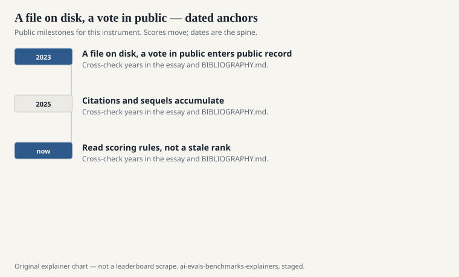
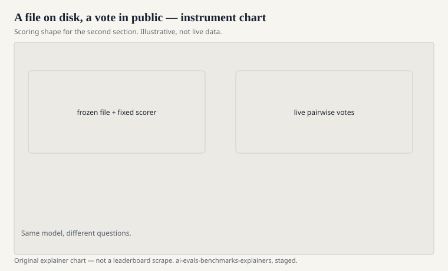

There are two kinds of public hardship, and they do not settle the same bet.

One kind is a file. GLUE, MMLU, HumanEval, GSM8K: a list of items and a key. You can download it, hash it, argue about item 412, and run it next year on a machine that does not exist yet. The file does not care who you are.

The other kind is a room. Chatbot Arena, as Chiang, Zheng, Sheng, Angelopoulos, and colleagues described it at ICML 2024, is a pairwise vote. A person types a prompt. Two unnamed models answer. The person picks a winner, or a tie, or walks away. The prompts are whatever the public brought today. The leaderboard is a statistical summary of those fights.

Calling one of these “real evaluation” and the other “fake” is a category error. A file measures agreement with a key. A room measures preference under a sampling process you do not control. Both are public. Both can be gamed. They fail in different weather.

## What a file is good for

<!-- graphics-pack:v1 -->

<figure class="eval-figure">

<figcaption>Figure 1. Dated public anchors for this piece. Years follow the essay; verify against BIBLIOGRAPHY.md before print.</figcaption>
</figure>

## What a room is good for

<!-- graphics-pack:v1 -->

<figure class="eval-figure">

<figcaption>Figure 2. Scoring shape for this instrument — protocol, not a weekly rank.</figcaption>
</figure>

## Judges that are not people

Between the file and the room sits a third object: a model scoring another model. AlpacaEval (from the Alpaca/AlpacaFarm line at Stanford and collaborators) and MT-Bench both lean on this. It is cheap. It correlates, sometimes, with human preference. It also inherits the judge’s taste and the judge’s blindness. If the judge likes lists, lists rise. If the judge is the cousin of the candidate, the family resemblance is not a secret.

LiveBench tried to refuse both the stale file and the chatty judge: new items, automatic keys. That is a fourth object — a file that pretends to be a room by moving. It is a good pretense. It still needs a key.

## How to use both without lying

Use a file when you need a reproducible claim: this checkpoint, this template, this split, this scorer. Use a room when you need to know what people pick when the prompt is not your homework. Use a model judge when you can afford the bias and cannot afford the humans. Do not average them into a super-score and call the average “intelligence.”

The field’s better papers already know this. HELM refused the single number. Arena’s authors called their object preference. MMLU’s authors called theirs multitask understanding and then used multiple choice. The lie begins when a slide erases those nouns.

A file on disk will still be there when the voters go home. A vote in public will still tell you something a file cannot. Keep both. Name which one you are holding.
