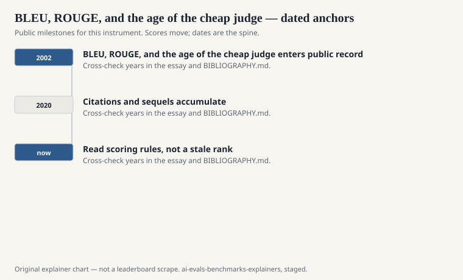
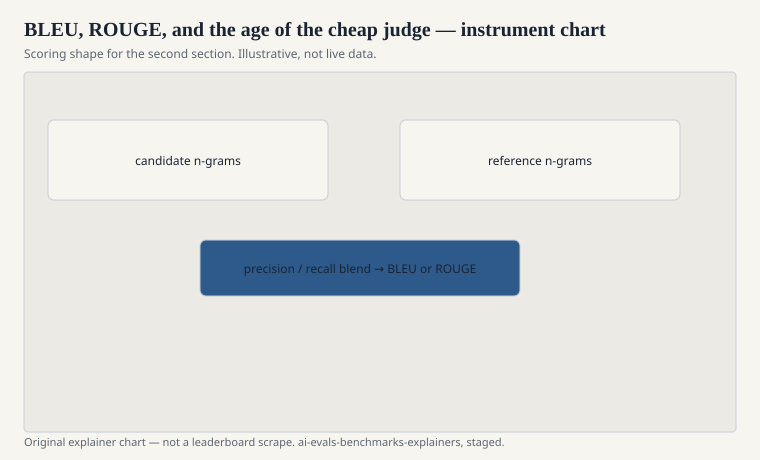

Before there were chat leaderboards, there was a workshop deadline and a shortage of bilinguals. Machine translation and summarization needed a number that could be computed at 2 a.m. without waking a human. The number they got — BLEU, then ROUGE — taught the next twenty years of evaluation how to feel finished.

This is not a history of all automatic metrics. It is a tour of the bargain: replace a judge with an overlap, then spend a generation explaining what the overlap missed.

## BLEU, 2002

<!-- graphics-pack:v1 -->

<figure class="eval-figure">

<figcaption>Figure 1. Dated public anchors for this piece. Years follow the essay; verify against BIBLIOGRAPHY.md before print.</figcaption>
</figure>

## ROUGE, 2004

<!-- graphics-pack:v1 -->

<figure class="eval-figure">

<figcaption>Figure 2. Scoring shape for this instrument — protocol, not a weekly rank.</figcaption>
</figure>

## The overlap era’s other furniture

Exact match and token F1 on extractive question answering (SQuAD, Rajpurkar et al., EMNLP 2016) are cousins: they also compare strings to a key. They are honest about it. A span is right or it is not, up to punctuation and articles. The honesty is why SQuAD could die of success. When models hit human-ish F1, the instrument had little left to say.

Word error rate in speech, top-1 and top-5 error on ImageNet, and parse-eval in the old CoNLL shared tasks belong to the same civilization: a public key, a cheap scorer, a table that can be reprinted. They are not BLEU. They share BLEU’s social form.

## BERTScore and the hope that meaning would show up

Tianyi Zhang, Varsha Kishore, Felix Wu, Kilian Weinberger, and Yoav Artzi published BERTScore (ICLR 2020; preprint 2019). Instead of matching n-grams, they match contextual embeddings from a BERT-like model and compute a greedy similarity. The hope was obvious: a paraphrase should finally get credit.

Sometimes it does. BERTScore and its neighbors (MoverScore, BLEURT, COMET on the translation side) are better at the cases that made BLEU look silly. They also import a new judge: the embedding model. If that model is biased, or simply English-centric, the “meaning” score is a vote from a particular network. You have not removed the cheap judge. You have hired a different one, and it does not send invoices in n-grams.

## Why this still matters after chat

People who only read 2024 model cards can treat BLEU as ancestor worship. It is not. Plenty of systems still report it because a customer or a shared task still asks. The cheap-judge bargain never left. `pass@k` is a cheap judge for code. An LLM-as-a-judge is a cheap judge for chat. A fail-to-pass pytest is a cheap judge for GitHub issues — a better one, because the key is executable, but still a key.

The lesson from 2002 is not “n-grams were stupid.” The lesson is that a metric becomes a culture, and a culture will optimize what you print. Papineni’s group asked for a stand-in. They got a stand-in. The stand-in then stood in for understanding for a little too long.

When a modern explainer in this series says “accuracy,” “Elo,” or “resolved issues,” keep BLEU in the room. Ask what the cheap judge cannot see. Ask who would have to be woken at 2 a.m. if you refused the stand-in. Sometimes you should refuse it. Sometimes you should keep it and stop calling it a mind.
