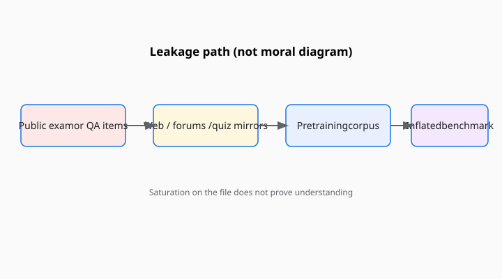

The oldest way to ace a test is to have read the test. Language models made that joke expensive. The training set is a library the size of a crawl. The benchmark is a pamphlet that was, at some point, on the internet. If the pamphlet was popular — and a successful benchmark is popular by design — the library may already contain it.

<!-- figure-pack -->
<figure>
  
  <figcaption><strong>Contamination path (conceptual).</strong> Public items can reappear in crawls and forums; high benchmark accuracy then measures familiarity as much as skill—why suites like MMLU-Pro and LiveBench exist.</figcaption>
</figure>

Contamination is the name the 2020s settled on. Leakage is the older word from machine-learning hygiene: test items in the training split. They are cousins. The new problem is that nobody can produce a full, inspectable training set for the models people actually argue about.

## How a pamphlet gets into a library

A dataset ships on GitHub or Hugging Face. A paper quotes items. A blog copies the quotes. A student posts a homework write-up. A model card reports a score, and a journalist reprints three examples. Years later a crawler takes the lot. None of those steps is theft in the movie sense. Each is ordinary science communication. Together they can turn a held-out split into a memorization exam.

There is a second path that is not a crawl. Fine-tuning and “eval-aware” training. A group wants a number on MMLU or GSM8K. They train on lookalike items, or on the development set, or on a reconstruction of the test set from public copies. The paper may or may not say so. The number still prints.

## What the papers actually did

The careful public work is about detection and about moving targets, not about a courtroom.

Researchers have published n-gram overlap checks, membership-inference style probes, and “can the model reproduce the item verbatim” tests. Those methods disagree. A model can have seen an item and still fail it. A model can miss every n-gram and still have seen a paraphrase. The honest report is a range and a method, not a purity badge.

LiveBench (White, Dooley, Roberts, Pal, and colleagues; arXiv June 2024, ICLR 2025) tried to change the pamphlet. New items drawn from recent contests, papers, and news; automatic scoring against a key; a monthly refresh. The title on arXiv is the tell: “Contamination-Limited,” not “Contamination-Impossible.” The later ICLR PDF keeps that honesty.

Humanity’s Last Exam and FrontierMath keep many items off the public web on purpose. That is a contamination strategy. It is also a reproducibility tax. A second lab cannot casually re-score a hidden set without a relationship. The papers should be read as making that trade in the open.

SWE-bench has a different leak surface. The issues came from public GitHub. A model trained on a 2024 code crawl may have seen the pull request that is supposed to be the answer. Later variants (including the publicly discussed SWE-bench Verified subset) are attempts to make the hardship cleaner, not proof that the original file was dishonest.

## Saturation is the other death

Contamination is not the only way a yardstick dies. The other way is that the models get good at the actual task. GLUE’s average climbed until SuperGLUE was necessary. SQuAD’s span F1 stopped embarrassing anyone who had a big encoder. MMLU’s four-choice format began to look like a format the models had practiced. Yubo Wang’s MMLU-Pro group (NeurIPS 2024) answered by throwing out noisy items, adding reasoning-heavy questions, and expanding the choice set from four to ten. That is an anti-saturation move. It is only accidentally an anti-contamination move.

If you cannot tell whether a high score is leakage, saturation, or competence, the number is not information. It is furniture.

## What a reader can ask

When a model card says “87 on MMLU,” ask:

1. Which split, which prompt, how many shots, chain-of-thought or not?
2. Did the trainers have a policy about this file, and did they publish it?
3. Is there a decontamination report, and does it name a method?
4. Is there a harder or newer sibling (MMLU-Pro, GSM8K plus a hidden set, LiveBench’s current month) that still hurts?

When a company says “we didn’t train on the test set,” ask what that sentence can possibly mean if the test set has been quoted in a hundred papers. Sometimes it means they ran an overlap filter. Sometimes it means they believe their crawl dates. Sometimes it means they would prefer the question to end.

## The ethical leftover

It is easy to sound prosecutorial. Most leakage is not a heist. It is the cost of doing evaluation in public, which is the only evaluation this series is willing to discuss. The fix is not to hide science. The fix is to treat a static popular file as a historical instrument, to refresh or hide items when the scientific claim requires it, and to stop using a saturated number as a personality.

The exam was in the library. The library is the point of the models. A yardstick that cannot survive that fact was a yardstick for a smaller world.
