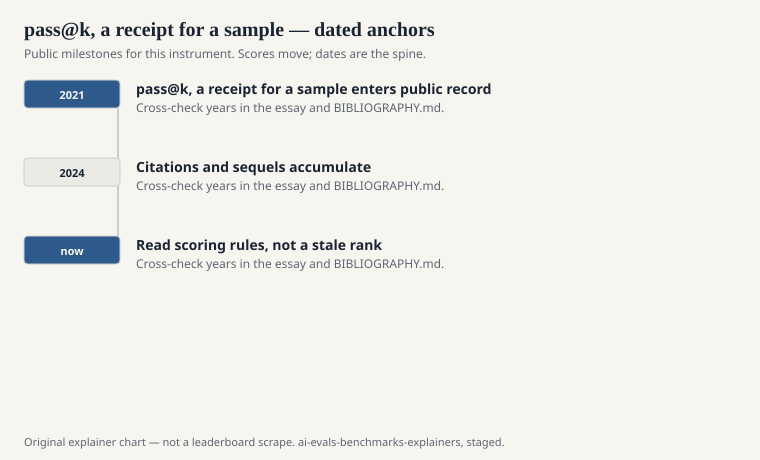
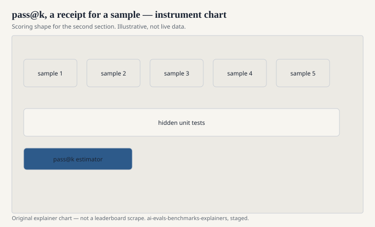

Coding benchmarks did not have to invent a new metaphysics. They inherited unit tests. A function either satisfies the hidden tests or it does not. That is already cleaner than BLEU. The mess arrived when the models became samplers.

A language model does not emit one program. It emits a distribution. Temperature, nucleus sampling, and the number of tries are part of the instrument. Mark Chen and colleagues, in the 2021 Codex paper that also introduced HumanEval, needed a way to say “how often would you get a program that passes if you were allowed k samples?” They used `pass@k`.

The metric is a receipt, not a personality. This essay is about what the receipt says, and what it hides.

## The estimator

<!-- graphics-pack:v1 -->

<figure class="eval-figure">

<figcaption>Figure 1. Dated public anchors for this piece. Years follow the essay; verify against BIBLIOGRAPHY.md before print.</figcaption>
</figure>

## Why code got a cleaner cheap judge

<!-- graphics-pack:v1 -->

<figure class="eval-figure">

<figcaption>Figure 2. Scoring shape for this instrument — protocol, not a weekly rank.</figcaption>
</figure>

## The compute leftover

`pass@k` makes compute part of the score. A weaker sampler with a hundred tries can beat a stronger sampler with one. That is not a scandal if you name k. It becomes a scandal when a plot implies a single “coding ability” axis. LiveCodeBench (Jain et al., 2024) and later contest-style suites exist partly because HumanEval’s 164 items, and the `pass@k` culture around them, were no longer hurting the models that had seen too many docstrings.

There is a second leftover: contamination of the tests themselves. If the hidden tests leaked into training, `pass@1` is memorization with a green bar. If the problem text leaked but the tests did not, you get a model that writes the textbook solution and still fails an off-by-one the hidden tests catch. Both happen. Neither is visible in a lone percentage.

## How to read a coding number

Ask:

1. Which file? HumanEval, HumanEval+, MBPP, DS-1000, LiveCodeBench, SWE-bench, a private fork?
2. Which k, which n, which temperature, greedy or not?
3. Does “pass” mean hidden unit tests, a pytest from a PR, or a model judge staring at code?
4. Was the model allowed tools, search, execution, or multiple files?

If the card cannot answer those, you do not have a coding eval. You have a vibe.

The receipt is still worth keeping. Execution is a better cheap judge than n-gram overlap. The field should not apologize for wanting a green test. It should apologize for saying the green test is a colleague.

HumanEval’s docstring is a small room. SWE-bench’s issue tracker is a larger one. `pass@k` will follow the models into both rooms if you let it. Let it. Then write down k.
