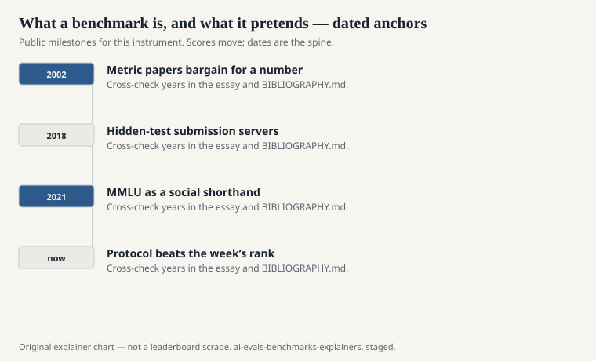
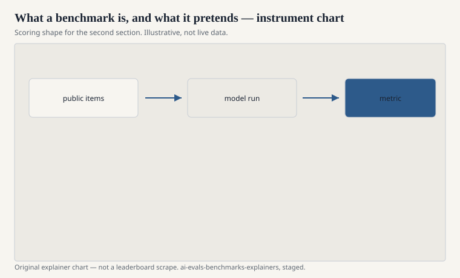

A benchmark, in the sense this series uses the word, is a public agreement to be compared on a shared hardship. Someone publishes items. Someone publishes a scoring rule. Other people run models and report a number. The hardship is the point. If the items are easy, the agreement dies of saturation. If the rule is vague, the agreement dies of argument. If the items never leave one lab, the agreement was never public.

That is already more than a dataset. A dataset can sit on a disk. A benchmark is a dataset plus a social life: a paper, a leaderboard or a table in a paper, a habit of citing the number in a model card, and a later literature that explains why the number lied.

## The parts

<!-- graphics-pack:v1 -->

<figure class="eval-figure">

<figcaption>Figure 1. Dated public anchors for this piece. Years follow the essay; verify against BIBLIOGRAPHY.md before print.</figcaption>
</figure>

## What it pretends

<!-- graphics-pack:v1 -->

<figure class="eval-figure">

<figcaption>Figure 2. Scoring shape for this instrument — protocol, not a weekly rank.</figcaption>
</figure>

## Who gets to publish one

In the 2010s the typical authors were academic NLP or vision groups with a shared task tradition: SemEval, CoNLL, ILSVRC, the GLUE site at NYU. In the 2020s the authors diversified. University labs still publish (Princeton’s SWE-bench; Stanford’s HELM; Waterloo’s MMLU-Pro). Industry labs publish (OpenAI’s HumanEval, GSM8K, SimpleQA; Google’s MBPP). Collectives publish (BIG-bench’s hundreds of contributors; LMSYS’s Arena). Safety institutes publish (Center for AI Safety’s work on Humanity’s Last Exam, with Scale AI). Epoch AI publishes FrontierMath.

The institutional mix matters because incentives mix. A company that sells a model also publishes an eval that its model can sit on. That is not automatically fraud. It is a conflict that the paper should make easy to see. OpenAI’s SimpleQA paper is a factuality test collected against GPT-4; that fact belongs in the explainer, not in a footnote of suspicion. Scale AI’s name on Humanity’s Last Exam belongs in the byline, because it is in the byline.

## Static files and live rooms

A frozen file is easy to cite and easy to spoil. A live room — Arena, LiveBench’s monthly refresh, a hidden test split that never ships — is harder to spoil and harder to reproduce. The field now runs both, and then argues about which one is “real.” The argument is misplaced. They answer different questions. A file asks: did this system, on this date, match this key? A room asks: what do people (or this month’s fresh items) do with the system now? See [A file on disk, a vote in public](arena-versus-static.md).

## How to tell a yardstick from a costume

A yardstick publishes items or a reproducible generator, a scoring rule a second lab can implement, and enough protocol that a disagreement can be localized. A costume publishes a name, a vibe, and a number that cannot be re-run.

Some public evals sit between those poles. Chatbot Arena publishes votes and a statistical story; it does not publish tomorrow’s user prompts in advance. FrontierMath publishes a paper and a difficulty argument; many items stay private so they are not immediately trained on. Both can still be public science. Privacy of items is a method, not a sin — if the protocol is public and the holdout is not a marketing department.

## The sentence that should survive

If you remember one sentence from this piece, remember this: a benchmark is a hardship people agreed to share, plus a rule for saying who suffered less. It is not a mind, a product, or a moral grade. The explainers that follow are tours of particular hardships. They are not endorsements of the rumors that grew on them.
