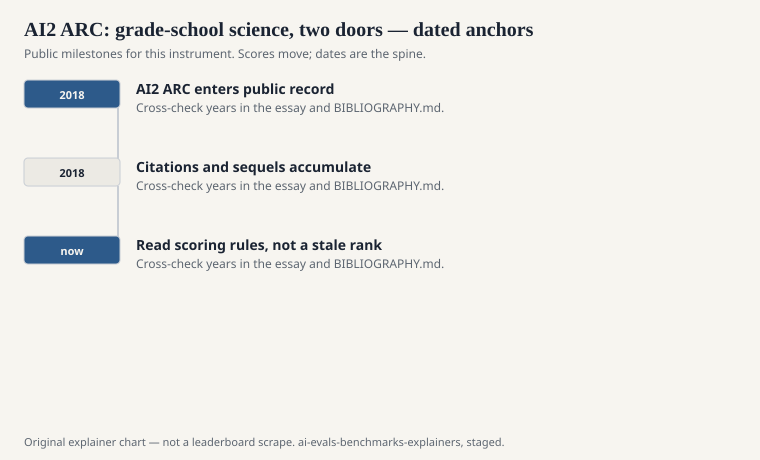
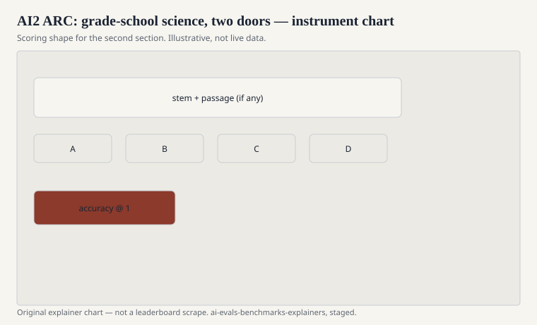

Peter Clark, Isaac Cowhey, Oren Etzioni, Tushar Khot, Ashish Sabharwal, Carissa Schoenick, and Oyvind Tafjord published “Think you have Solved Question Answering? Try ARC, the AI2 Reasoning Challenge” in 2018 (arXiv:1803.05457). Allen Institute for AI. The questions are grade-school standardized science: multiple choice, the sort of item that asks why a shadow is longer at a certain hour, or what a plant gets from a dark closet.

The paper’s taunt is in the title. SQuAD-style pointing had started to look solved. ARC asked for questions that need you to combine facts, not just highlight a span.

## Easy and Challenge

<!-- graphics-pack:v1 -->

<figure class="eval-figure">

<figcaption>Figure 1. Dated public anchors for this piece. Years follow the essay; verify against BIBLIOGRAPHY.md before print.</figcaption>
</figure>

## What “reasoning” meant in 2018

<!-- graphics-pack:v1 -->

<figure class="eval-figure">

<figcaption>Figure 2. Scoring shape for this instrument — protocol, not a weekly rank.</figcaption>
</figure>

## An item in the hand

A Challenge item might ask what happens to the water level when a boat in a pool throws a rock overboard, or why a metal spoon feels colder than a wooden one in the same room. The facts are grade-school. The distractors are written for a child who almost remembers. A 2018 retrieval baseline would fetch a sentence that shares nouns and still pick the wrong letter. A 2024 chatbot will often pick the right one and still be unable to run a lab.

The Easy set includes items a lexical overlap system could already do. Mixing Easy into a “Challenge” number is a way to look taller. Harnesses have done it by accident. Check the config.

Clark’s taunt — try ARC if you think QA is solved — was aimed at span extractors. It landed. It should not be recycled as a 2026 reasoning claim. The file did its job. The job was 2018 science questions, not a theory of mind.

## Why it stayed in the open tables

EleutherAI’s evaluation harness, Hugging Face leaderboards, and a thousand model cards needed a short science noun. ARC was public, multiple-choice, and already split into a hard door. It sat beside HellaSwag, MMLU, and WinoGrande as default furniture.

Furniture still measures something: can you pass a particular flavor of U.S. grade-school science item? That is not nothing. It is also not a reasoning research program by itself. Clark’s title was a taunt at span-QA. It was not a claim that the Challenge set would remain a wall after a decade of pretraining.

## How to read an AI2 ARC line

Ask Easy versus Challenge, the number of shots, and whether the retrieval corpus was allowed (historical) or the model was closed-book (modern default). If the card says only “ARC,” look at the harness source. If the card is sitting next to “ARC-AGI,” you are in a slide that needed an editor.

Grade-school science, two doors, a 2018 taunt at pointing. Keep the institute in the name when you can: AI2 ARC. The other ARC will thank you.

A common mis-citation is a 2026 “reasoning” plot that uses ARC-Challenge as the only science point. Pair it with GPQA or a later exam if you want graduate hardship. Leave the grade-school door labeled as grade-school.
