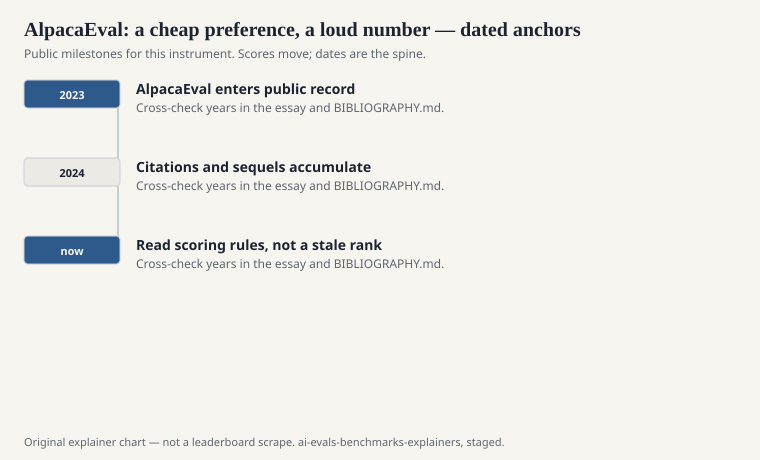
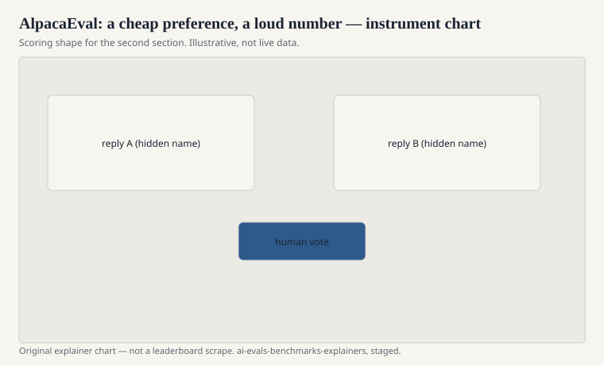

Stanford’s Alpaca project (Rohan Taori, Ishaan Gulrajani, Tianyi Zhang, Yann Dubois, Xuechen Li, Carlos Guestrin, Percy Liang, Tatsunori Hashimoto, and collaborators) started as a recipe for instruction-following from a relatively small model. The evaluation habit that escaped the recipe is AlpacaEval: a set of instructions, a baseline model’s replies, a judge model that picks a winner, and a win rate that looks like a percentage of truth.

Yann Dubois and colleagues documented the evaluator in public technical reports and in the AlpacaFarm line (instruction-following evaluation as a preference problem). AlpacaEval 2.0 later added length control because the first version had a known vice: the longer reply was winning.

## What it actually scores

<!-- graphics-pack:v1 -->

<figure class="eval-figure">

<figcaption>Figure 1. Dated public anchors for this piece. Years follow the essay; verify against BIBLIOGRAPHY.md before print.</figcaption>
</figure>

## Length, the scandal that was a finding

<!-- graphics-pack:v1 -->

<figure class="eval-figure">

<figcaption>Figure 2. Scoring shape for this instrument — protocol, not a weekly rank.</figcaption>
</figure>

## An item in the hand

An instruction from the file: write a polite email, or explain a concept, or rewrite a paragraph in a tone. There is no hidden unit test. There is a baseline reply, already written by a strong chat model of that year, and a judge that sees both. The judge picks. Your win rate is how often it picks you.

That is closer to a bake-off than to an exam. Bake-offs are real. They are also how a house style becomes a “quality” number. If the judge loves a greeting and a sign-off, greetings rise. Length control was the authors admitting that the bake-off had a thumb on the scale.

AlpacaFarm, the related paper, treats instruction-following as a preference optimization problem. AlpacaEval is the cheap leaderboard that escaped the paper. Do not cite Farm if you only ran Eval. Do not cite Eval if you only trained Alpaca the model.

## How it should be used

As a cheap regression on instruction-following style, with the judge and the version named, next to a file that checks facts (SimpleQA, a dated MMLU protocol) and next to a room if you can afford one. As a headline “#1,” it is a costume.

The Alpaca name also causes a citation mess. Alpaca the model, AlpacaFarm the paper, AlpacaEval the win rate. Say Eval. Say the version. Do not say “we beat Alpaca” if you mean you beat a baseline in a judge’s eyes.

## How to read an AlpacaEval line

Judge, version (1 vs 2 / length-controlled), baseline identity, number of instructions, and whether the card also reports a human or Arena number. If those are missing, you have a loud percentage. Loud is not the same as sourced.

A cheap preference is still data. It is data about a judge and a file. Keep the judge in the sentence. Dubois’s group eventually did. The cards should catch up.

A common mis-citation is to treat a length-controlled 2.0 win rate as continuous with an uncontrolled 1.x number. They are sequels. Plot them as sequels or do not plot them together.
