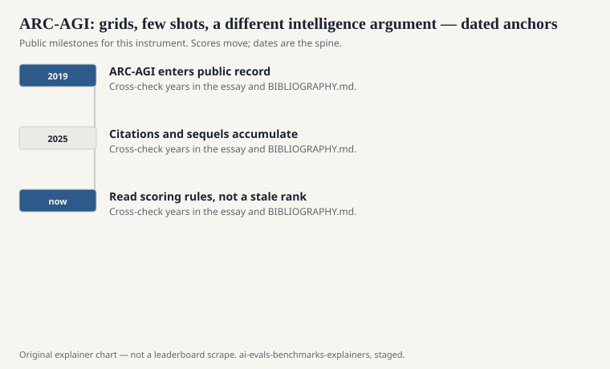
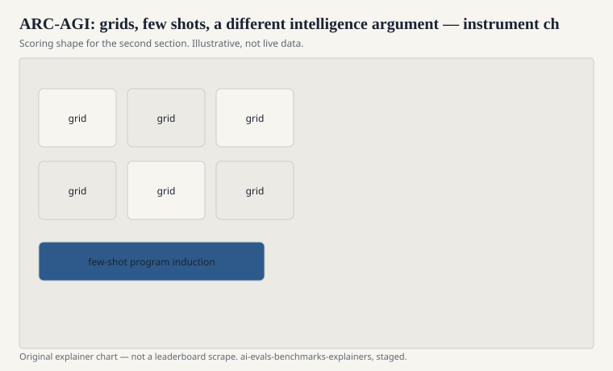

François Chollet published “On the Measure of Intelligence” in 2019 (arXiv:1911.01547). In that paper he introduced the Abstraction and Reasoning Corpus: small colored grids, a handful of input–output examples, a new input, and a demand that you paint the output grid. Later public materials, and a contest culture that grew around the file, call the instrument ARC-AGI. It is not the Allen Institute’s science quiz. If you only remember one collision in this series, remember this one. See [AI2 ARC](ai2-arc.md).

## What an item is

<!-- graphics-pack:v1 -->

<figure class="eval-figure">

<figcaption>Figure 1. Dated public anchors for this piece. Years follow the essay; verify against BIBLIOGRAPHY.md before print.</figcaption>
</figure>

A puzzle. Three, maybe four, pairs of grids that demonstrate a transformation: rotate, count, fill, group by color, obey a rule that is easy to see once you see it and expensive to guess from language priors. Then a test grid. The answer is a grid, not a letter. The cheap judge is exact match on cells.

Humans who like puzzles often do well after a minute of staring. The 2019–2023 programs did not. That gap is Chollet’s exhibit. He wanted a test of skill-acquisition efficiency: how little prior knowledge, how little data, how quickly a system can lock onto a novel rule. The essay around the corpus is long and argumentative. The corpus is small and visual.

## What it is not

<!-- graphics-pack:v1 -->

<figure class="eval-figure">

<figcaption>Figure 2. Scoring shape for this instrument — protocol, not a weekly rank.</figcaption>
</figure>

It is not a language exam. A chatbot can describe the rule in English and still paint the wrong pixels. It is not ImageNet. The grids are synthetic. It is not “AGI” as a product category, even though the later name invites that confusion. Chollet’s “AGI” here is a claim about measuring general skill acquisition, not a vendor milestone.

It is also not a large statistical instrument. The public training set is modest. The hidden evaluation sets (the contest’s private tests) are the ones that matter for a prize, and they are hidden for the usual reason: if you publish the test grids, people will fit them.

## A grid in the hand

Four small examples: a colored shape moves to the opposite corner, or a pattern completes, or objects are counted and the count is painted as a new grid. Then a fifth input. You paint. A person who likes puzzles often laughs and then does it. A language model that can write an essay about “abstraction” may still paint noise.

The cheap judge is pixels. There is no partial credit for a good English description of the rule. That harshness is the point. Chollet wanted a test that could not be passed by talking.

The public training grids are for practice. The hidden eval grids are for claims. A blog that reprints a “solved” training puzzle has not made a claim. A contest entry that hits the hidden set has, for that year’s rules.

## Contests and the 2024–2025 weather

Kaggle hosted an ARC challenge. Later, Chollet and collaborators ran further public contests as models got better at tool use and at program synthesis. Scores moved. The movement is real and time-stamped. This draft will not print a live percentage. A system that writes Python to transform grids is a different student from a 2019 handmade baseline. Name the year and the allowed tools.

When a lab says it “solved ARC,” ask: which split, which time limit, how many submissions per task, was a program synthesizer in the loop, and do they mean AI2’s science set by accident?

## Why language people should still care

Because it is a public argument that the usual LM yardsticks — next-token exams, preference rooms, even SWE-bench — measure accumulated prior more than they measure a quick lock onto a new rule. You can disagree with Chollet’s theory and still use the grids as a hardship that does not look like the internet.

You can also over-weight it. A system that is excellent at ARC-AGI and useless at a customer ticket is not a colleague. A system that fails ARC-AGI and writes a good patch may still be the thing you deploy. Instruments answer the questions they were built to ask.

## How to read an ARC-AGI line

Say ARC-AGI or “Chollet’s ARC.” Never say “ARC” in a table that also has AI2 items. Report exact-match on grids, the split, and the tool budget. If the number comes from a contest leaderboard, date the contest.

Small grids. Few examples. A hidden test. A 2019 essay that is still being argued. Keep the science quiz in the other file. Keep these pixels here.
