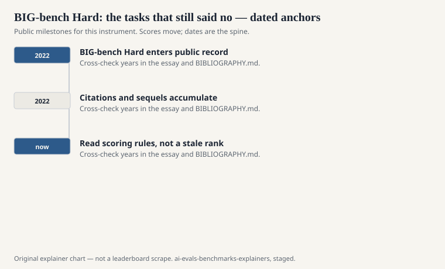
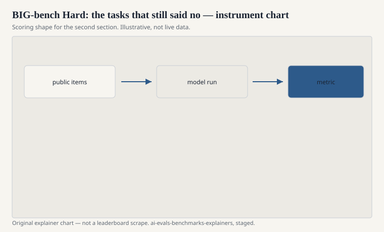

A zoo is not a hardship. A filter on a zoo can be. Mirac Suzgun, Nathan Scales, Nathanael Schärli, Sebastian Gehrmann, Yi Tay, Hyung Won Chung, Aakanksha Chowdhery, Quoc Le, Ed Chi, Denny Zhou, and Jason Wei published “Challenging BIG-Bench Tasks and Whether Chain-of-Thought Can Solve Them” in 2022 (arXiv:2210.09261; later Findings of ACL 2023). The filter is in the title: they took BIG-bench tasks that large models still failed and asked whether asking the model to think out loud would move the number.

The suite that stuck in model cards is BIG-bench Hard, BBH. Twenty-three tasks. A short enough list to run. A mean enough list to still embarrass a 2022 model that had already learned to sound general.

## How you get twenty-three

<!-- graphics-pack:v1 -->

<figure class="eval-figure">

<figcaption>Figure 1. Dated public anchors for this piece. Years follow the essay; verify against BIBLIOGRAPHY.md before print.</figcaption>
</figure>

## Chain-of-thought as the other instrument

<!-- graphics-pack:v1 -->

<figure class="eval-figure">

<figcaption>Figure 2. Scoring shape for this instrument — protocol, not a weekly rank.</figcaption>
</figure>

## A task in the twenty-three

One BBH-style task asks you to track objects through a sequence of swaps. Another wants a date that is not the first date in the sentence. Another is a formal toy that looks like a joke until you evaluate it. The original BIG-bench pages name them. This explainer will not pretend to be a task card.

What matters is the filter: these were the zoo animals that still bit in 2022. Chain-of-thought is a leash that works on some of them. On others the model writes a confident walkthrough and lands the wrong object. Publishing both numbers — with CoT and without — is the paper’s actual contribution. A card that reports one BBH integer has thrown the contribution away.

Because the list is short, a single broken harness (wrong few-shot, truncated context) can move the mean more than a real modeling idea. If your BBH number is surprising, read three items before you write a press sentence.

## Why cards love BBH

Because it is smaller than BIG-bench and harder than the lite slice. Because it has a crisp noun. Because, for a couple of years, it still ranked models. Those are engineering reasons. The scientific reason to keep it around is the filter: here is what a community zoo thought was hard, frozen at a date, plus a study of whether talk-aloud helping is real.

When a 2025 card reports BBH in the 90s, you are looking at a climbed sequel, not at a permanent law of reasoning. Compare to LiveBench’s harder refreshes, to GPQA, to a contest-style code set. Or run BBH with and without CoT and publish both. The delta is data.

## The contamination weather

BBH items, like all charming tasks, get screenshotted. They appear in blogs about “tasks models fail.” That sentence is an advertisement to a crawler. Treat a late, huge BBH score as a mixture of competence, prompting, and possible familiarity. The original paper cannot certify your 2026 crawl.

## How to cite it

Cite Suzgun et al. for the subset and the CoT study. Cite Srivastava et al. for the parent zoo. Do not say “we ran BIG-bench” if you ran BBH. Do not say “reasoning” if you mean “this particular twenty-three.” The hard slice is a good instrument with a small mouth. Let it speak only as loudly as that.
