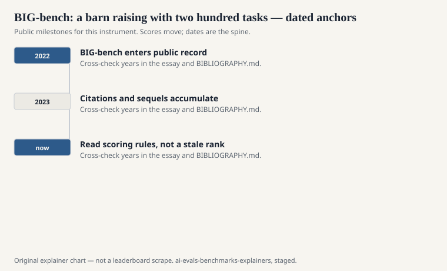
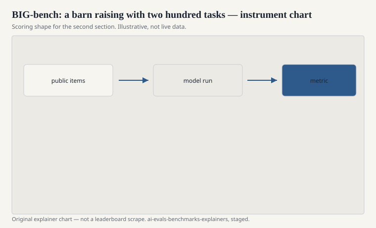

BIG-bench is what happens when a field tries to crowdsource its own exam. Aarohi Srivastava, Abhinav Rastogi, Abhishek Rao, and a very long author list published “Beyond the Imitation Game: Quantifying and Extrapolating the Capabilities of Language Models” — the paper is dated 2022 on arXiv (2206.04615) and later appeared in *Transactions on Machine Learning Research* (2023). Google organized. The community donated tasks. The acronym is a stretch that everyone immediately shortened.

The imitation game in the title is Turing’s. The “beyond” is a pile: hundreds of tasks, contributed by hundreds of people, covering problems that did not fit in GLUE’s English classification mood — arithmetic, proto-science, social reasoning, constructed languages, jokes that stop being jokes when you explain them.

## A benchmark as a conference

<!-- graphics-pack:v1 -->

<figure class="eval-figure">

<figcaption>Figure 1. Dated public anchors for this piece. Years follow the essay; verify against BIBLIOGRAPHY.md before print.</figcaption>
</figure>

## What “beyond” included

<!-- graphics-pack:v1 -->

<figure class="eval-figure">

<figcaption>Figure 2. Scoring shape for this instrument — protocol, not a weekly rank.</figcaption>
</figure>

## Scale as a character

The paper’s scientific plot is scale. They ran models of different sizes, including Google’s own, and asked which tasks suddenly yield as parameters grow. The “breakthrough” language in the surrounding discussion — capabilities that look flat and then jump — comes from this plot and from later popularizations. Treat “breakthrough” as a description of a curve, not as a metaphysics. Some tasks yield smoothly. Some stay flat. Some are too noisy to say.

Because Google organized, and because some evaluated models were Google’s, a careful reader keeps the affiliation in view. The paper is still a community object. The runs are still someone’s compute.

## The lite fork and the hard fork

A 200-task suite is a poor CI job. BIG-bench Lite exists because people needed a cheaper slice. BIG-bench Hard (Suzgun et al., 2022) exists because people needed the tasks that large models still failed. See [BIG-bench Hard](big-bench-hard.md). Those forks are how a barn raising becomes a toolkit. They are also how the original name starts to mean three instruments.

## What it taught the next suites

It taught that you can solicit evals the way you solicit workshop papers. Humanity’s Last Exam later solicited expert questions with a different editorial bar. HELM solicited a taxonomy instead of a task bazaar. Arena solicited voters. BIG-bench is the bazaar.

It also taught that a zoo is hard to cite honestly. “We evaluate on BIG-bench” is, by itself, an empty sentence. Which tasks, which scoring, which models in the original paper’s tables versus your own re-run?

## How to read it now

Use it as a map of what 2021–2022 researchers thought a language model might fail. Use BBH when you want the failures that lasted a bit longer. Do not use a single zoo-average as a mind. The imitation game was one question in a room. BIG-bench was hundreds of questions in a repository. Quantity was the method. Editorial unevenness was the price. Both should appear in the citation.
