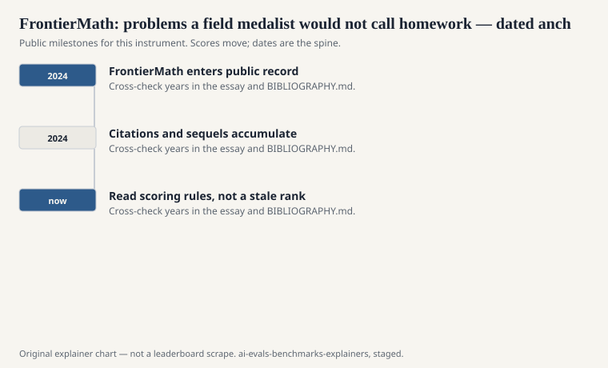
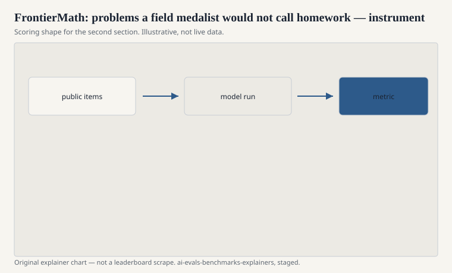

Elliot Glazer, Ege Erdil, Tamay Besiroglu, and a list of contributing mathematicians published “FrontierMath: A Benchmark for Evaluating Advanced Mathematical Reasoning in AI” in 2024 (arXiv:2411.04872). Epoch AI organized. The hardship is original problems at a level the authors argue is far above Hendrycks MATH: research-adjacent, competition-beyond, the sort of item you would not assign as overnight homework to a strong undergraduate.

The paper includes interviews with Terence Tao, Timothy Gowers, and Richard Borcherds as public comments on difficulty — and notes that Tao contributed problems. Evan Chen is a co-author. Those names are in the document. They are not decorations you should invent around the file.

## Why another math set

<!-- graphics-pack:v1 -->

<figure class="eval-figure">

<figcaption>Figure 1. Dated public anchors for this piece. Years follow the essay; verify against BIBLIOGRAPHY.md before print.</figcaption>
</figure>

## What “advanced” means here

<!-- graphics-pack:v1 -->

<figure class="eval-figure">

<figcaption>Figure 2. Scoring shape for this instrument — protocol, not a weekly rank.</figcaption>
</figure>

## An item you will not see

This explainer will not reprint a FrontierMath problem. Many are unpublished on purpose. What you can say in public is the shape: a statement a working mathematician would need a sitting to unpack; an answer that can be checked without grading a ten-page proof; a difficulty that Tao and Gowers, in the paper’s interviews, did not treat as a weekend puzzle.

That secrecy is easy to romanticize. It is also a practical anti-contamination choice, the same family as a hidden ILSVRC test or a private ARC-AGI eval. The cost is that a graduate student cannot reproduce your number from a zip file on a Sunday. Epoch’s process is part of the instrument. If you bypass it with a leaked subset, say you ran a leak.

Hendrycks MATH remains the public floor: contest algebra with a boxed answer. FrontierMath is the sealed upper floor. Do not put them in one cell and call the cell “math.”

## Tools and oracles

A model with a proof assistant, a CAS, and a week of compute is not the same student as a frozen chatbot with a scratchpad. The interesting scientific question is not whether tools help (they will) but whether the remaining failures are conceptual. Report the tool stack or you are hiding the student.

## How to read a FrontierMath line

Which version, which tier if any, tools or not, and whether the run was official (through Epoch’s process) or a public subset. Compare to MATH only as a floor. Compare to Humanity’s Last Exam only as a sibling impulse (make it hurt again), not as the same subject.

Glazer’s group and the contributing mathematicians tried to put problems on the table that the internet had not already graded. The table is partly hidden. The hiddenness is part of the score. Say so.

A common mis-citation is to treat a Fields Medalist’s quoted remark in the paper as a score. Tao’s comments are interviews about difficulty, not a leaderboard. Keep the interview in the interview seat. Keep Epoch’s access process in the methods sentence, including whether the run was official or only a public-subset cousin of the sealed packet they hold.
