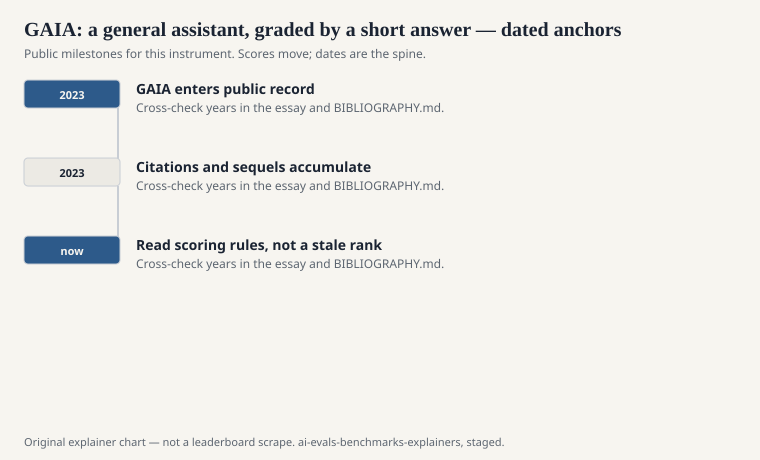
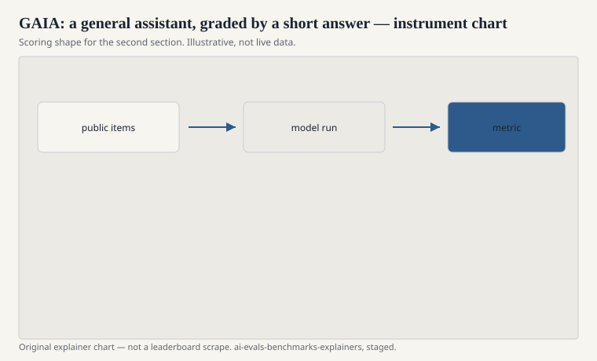

Grégoire Mialon, Clémentine Fourrier, Craig Swift, Thomas Wolf, Yann LeCun, and Thomas Scialom published “GAIA: a benchmark for General AI Assistants” in 2023 (arXiv:2311.12983). Meta, Hugging Face, and collaborators. The pitch is a set of questions that are conceptually simple for a person with a browser and a bit of time, and still hard for a 2023 model: look something up, open a file, do a small calculation, combine the pieces, return a short answer.

The name wants to be large. The scorer wants to be small. A short, checkable string. That tension is the instrument.

## What “general assistant” means here

<!-- graphics-pack:v1 -->

<figure class="eval-figure">

<figcaption>Figure 1. Dated public anchors for this piece. Years follow the essay; verify against BIBLIOGRAPHY.md before print.</figcaption>
</figure>

## Levels, not a single mood

<!-- graphics-pack:v1 -->

<figure class="eval-figure">

<figcaption>Figure 2. Scoring shape for this instrument — protocol, not a weekly rank.</figcaption>
</figure>

## An item in the hand

A typical public example, in the paper’s spirit: a question that wants a number you can only get by opening a page, reading a table, and doing a unit conversion — or by opening an attached spreadsheet and finding a cell. A person with a browser does this without philosophy. A 2023 model without tools recites a plausible number. A 2023 model with tools still gets lost in the tabs.

The short gold is merciless. If the gold is “42” and you say “approximately 40,” you may lose. If the page updated and the gold did not, you may lose honestly. Time-stamping the run is not optional on this file.

Level labels are the authors trying to keep composition visible. A card that only reports the easy level has chosen a different instrument. Say the mix.

## What it is not

It is not SWE-bench. There is no repository test suite. It is not WebArena’s simulated websites. The web in GAIA is closer to the real one, with all the weather that implies: pages change, search rank changes, a number that was true in 2023 is wrong in 2026. Time-sensitive items make a living benchmark whether the authors wanted one or not.

It is not an AGI certificate, despite the gravity of the acronym. It is a short-answer assistant exam with tools.

## Humans as the original student

The authors report that humans do well and models, at release, did not. That gap is the exhibit, same as HellaSwag in 2019 and ARC-AGI in Chollet’s essay. When the gap closes, ask whether the items leaked, whether the tools got better, or whether the models actually learned to assemble a small investigation.

## How to read a GAIA line

Name the level mix, the tool stack (browser, code, files), the split (public vs official holdout), and the date of the run. If the web changed under the item, say so. A short gold answer is a blessing. It is also a curse when the world moves.

Mialon and Wolf’s group asked for an assistant that can do what a mildly determined person can do with a laptop. The file is the request. The short string is the receipt. Keep both in the citation.

A common mis-citation is to treat a public-sample score as the official GAIA number. The holdout and the scoring path are part of the instrument. If you did not use them, shrink the noun to “GAIA-like questions.”
