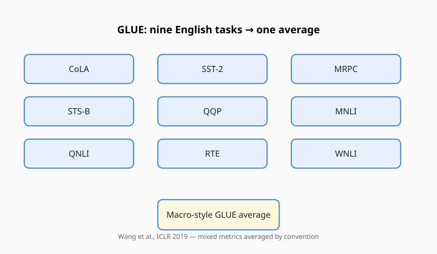

GLUE is the reason a later model card can print one English number and expect you to nod. Alex Wang, Amanpreet Singh, Julian Michael, Felix Hill, Omer Levy, and Samuel R. Bowman published “GLUE: A Multi-Task Benchmark and Analysis Platform for Natural Language Understanding” as an ICLR 2019 paper; the preprint is dated 2018. The authors were at NYU and collaborators. The site that collected scores made the average famous.

<!-- figure-pack -->
<figure>
  
  <figcaption><strong>GLUE (Wang et al., ICLR 2019).</strong> Nine English understanding tasks (CoLA, MNLI, QQP, and others) roll into one leaderboard average with hidden test labels— the habit later suites copied or rejected.</figcaption>
</figure>

The paper did not claim to have measured intelligence. It claimed to have bundled existing English tasks so that a single model, and a single leaderboard, could be compared without nine separate papers. That bundling is the invention. The tasks were already in the literature.

## Nine hardships

The suite, as the paper presents it, is a mix of formats that were already respectable:

- **CoLA** — acceptability judgments from Warstadt, Singh, and Bowman’s linguistic acceptability corpus. A sentence is grammatical enough, or it is not. Matthews correlation, because the classes are uneven.
- **SST-2** — binary sentiment from Socher’s Stanford Sentiment Treebank, the movie-review sentences everyone had already used.
- **MRPC** — paraphrase detection from Microsoft Research, Dolan and Brockett’s pairs.
- **STS-B** — semantic textual similarity, a graded score, Pearson/Spearman instead of accuracy.
- **QQP** — Quora question pairs: are these two questions the same ask?
- **MNLI** — Williams, Nangia, and Bowman’s Multi-Genre Natural Language Inference. Entailment, contradiction, neutral; matched and mismatched genres. The heavy task.
- **QNLI** — a question-answering inference recasting from SQuAD.
- **RTE** — the old Recognizing Textual Entailment sets, smaller and meaner than MNLI.
- **WNLI** — a Winograd-style recasting that became notorious for being small, leaky, and easy to overfit.

The average of those scores is “the GLUE score.” The average is a political object. STS-B is a correlation. CoLA is a correlation. MNLI is accuracy. Adding them is a convenience. It worked because everyone agreed to be inconvenienced the same way.

## What the platform added

GLUE was not only a zip file. It was a site, a diagnostic set, and a rule that the test labels stayed hidden. You submitted predictions. The server scored you. That pattern — hide the test, publish the average — is how you keep a little honesty when the training data is public. It is also how you create a priesthood of the submission script.

The diagnostics (linguistic phenomena tagged on MNLI-style examples) were the authors trying to keep the suite from becoming a single number with no autopsy. People cited the number anyway.

## What it felt like to climb

In 2018, a reasonably tuned BiLSTM was a respectable baseline and BERT was a shock. By 2019, fine-tuned transformers had walked up the average far enough that the interesting question was no longer “can we beat the baselines?” It was “is this still a hardship?” SuperGLUE exists because the answer was becoming no. See [SuperGLUE](superglue.md).

WNLI is the scar people remember. A tiny Winograd recast with a leak that made clever preprocessing look like genius. Later write-ups treat it as a caution about small sets and about recasting a hard pronoun problem into a format that can be hacked. The Winograd Schema Challenge itself is a different, older instrument ([Levesque’s schemas](winograd-schema.md)).

## What the number refuses

GLUE refuses non-English. It refuses long documents. It refuses dialogue. It refuses any sense of whether a model is making up citations. It refuses, mostly, generation: the tasks are classification and similarity. A system that cannot write a paragraph can still be a GLUE champion.

It also refuses the 2020s’ favorite drama, contamination in a pretraining crawl, because the original social contract was fine-tuning. You were supposed to train on the provided splits. The leak you feared was a test label on your laptop, not a forum post of item 12 in The Pile.

When a modern LLM reports “GLUE” at all, ask whether anyone fine-tuned, whether they used the old server, and why they are using a 2018 English classification average as a personality. Sometimes the answer is continuity. Sometimes the answer is that the card needed a familiar noun.

## The habit that outlived the hardship

The habit is the multi-task average with a hidden test and a public name. MMLU borrowed the social form and changed the items. HELM borrowed the anxiety and refused the single average. Arena walked away from the file. GLUE is still the paper you cite when you want to say when that habit began in language understanding.

Nine tasks. One average. A server that would not give you the labels. That was enough to reorganize a field’s tables. It was never enough to say what understanding is. Bowman and Wang did not need it to be. They needed a shared hardship. They got one, and then they had to invent a harder sibling when the hardship got lonely.
