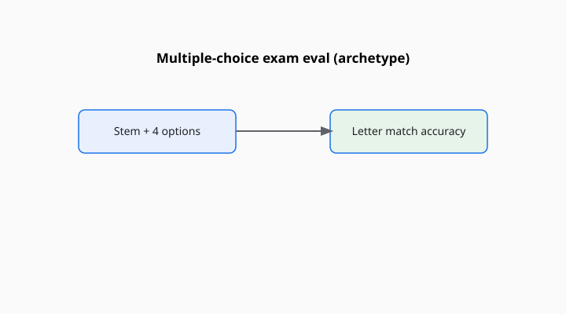

David Rein, Betty Li Hou, Asa Cooper Stickland, Jackson Petty, Richard Yuanzhe Pang, Julien Dirani, Julian Michael, and Samuel R. Bowman published “GPQA: A Graduate-Level Google-Proof Q&A Benchmark” in 2023 (arXiv:2311.12022; later COLM 2024). The subtitle is the design. The questions are written by domain experts in biology, physics, and chemistry so that a non-expert with a search engine should still struggle, and an expert should be able to agree on the answer.

<!-- figure-pack -->
<figure>
  
  <figcaption><strong>GPQA (2023).</strong> Graduate-level multiple-choice science questions written by domain experts—hard recognition tests, not open-ended proof grading.</figcaption>
</figure>

“Google-proof” is a 2023 sentence. It does not mean “proof against a 2026 agent with tools.” It means: we tried to write items that a web page will not politely hand you in the first snippet.

## What an item is

A multiple-choice question at a graduate level of detail. Not “what is a mitochondrion.” Closer to a qualifier-exam probe, with distractors that look right to a person who almost remembers. The authors report expert and non-expert accuracies to show the gap. That gap is the benchmark’s reason to exist. If non-experts with Google catch up, the “proof” has failed. If experts disagree, the item is a bad exam question.

**GPQA Diamond** is the subset the authors (and later cards) treat as cleaner: higher expert agreement, fewer messy items. If a card says GPQA and means Diamond, it should say Diamond. The full set and the diamond set are different denominators.

## Why Bowman is on this paper too

Samuel Bowman is also a GLUE and SuperGLUE author. The through-line is not a coincidence. GPQA is what you build when four-choice undergraduate exams (MMLU) have become too kind, and when you still want a file rather than a room. The NYU-and-friends taste is back: hidden hardship, a published protocol, a suspicion of easy numbers.

## An item in the hand

A diamond item in chemistry or physics asks for a distinction that a first-year survey course does not make. The distractors are the mistakes a confident almost-expert makes. A non-expert with a browser finds a related page and still cannot tell which letter is right. That gap — expert high, non-expert-with-Google low — is the authors’ acceptance test for an item.

If later agents close the non-expert gap by reading papers instead of snippets, the “Google-proof” adjective should be retired for those students. The file can remain. The adjective is a 2023 weather report.

Julian Michael and Samuel Bowman on the author list are a link back to GLUE’s editorial culture: hidden hardship, suspicion of easy numbers, a preference for a file you can argue about item by item.

## Tools change the instrument

A model allowed to browse, to read PDFs, to run code, is not taking the same test as a frozen chatbot. The “Google-proof” claim is about non-expert humans and ordinary search. An agent with a paper-reading tool is a different student. Cards that report GPQA with tools and GPQA without tools in the same breath are adding apples to a spectrometer.

## Contamination and expertise theater

Graduate questions still leak once they are famous. Diamond items will be screenshotted. A later crawl may contain them. The original “we asked experts to write new questions” shield is time-limited, like HumanEval’s handwritten shield.

There is also expertise theater: a question can be hard because it is obscure, or hard because it is well-posed. GPQA aims at the second. A few items, in any graduate set, will be the first. When a model fails, ask whether a working chemist would call the item fair.

## How to read a GPQA line

Name full versus Diamond, with or without tools, multiple-choice versus a generative recast, and the date. Compare to MMLU-Pro if you want broader undergraduate-plus hardship, and to Humanity’s Last Exam if you want a later, wider expert solicitation. Do not compare to GSM8K and call the axis “reasoning.” GPQA is graduate science recognition, Google-resistant at birth. That is already a long, specific claim. It does not need a larger noun.

A common mis-citation is to say “GPQA” and mean Diamond, or the reverse, without a word. The denominators differ. The word is cheap. Spend it.
