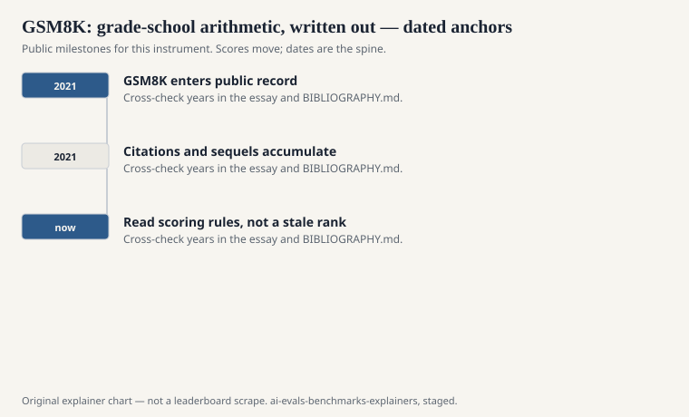
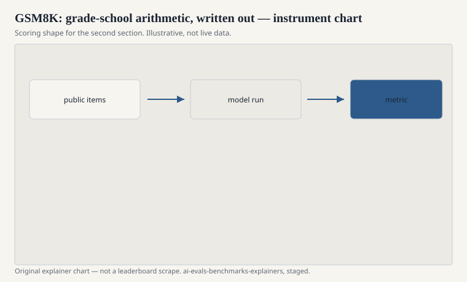

The name is a count. GSM8K is about eight thousand grade-school math word problems. Karl Cobbe, Vineet Kosaraju, Mohammad Bavarian, Mark Chen, Heewoo Jun, Lukasz Kaiser, Matthias Plappert, Jerry Tworek, Jacob Hilton, Reiichiro Nakano, Christopher Hesse, and John Schulman published “Training Verifiers to Solve Math Word Problems” in 2021 (arXiv:2110.14168). OpenAI. The paper is about verifiers. The dataset became the thing people meant when they said a model could “do math.”

That sentence was always too large. The items are the word problems a careful child meets: multi-step arithmetic, a few objects, a question that wants a number. Algebra sits mostly next door, in Hendrycks’s MATH. Proofs live somewhere else entirely.

## What an item looks like

<!-- graphics-pack:v1 -->

<figure class="eval-figure">

<figcaption>Figure 1. Dated public anchors for this piece. Years follow the essay; verify against BIBLIOGRAPHY.md before print.</figcaption>
</figure>

## Why verifiers were the paper’s idea

<!-- graphics-pack:v1 -->

<figure class="eval-figure">

<figcaption>Figure 2. Scoring shape for this instrument — protocol, not a weekly rank.</figcaption>
</figure>

## An item in the hand

A child buys notebooks at one price and pens at another, uses a coupon, and the question wants the change from a bill. The arithmetic is small. The trap is the number of steps and the unused number the writer left in the story. A model that grabs every integer and adds them will fail in a human way.

The gold is an integer. The write-up in the training split is a teaching artifact for verifiers. At test time, many harnesses only look at the final number. A beautiful wrong write-up that stumbles into the right integer can win. A correct method with a formatting twitch can lose. Read a few disagreements before you trust a one-point gap.

Eight thousand is large enough to average out some noise and small enough that leakage of a slice still moves a card. MGSM asks whether the same stories work after translation. If they do not, you did not have math. You had English math.

## Chain-of-thought’s favorite prop

Jason Wei’s chain-of-thought paper used GSM8K as a headline stage. Write the steps, get a better integer. That demo did more for CoT’s fame than a dozen ablation tables. It also welded GSM8K to a prompting style. A GSM8K number without “did you ask it to show work?” is an incomplete instrument.

Once everyone showed work, the scores climbed. Once everyone crawled the internet, the problems — charming, shareable — leaked. MGSM (Shi et al., ICLR 2023) translated a subset into other languages and asked whether the skill traveled. Later math suites (MATH, FrontierMath, contest dumps) asked whether the skill had ever been more than arithmetic-with-a-story.

## What the integer refuses

It refuses geometry with a diagram. It refuses formal proof. It refuses statistics as practiced. It refuses the word problems whose “correct” answer depends on a cultural assumption the writers did not notice. It refuses, mostly, symbolic manipulation that is not elementary.

It also refuses to tell you whether the model is a child who understands or a machine that has seen the worksheet. Grade-school problems are reprinted everywhere. That is their pedagogical virtue and their evaluation vice.

## How to read a GSM8K line

Ask: which split, with or without CoT, what answer parser, majority vote over samples or one greedy path, and whether they also report MATH or a fresher set. A model that is 95 on GSM8K and 20 on MATH is a calculator with a reading habit. A model that is high on both is still not a mathematician. It is a system that can land numbers on two public worksheets.

Eight thousand stories. One integer at the end. A paper about verifiers that became a proverb about reasoning. Keep the proverb small enough to fit the worksheet.
