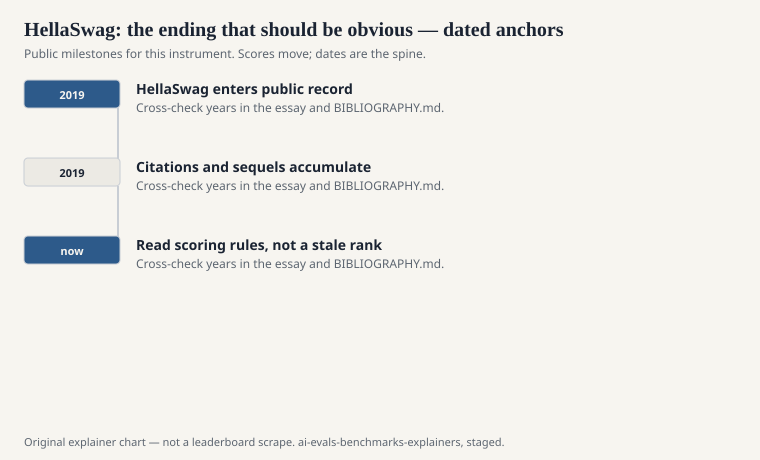
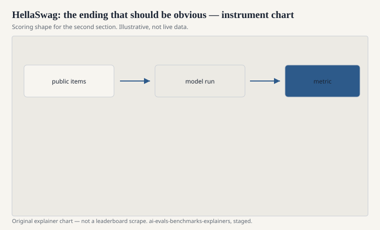

Rowan Zellers, Ari Holtzman, Yonatan Bisk, Ali Farhadi, and Yejin Choi published “HellaSwag: Can a Machine Really Finish Your Sentence?” at ACL 2019. The name is a joke on SWAG, their earlier adversarial dataset, and on the swagger of a model that thinks it knows what happens next. The task is simple to state. You get a context. You pick which of four endings is the natural continuation.

The contexts come from everyday video captions and how-to text — ActivityNet, WikiHow — not from a logic puzzle. A person looks at the four endings and is rarely confused. The 2019 machines were. That gap is the paper’s exhibit.

## Adversarial filters, not random wrong answers

<!-- graphics-pack:v1 -->

<figure class="eval-figure">

<figcaption>Figure 1. Dated public anchors for this piece. Years follow the essay; verify against BIBLIOGRAPHY.md before print.</figcaption>
</figure>

If you sample random endings, a model that has learned a little about English can often reject the junk. HellaSwag’s wrong answers were filtered to fool then-current models while remaining obvious to people. The method sits in a line Choi’s group worked hard: build a dataset that is easy for humans and hard for the machines you have, then watch the next machines eat it.

Adversarial filtering is a timestamp. The negatives were hard for BERT-era models. They are less hard for a 2024 chatbot. The items remain a test of whether a model prefers a physically and socially ordinary continuation over a fluent absurdity. When scores approach the human ceiling, the filter has done its historical job.

## What “commonsense” means here

<!-- graphics-pack:v1 -->

<figure class="eval-figure">

<figcaption>Figure 2. Scoring shape for this instrument — protocol, not a weekly rank.</figcaption>
</figure>

It means: water is wet, a person who picks up a bag is probably leaving, a recipe’s next sentence is not a random clause about Jupiter. It does not mean moral common sense, or scientific common sense, or the common sense of a culture that is not in the captions. WikiHow has a voice. ActivityNet has a voice. Those voices are the world the endings come from.

A four-choice continuation is also not the same as writing the next sentence. Generation can be worse than selection. HellaSwag will not catch a model that can pick (B) and cannot tell the story.

## An item in the hand

A WikiHow-ish context: a person is changing a tire, the lug nuts are off, the spare is in hand. Four endings: one is the next ordinary beat; three are fluent nonsense that a 2019 model liked anyway — a random kitchen, a jump cut to a ceremony, a physically impossible twist. A person points at the ordinary beat without a meeting. That gap was the paper.

Adversarial filtering means the nonsense was not random. It was the nonsense that fooled the machines of that year. When later machines stop being fooled, you have not necessarily installed commonsense. You have aged the filter. Choi’s group knew that; the method is designed to be re-run. Most cards never re-ran it. They kept the 2019 negatives and called the climb progress, which it partly is.

ActivityNet captions bring a video-world prior: bodies, rooms, sports. WikiHow brings a how-to prior. Neither is a theory of the everyday. Both are better than a logic puzzle pretending to be the everyday.

## Why it stayed on the cards

Because it is easy to run, because EleutherAI’s harness and HELM both treated it as a standard scenario, and because it became part of the “open LLM table” alongside ARC, MMLU, and WinoGrande. That table is a cultural object. It is not a natural kind. HellaSwag is on it because 2019’s commonsense gap was famous and the file was public.

By the time base models score in the high 80s or 90s, the card is mostly saying: we ran the harness. That is still worth doing as a regression. It is not worth doing as a personality.

## How to read it

Prefer the paper’s original setup (ending selection, the published splits) over a chatbot paraphrase of the context. If you prompt it as an open conversation, you have built a cousin. Report accuracy, not a vibe. If you need commonsense that still hurts, look at the later social and physical suites, or at PIQA and the remaining hard slices of BIG-bench — and then check whether those, too, have been climbed.

Zellers’s title asked if a machine could finish your sentence. For this file, the answer became yes sooner than the adjective “hellish” suggested. The hell was for 2019. The file is now a museum of what used to be obvious only to us.
