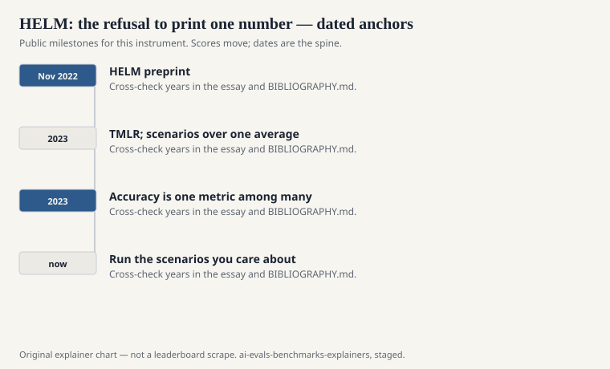
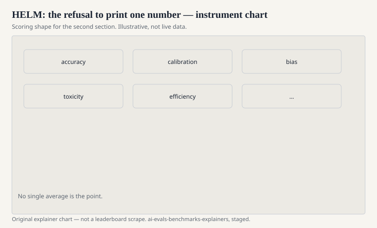

Most evaluation projects add a hardship. HELM added a tax on the way the field talked. Percy Liang, Rishi Bommasani, Tony Lee, and a long Stanford CRFM list published “Holistic Evaluation of Language Models” as a 2022 preprint (arXiv:2211.09110) and in *Transactions on Machine Learning Research* in 2023. A shorter telling by Bommasani, Liang, and Lee also appeared in the *Annals of the New York Academy of Sciences* that year. The website and the toolkit are public: crfm.stanford.edu/helm, github.com/stanford-crfm/helm.

The word in the title is the argument. Holistic, here, means: many scenarios, several metrics, the same models run the same way, and the raw generations released so a stranger can disagree.

## The diagnosis

<!-- graphics-pack:v1 -->

<figure class="eval-figure">

<figcaption>Figure 1. Dated public anchors for this piece. Years follow the essay; verify against BIBLIOGRAPHY.md before print.</figcaption>
</figure>

Before HELM, the authors said, prominent models were evaluated on overlapping scraps. Their figure of merit is memorable: on average, models had been run on a small fraction of the scenarios HELM treated as core — the paper’s abstract gives 17.9 percent — and some well-known systems shared no scenario at all. You cannot compare what you did not run.

The other diagnosis is the single number. Accuracy on a favorite file had become a worldview. HELM’s core design measures multiple desiderata on the same scenarios: accuracy, calibration, robustness (their word, in the paper), fairness, bias, toxicity, efficiency — seven metrics, sixteen core scenarios, as far as the data allowed. The paper’s own accounting is that this multi-metric grid was filled most of the time, not perfectly. Missing cells are part of the honesty.

## Scenarios, not a mascot task

<!-- graphics-pack:v1 -->

<figure class="eval-figure">

<figcaption>Figure 2. Scoring shape for this instrument — protocol, not a weekly rank.</figcaption>
</figure>

A HELM scenario is a use case with a dataset and a metric adaptation: question answering, summarization, sentiment, information retrieval, toxicity detection, and others that were not, in 2022, on every model card. Targeted evaluations sit beside the core: knowledge, reasoning, memorization and copyright, disinformation. The taxonomy is the point. If a capacity is not in the taxonomy, the paper is supposed to say so, rather than let a GLUE average impersonate it.

This makes HELM a poor mascot. There is no one “HELM score” the press can tattoo on a model. That is a defect if you are writing a tweet. It is the design if you are writing a paper about transparency.

## What they ran

The 2022–2023 release evaluated 30 models — open, limited-access, and closed — across 42 scenarios, including many that had not been mainstream LM workhorses. The abstract’s coverage claim is 96 percent: almost all models on the core set under standardized conditions. They report 25 top-level findings about tradeoffs. This explainer will not reprint the findings as folklore. They are dated runs. The method is the lasting object.

The method includes prompting discipline. HELM treats the prompt as part of the instrument. That sounds obvious after 2024. It was not obvious when every lab had a private template and a private few-shot draw.

## The living-benchmark promise

CRFM called HELM living: new scenarios, new models, later leaderboards (classic HELM, then specialized HELM slices that grew after the first paper). A living eval is a fork in the road. Either you version it like software, or you let “HELM” mean whatever the site shows this month. Cite the paper for the 2022–2023 argument. Cite a dated leaderboard snapshot for a number. Do not blur them.

Later HELM work expands into multimodal and into safety-flavored slices. Those are descendants. They inherit the refusal of the single number only if they keep the grid. A descendant that becomes a mascot has left the church.

## What HELM will not do for you

It will not tell you which model to buy. It will not replace a preference room. It will not save you from contamination on the underlying datasets — HELM composes existing files; it does not magically un-leak them. It will not run your private workload.

It will give you a vocabulary for saying: this system is accurate here, poorly calibrated there, expensive in between, and we can show you the completions. That sentence is longer than “89 on MMLU.” It is also harder to lie with.

## How to read a HELM citation

If a card says “evaluated with HELM,” ask which year, which core scenarios, which metrics were actually filled, and whether the completions are available. If the card then prints one number and calls it HELM, the citation has failed the paper. Liang’s group wrote a lot of pages to stop that compression. Honor the pages, or cite something else.
