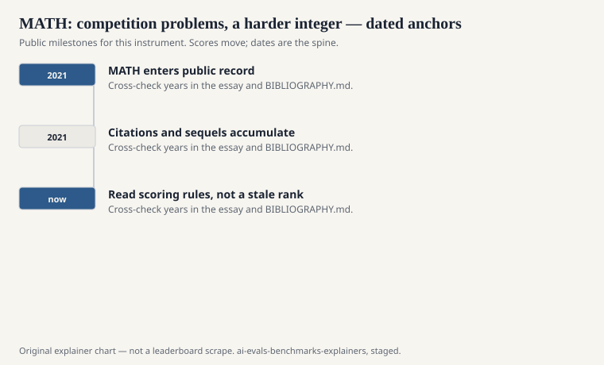
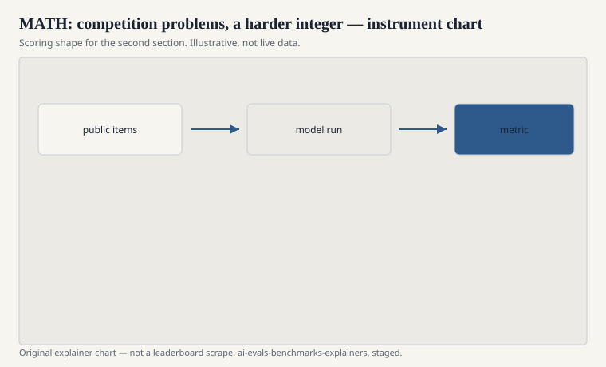

Dan Hendrycks, Collin Burns, Saurav Kadavath, Akul Arora, Steven Basart, Eric Tang, Dawn Song, and Jacob Steinhardt published “Measuring Mathematical Problem Solving with the MATH Dataset” at NeurIPS 2021. If GSM8K is a grade-school worksheet, MATH is a contest packet: problems in the spirit of AMC, AIME, and the harder end of high-school competition math, written so a model must do more than add the apples.

The name is greedy. It claimed the noun. Later papers have to say “Hendrycks MATH” or “the MATH dataset” to leave room for FrontierMath, Minerva’s evaluation sets, and actual mathematics.

## What an item wants

<!-- graphics-pack:v1 -->

<figure class="eval-figure">

<figcaption>Figure 1. Dated public anchors for this piece. Years follow the essay; verify against BIBLIOGRAPHY.md before print.</figcaption>
</figure>

## Scoring a boxed expression

<!-- graphics-pack:v1 -->

<figure class="eval-figure">

<figcaption>Figure 2. Scoring shape for this instrument — protocol, not a weekly rank.</figcaption>
</figure>

## An item in the hand

An intermediate-algebra problem with a boxed rational; a counting problem that wants an integer; a geometry problem whose answer is an expression in radicals. The write-up in the training data may be a full contest solution. At test time the harness wants the box. A model that can talk like a coach and cannot box the equivalent form will look smarter than it scores.

Difficulty labels let you see a curve. A system that is fine on 1–2 and dead on 5 is a different student from a flat 40 percent. Cards that drop the curve are hiding the instrument.

Tools change the geometry items first: a diagram in the head versus a Python plot versus a CAS. If you allowed them, you left the 2021 student behind. Say so.

## Contamination, again

Contest problems are copied with love. Art of Problem Solving, coaching blogs, Reddit, the papers themselves. Hendrycks’s group can ask you not to train on the test split. They cannot un-publish the last decade of contest archives. A decontamination filter that matches strings will miss a paraphrase. A filter that matches too loosely will throw out real math.

If you need a clean contest, you need new problems or a sealed packet. Epoch AI’s FrontierMath is one answer to that need. It is not a sequel that replaces MATH. It is a different difficulty class with a different secrecy bargain.

## What the dataset is not

It is not undergraduate analysis. It is not research math. It is not a proof benchmark, even when a solution in the training data is a write-up. The scorer wants the boxed object. A brilliant proof with the wrong box loses. A lucky box with a nonsense write-up can win if you only score the box.

Human contestants are scored with more mercy and more attention. The dataset uses the cheap judge because the cheap judge scales. Remember the bargain.

## How to read a MATH line

Ask which split (the paper’s test set versus a later subset like MATH-500), what equivalence code, tools or not, CoT or not, and whether they report GSM8K as the easy sibling. A card that only reports GSM8K is choosing the worksheet. A card that only reports MATH in 2026 may be choosing a climbed wall. Pair them, then look for something that still hurts.

Hendrycks put a contest packet on the internet and dared the models to open it. They did. The packet still describes a real skill: competition-style problem solving with a boxed answer. It no longer describes, by itself, the edge of what the large models can do. The noun was always bigger than the file. The file is still the citation for 2021’s wall.
