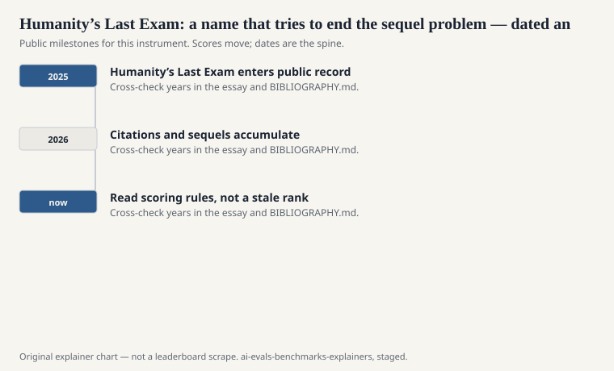
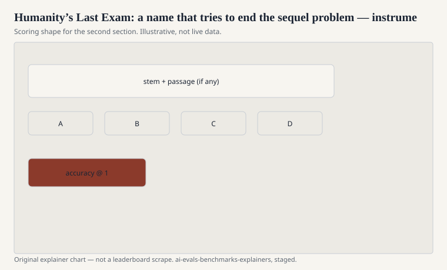

The public name is a dare. The archival name is quieter. Long Phan, Alice Gatti, Ziwen Han, Nathaniel Li, and a very large consortium — Center for AI Safety and Scale AI in the organizing seats, Dan Hendrycks, Summer Yue, and Alexandr Wang among the senior authors — released “Humanity’s Last Exam” as arXiv:2501.14249 in January 2025. *Nature* later published the work as “A benchmark of expert-level academic questions to assess AI capabilities” (2026, doi:10.1038/s41586-025-09962-4). Cite both if you are being careful. The acronym that escaped is HLE.

The dare is: stop writing easier sequels to MMLU when the models have eaten MMLU. Ask working experts for questions that they, not a quizlet, still respect.

## How the questions got there

<!-- graphics-pack:v1 -->

<figure class="eval-figure">

<figcaption>Figure 1. Dated public anchors for this piece. Years follow the essay; verify against BIBLIOGRAPHY.md before print.</figcaption>
</figure>

## What the hardship is

<!-- graphics-pack:v1 -->

<figure class="eval-figure">

<figcaption>Figure 2. Scoring shape for this instrument — protocol, not a weekly rank.</figcaption>
</figure>

## An item you may not see

Public samples exist; the items that matter for a claim often sit behind the organizers’ process. What you can say without leaking a question: a specialist would recognize the object (a spectrum, a lemma, a case, a construction), a non-specialist with a search box should still struggle, and the answer should be short enough to grade.

That is GPQA’s impulse with a wider solicitation and a louder brand. The brand is doing recruitment work — experts will write for a “last exam” sooner than for “yet another MMLU sequel.” The science is the editorial bar. Keep them straight.

Scale AI’s operational role and CAIS’s safety framing belong in the citation because they are in the author line. A magazine piece that pretends this was only a university workshop is smoothing the record.

## What it is not

It is not a job trial. It is not a safety trial. It is not a proof that “humanity” has been examined; it is a particular, English-heavy, academic notion of expertise. It is not GPQA’s smaller graduate science set, though it lives in the same impulse: make the exam hurt again.

Tool use, again, changes the student. An expert with a library is the original human baseline. An agent with a library is closer to that human than a frozen chatbot is. Name the tools.

## How to read an HLE line

Which split (public sample versus held-out), multiple-choice versus exact-match short answer, tools or not, and whether you are citing the arXiv or the *Nature* version. Do not reprint a live site percentage as a constant. Do not call it “the last” anything in a sentence that is not clearly the authors’ brand.

A consortium asked experts to write questions the models should still fail. For a while, they will. Then someone will write a harder packet. The packet is science. The prophecy is a title. Keep the packet.

A common mis-citation is to quote only the brand and not the *Nature* / arXiv pair. If you need a scholarly pointer, use the journal title and the doi. If you need the name people search, say HLE and then point at the paper. Do both when you can.
