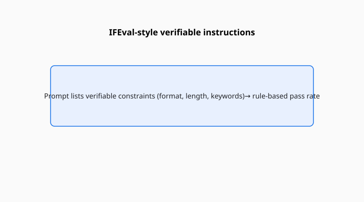

Jeffrey Zhou, Tianjian Lu, Swaroop Mishra, Siddhartha Brahma, Sujoy Basu, Yi Luan, Denny Zhou, and Le Hou published “Instruction-Following Evaluation for Large Language Models” in 2023 (arXiv:2311.07911). Google. The hardship is petty on purpose. Write exactly four bullet points. Mention a keyword. Do not mention another. End with a certain punctuation. Wrap the answer in JSON. The content can be dull. The constraint is the test.

<!-- figure-pack -->
<figure>
  
  <figcaption><strong>IFEval.</strong> Prompts with automatically checkable constraints (format, keywords, length)—rule-based instruction following without human thumbs.</figcaption>
</figure>

Most preference evals will forgive a model that is helpful and slightly disobedient. IFEval does not. The scorer is a program. Either the output satisfies the verifiable constraint or it does not.

## Why verifiable is the word

If the instruction is “be nice,” you need a judge. If the instruction is “use exactly two questions marks,” you need a counter. Zhou’s group collected instructions that a script can check. That choice throws out a lot of real user intent and keeps the part that can be graded at 2 a.m. without a model judge.

The benefit is honesty. The cost is a certain bureaucratic flavor. A system can ace IFEval and still be a bad colleague. A system can fail IFEval and still be a good explainer that ignored a silly constraint. The file measures compliance with checkable requests.

## What an item looks like

A prompt that mixes a task (explain, list, rewrite) with one or more constraints (length, format, keywords, language, case). The paper groups them into types so you can see whether a model fails JSON more than it fails “start every sentence with a verb.” Category tables matter. A single average will hide a format specialist.

LiveBench later included instruction-following slices in the same spirit, with a calendar. IFEval is the static, early, widely copied version.

## An item in the hand

Imagine a prompt that says: explain photosynthesis in three sentences, include the word “stomata,” do not use a semicolon, and put the whole answer inside a markdown code block. A colleague might shrug and write a good paragraph that violates two of those. IFEval’s script shrugs at the paragraph and fails the code block. That is not pettiness for its own sake. It is a reminder that “helpful” and “obedient” parted company the moment instruction-tuning became a product.

Users actually ask for this class of thing. They want JSON for a pipeline. They want a title under twenty words. They want a list that is a list, not a prose blob with fake bullets. A model that cannot do those chores will be called creative in a demo and broken in a workflow. Zhou’s file is closer to the workflow than MT-Bench’s vibe scores are.

The inverse is also true. A model can satisfy every constraint and still be wrong about stomata. IFEval will not save you from that. Run a content exam beside it. The pair is the point: one file for the envelope, one file for the letter.

## How models cheat without cheating

They follow the easy constraint and ignore the hard one. They follow the constraint and fail the task. They produce the JSON and forget to answer. The programmatic scorer will catch the first class. It may not catch “valid JSON that is nonsense.” Pair IFEval with a task that cares about content.

Prompting changes everything. A system message that says “always obey format constraints” is part of the instrument. Few-shot examples of obedience are part of the instrument. Report them.

## How to read an IFEval line

Prompt-level versus instruction-level accuracy (the paper distinguishes a prompt with several constraints from each constraint), which categories, and whether a repair loop was allowed. A model that may reformat after a tool check is a different student.

Be nice is a preference. Use exactly four bullets is a test. Zhou’s group built the second. It is a narrow, useful, slightly petty yardstick. Keep it petty. That is the measurement.

A common mis-citation is to call IFEval “alignment.” Alignment, in public debate, is a larger and more loaded word. This file measures checkable obedience. That is already worth a column. It does not need the larger word. Prompt-level and instruction-level accuracies are not interchangeable.
