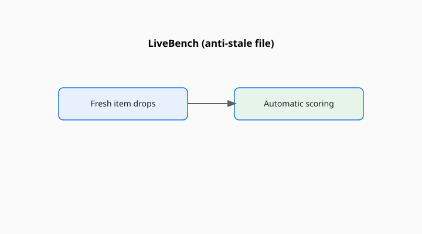

Colin White, Samuel Dooley, Manley Roberts, Arka Pal, and a list that includes Benjamin Feuer, Chinmay Hegde, Yann LeCun, Tom Goldstein, Willie Neiswanger, and Micah Goldblum published “LiveBench: A Challenging, Contamination-Limited LLM Benchmark” as arXiv:2406.19314 (June 2024) and later as an ICLR 2025 paper. The title on arXiv is the honest one. An earlier draft said “contamination-free.” Free is a hope. Limited is a method.

<!-- figure-pack -->
<figure>
  
  <figcaption><strong>LiveBench.</strong> Periodically refreshed items with automatic scoring to fight stale-file contamination and chatty judges.</figcaption>
</figure>

The method is three refusals at once: refuse a stale file, refuse a chatty human crowd as the only judge, refuse a model judge as the only scorer. New items, objective keys, a monthly refresh.

## Where the new items come from

Recent math contests, arXiv papers, news, and datasets that did not exist when last month’s models were trained — plus harder recasts of older tasks (BBH-ish puzzles, IFEval-ish constraints, AMPS-ish math). The mix is the point. A bench that only refreshes trivia becomes a news quiz. A bench that only refreshes math becomes a contest dump. LiveBench wants several skills to move at once.

Automatic scoring means the answers have to be checkable: a number, a structured object, a program, a constraint. You lose the soft preference that Arena captures. You gain the ability to grade at 2 a.m. without hiring a cousin of the candidate.

## What “monthly” does to citation

It makes “the LiveBench number” a time series. Version your citation. A June 2024 table and a 2025 table are not a disagreement; they are two instruments that share a constitution. Cards that print a live site’s headline without a version are printing weather.

The authors reported that even top models sat well below a comfortable ceiling on the early releases (the abstract’s “below 70 percent” is a dated snapshot). Use it as a qualitative claim about difficulty at launch, not as a constant.

## An item in the hand

One month’s math item might be a problem from a contest that was held last Thursday. One coding item might be a new function specification. One instruction item might be a constraint set in IFEval’s mood with a fresh wording. The key is automatic: a number, a program, a format. If you cannot write a checker, the item should not have entered.

That is why preference questions stay out. “Which reply do you like?” has no key. LiveBench is not trying to replace Arena. It is trying to replace a stale MMLU-shaped average with a moving, checkable one.

Because items retire, a plot across months is the native visualization. A single cell in a model card is a compromise. If you only have room for one cell, put the version in the cell, not only the integer.

## Limits the paper cannot repeal

A monthly generator can still rhyme with older items. Contest problems remix. News questions become old news. A model trained continuously may have seen last week’s arXiv. The constitution reduces the most embarrassing leakage; it does not repeal training on the internet.

Objective keys can still be gamed if your output format is the real test. A model that is excellent at boxes and JSON will look more alive. Category tables, again, matter.

## How it sits next to Arena and HELM

Arena moves because voters move. LiveBench moves because editors inject new keys. HELM moves by adding scenarios and keeping a grid. The three are not rivals so much as different answers to the death of a static average. You can run all three. You cannot average them into a mind.

## How to read a LiveBench line

Version, date, category breakdown (math, coding, reasoning, language, instruction following, data analysis — the paper’s bins), and whether the model’s training cutoff sits before the item window. If those are present, you have a living file. If they are absent, you have a noun.

White’s group tried to keep the pamphlet from sitting still in the library. That is a good try. Date the pamphlet anyway.

A common mis-citation is to call LiveBench “contamination-free” because an early draft’s title did. The ICLR/arXiv title that stuck is “contamination-limited.” Limited is the honest adjective. Use it.
