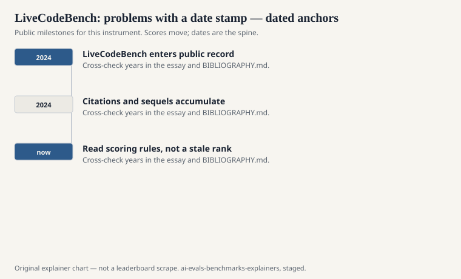
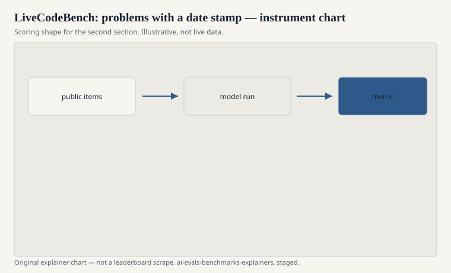

HumanEval’s 164 docstrings could not stay young. Naman Jain, King Han, Alex Gu, Wen-Ding Li, Fanjia Yan, Tianjun Zhang, Sida Wang, Armando Solar-Lezama, Koushik Sen, and Ion Stoica published “LiveCodeBench: Holistic and Contamination Free Evaluation of Large Language Models for Code” in 2024 (arXiv:2403.07974). The method is a calendar. Scrape new problems from contest sites after a model’s training cutoff, score by execution, and keep going.

“Holistic” in their title is a smaller claim than HELM’s: not only generation, but also execution-related skills the paper bins as code generation, self-repair, execution, and test prediction. “Contamination free” is an aspiration the later literature would phrase more carefully as “contamination-limited.” New problems help. They do not make a time machine.

## Why a calendar

<!-- graphics-pack:v1 -->

<figure class="eval-figure">

<figcaption>Figure 1. Dated public anchors for this piece. Years follow the essay; verify against BIBLIOGRAPHY.md before print.</figcaption>
</figure>

If a problem appeared on Codeforces, LeetCode, or AtCoder after your declared cutoff, a model that was trained before that date should not have seen the official statement. That sentence depends on honest cutoffs and on the problem not having been a remix of an older one. Contest culture remixes. The calendar still reduces the most embarrassing form of leakage: the exact HumanEval docstring in the crawl.

LiveCodeBench therefore reports numbers that are *as of a problem window*. A card that says “LiveCodeBench” without a version or a date range is omitting the method.

## What an item is

<!-- graphics-pack:v1 -->

<figure class="eval-figure">

<figcaption>Figure 2. Scoring shape for this instrument — protocol, not a weekly rank.</figcaption>
</figure>

A contest-style programming problem: statement, constraints, sample I/O, hidden tests. The model writes a solution. The judge runs it. This is closer to a programming competition than to SWE-bench’s issue tracker and closer to HumanEval than to a multi-file refactor — but the problems can be algorithmically meaner than “mostly basic.”

The extra tasks (repair a failing program, predict output, write tests) are the paper trying not to let one generation score impersonate “coding.” They are easy to drop on a card. If they were dropped, say so.

## An item in the hand

A Codeforces-style statement: constraints, a story that is a thin wrapper around a graph problem, sample tests that do not cover the nasty case. The model writes a solution. Hidden tests include a large N and a disconnected graph. HumanEval would have given you a docstring and a signature. This file gives you a contest voice and a time limit culture.

Self-repair, in the paper’s extra bins, starts from a failing program and a trace. That is closer to a working day than the first-try `pass@1` culture. Test prediction asks whether the model can say what a program prints. Those bins are easy to skip when a card wants one integer. If they were skipped, the noun should shrink.

Cutoff honesty is the whole calendar. A lab that trains through April and evaluates on March problems has not used the method. A lab that trains through April and evaluates on May problems has. Write the months.

## What it still misses

A contest problem is a closed world. The APIs are the standard library. The issue is the statement, not a maintainer’s half-written bug. A model can be strong here and weak on a messy repository, or the reverse. Pair with SWE-bench if you are making a job claim. Pair with MBPP if you want a floor.

The contest sites are also a culture: time limits, trick constraints, a certain flavor of adversarial input. That culture is not the whole of software.

## How to read a LiveCodeBench line

Name the version, the problem window, the languages, `pass@k` or equivalent, and which of the paper’s task bins were run. If the model’s training cutoff is after the problems, the calendar argument has expired for that pair.

New contests will keep arriving. That is the instrument’s hope. A live coding bench that stops living becomes HumanEval with extra steps. Jain’s group put the date in the method. Keep the date in the citation.

A common mis-citation is to report LiveCodeBench beside HumanEval as if they were two snapshots of one skill. One is 164 famous docstrings. The other is a window of contest problems. If the window is older than the weights, you are back to the first problem.
