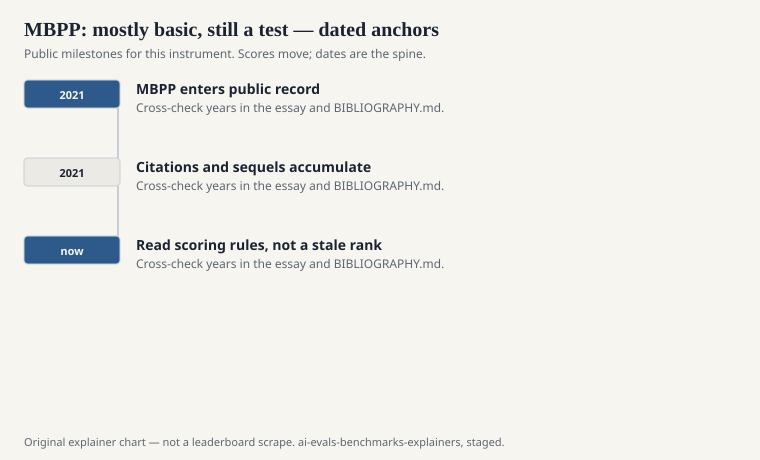
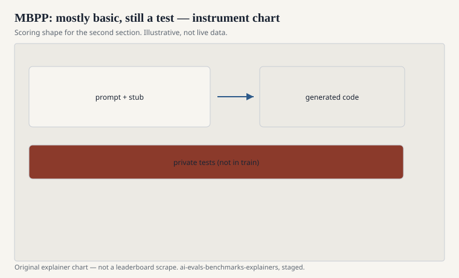

The title is a warning that the authors printed themselves. Jacob Austin, Augustus Odena, Maxwell Nye, Maarten Bosma, Henryk Michalewski, David Dohan, Ellen Jiang, Carrie Cai, Michael Terry, Quoc Le, and Charles Sutton published “Program Synthesis with Large Language Models” in 2021 (arXiv:2108.07732). The affiliation is Google. Buried in the work is a dataset they named Mostly Basic Programming Problems: MBPP.

Mostly basic is not an insult. It is the instrument. Short Python tasks, the sort a person might assign after a first course: lists, strings, simple arithmetic, a bit of bookkeeping. Each problem has a prompt in plain language and tests. The model writes a program. The tests run. Green or red.

## Why it exists beside HumanEval

<!-- graphics-pack:v1 -->

<figure class="eval-figure">

<figcaption>Figure 1. Dated public anchors for this piece. Years follow the essay; verify against BIBLIOGRAPHY.md before print.</figcaption>
</figure>

## Sanitized, few-shot, and the subset games

<!-- graphics-pack:v1 -->

<figure class="eval-figure">

<figcaption>Figure 2. Scoring shape for this instrument — protocol, not a weekly rank.</figcaption>
</figure>

## An item in the hand

“Write a function that returns the nth Fibonacci number.” “Check whether a string is a palindrome.” “Sum the positive numbers in a list.” The prompt is a sentence. The tests check a few inputs. A model that writes the obvious loop passes. A model that off-by-ones the empty list may still pass if the tests forgot.

That is the floor. It is also the interview’s first five minutes. Austin’s group did not pretend otherwise. Later cards that put MBPP next to SWE-bench without an adjective are the ones pretending.

Few-shot MBPP often pastes other basic problems as examples. That is a different instrument from a zero-shot sentence. It can be the right instrument if you say so. It can also leak style: the model learns your example’s naming habits and not much else.

## What “mostly basic” cannot see

It cannot see multi-file edits. It cannot see API choice. It cannot see whether the model will delete your tests. It cannot see SQL, CUDA, or a type system that is not Python. It cannot see the difference between a solution that passes and a solution you would merge.

It also cannot see, by itself, whether the model saw the problem on GitHub. Basic problems are the most duplicated objects in the programming internet. Contamination here is not a spicy scandal. It is the default weather. A high MBPP score in 2025 is consistent with competence and consistent with a good crawl. Pair it with a fresher contest set if you need the distinction.

## How it should be used

Use MBPP as a floor. Use HumanEval as a slightly less basic floor with a different prompt dialect. Use LiveCodeBench or a dated contest dump when you want the floor to move. Use SWE-bench when you want a job.

Austin’s group named the thing honestly. Later cards that report MBPP as “coding” without an adjective are less honest than the dataset’s title. Mostly basic is a virtue when you treat it as a floor. It is a vice when you treat it as a career.
