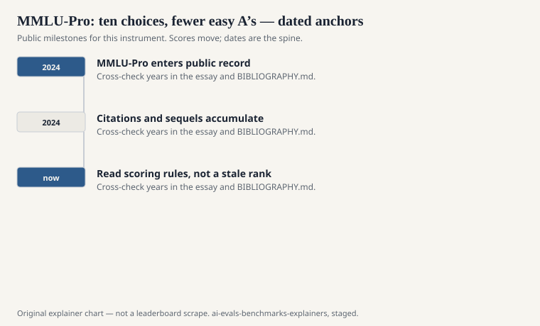
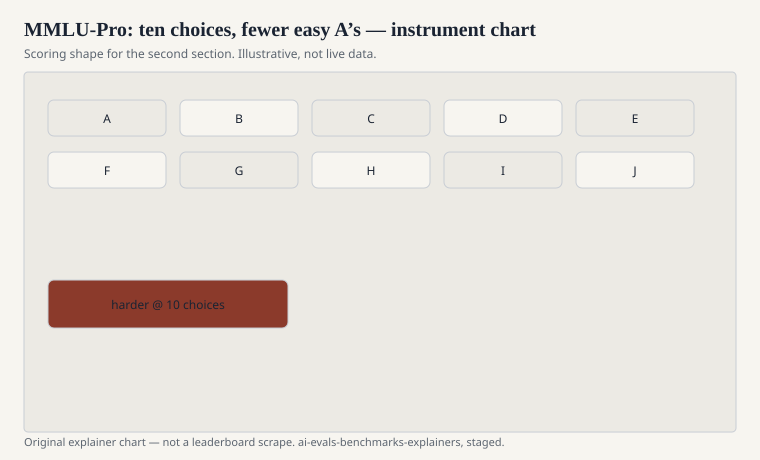

When a four-choice exam stops hurting, you can add more wrong answers, throw out the noisy questions, and ask for work. Yubo Wang, Xueguang Ma, Ge Zhang, Yuansheng Ni, and colleagues — TIGER-Lab at Waterloo, with Toronto and Carnegie Mellon names on the line — published “MMLU-Pro: A More Robust and Challenging Multi-Task Language Understanding Benchmark” at NeurIPS 2024 (Datasets and Benchmarks, Spotlight). The preprint is arXiv:2406.01574.

The title uses a word this series otherwise bans as house style. It is their title. Quote it. The substance is simpler: MMLU had plateaued as a discriminator, so they built a stickier exam.

## What they changed

<!-- graphics-pack:v1 -->

<figure class="eval-figure">

<figcaption>Figure 1. Dated public anchors for this piece. Years follow the essay; verify against BIBLIOGRAPHY.md before print.</figcaption>
</figure>

## What they measured besides accuracy

<!-- graphics-pack:v1 -->

<figure class="eval-figure">

<figcaption>Figure 2. Scoring shape for this instrument — protocol, not a weekly rank.</figcaption>
</figure>

## What it still is

It is still multiple choice. The right answer is still on the page. A ten-choice question is harder than a four-choice question and is not a proof. It will not tell you if the model can write the brief, only if it can pick the brief’s conclusion from a lineup.

It is still English-majority academic culture, even when the domain is “law” or “health.” It is still a file, which means it can leak. Ten options do not stop a crawl. They only stop some lucky guesses.

## An item in the hand

A ten-choice stem in physics or law that wants a short chain, not a remembered letter. Two or three distractors are the mistakes a rushed student makes. The other six exist to kill lucky elimination. A model that was coasting on four-choice MMLU now has to work or guess among ten.

The authors’ CoT finding is the tell: talking through the item helps here more than it helped on the original file. That is evidence the sequel bought reasoning items, not only a longer alphabet. It is also a protocol trap. A card that reports Pro without saying whether the model was allowed to talk is mixing two students.

Prompt stability, in their plots, is the other purchase. If your lab’s MMLU number swings when you change “Answer:” to “Final answer,” Pro is supposed to swing less. Verify that on your harness before you brag. The paper’s 24-prompt study is theirs, not yours.

## Why it earned a separate explainer

Because people now say “MMLU” when they mean “the exam number,” and the exam number has split. A card that reports only the 2021 file in 2026 is choosing the softer instrument. A card that reports only Pro may be choosing the instrument that still ranks their model. Both files can be run. Both should be named.

The Waterloo group also shipped a leaderboard. Leaderboards are weather. The paper is climate: more choices, more reasoning, less junk, more prompt stability. If a later sequel adds tools or hides the options, that will be another instrument. Do not call it MMLU-Pro out of habit.

## How to read a Pro number

Ask for the same protocol discipline you should have asked for on MMLU: shots, chain-of-thought, scoring of the letter versus the text, and whether any subjects were dropped. Then ask why they did not also report the original file, or why they did not also report GPQA if they want graduate hardship.

MMLU was a GPA. MMLU-Pro is a GPA with a harsher curve and a longer multiple-choice bubble sheet. That is progress in measurement. It is not a graduation.
