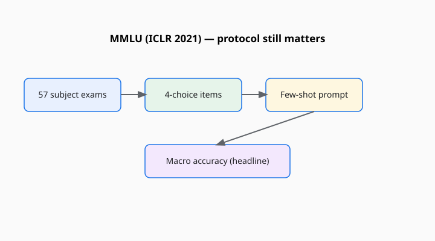

Dan Hendrycks, Collin Burns, Steven Basart, Andy Zou, Mantas Mazeika, Dawn Song, and Jacob Steinhardt published “Measuring Massive Multitask Language Understanding” at ICLR 2021. The preprint is from 2020. The name collapsed, immediately, into an acronym that now behaves like a brand: MMLU.

<!-- figure-pack -->
<figure>
  
  <figcaption><strong>MMLU (Hendrycks et al., ICLR 2021).</strong> Fifty-seven multiple-choice subject exams; headline few-shot macro accuracy depends on shots, letter scoring, and subject list—compare protocols, not slogans.</figcaption>
</figure>

The hardship is an exam pile. The paper describes 57 tasks drawn from real academic and professional tests — humanities, social sciences, STEM, and “other” — with four-choice questions. The original evaluation protocol that made the number famous is few-shot: show the model a handful of answered questions from the same subject, then ask a new one. Accuracy, averaged, is the headline.

## Why it landed

GLUE had measured fine-tuned English classifiers. By 2020 the objects of argument were large pretrained models that were supposed to know things without a task-specific head. An exam is a culturally legible way to ask “do you know things?” People have taken exams. People trust, or at least recognize, a percentage on anatomy or criminal law.

The suite is also wide. A model that memorized Python trivia and failed jurisprudence shows up in the per-subject table. Hendrycks’s group insisted on that table. The world cited the macro average. The average is how MMLU became a personality: “it’s a 74.”

## What a four-choice exam is

It is a recognition test. The right answer is on the page. A model that cannot produce a legal opinion can still pick (B). A model that can write a careful legal opinion can still miss a poorly written stem. The format is a gift to calibration-by-elimination and a theft from any skill that is generative, tool-using, or interactive.

It is also a gift to contamination. Exam questions are copied. They appear in quizlets, dumps, blogs, and papers. A crawl that has seen enough practice tests will flatter a model that has not “understood” medicine so much as seen the stem. Hendrycks has said, in later public writing, that evals get saturated and leaked; MMLU-Pro exists because the original file got too familiar. See [MMLU-Pro](mmlu-pro.md) and [When the exam was in the library](../essays/contamination-and-leakage.md).

## The protocol is the instrument

“The MMLU number” is not one number. It varies with:

- zero-shot versus five-shot versus chain-of-thought
- whether you let the model talk first and then pick a letter
- whether you score the letter, the log-prob of the choice text, or a judge’s parse
- which subjects you include (some cards quietly drop a subset)

HELM’s authors made this class of problem a theme: before standardization, models did not even share scenarios. If two cards both say MMLU and their protocols differ, you are comparing homework assignments.

## What the paper was arguing

The paper is not only a dataset release. It is an argument that then-current models were uneven in a way a language-modeling loss does not reveal. STEM subjects and professional exams were harder than the press’s favorite demos. The authors framed the suite as a measure of world knowledge and problem-solving as those appear in multiple-choice tests — a narrower claim than the acronym suggests.

Steinhardt’s and Hendrycks’s broader public work on measurement and risk sits around the paper. This explainer stays with the instrument. The instrument is an exam dump with a scholarly introduction.

## How it aged

It aged into a default. If you launched a model in 2023–2024 and omitted MMLU, reviewers asked why. That is success. Success is also how a yardstick becomes furniture. When frontier models sit in the 80s and 90s on the original file, the average stops discriminating. You are ranking prompt templates and contamination luck.

The right use of MMLU now is historical and diagnostic: per-subject tables, protocol notes, comparison to MMLU-Pro or to a held-out exam family (GPQA, AGIEval, Humanity’s Last Exam). The wrong use is a single integer in a keynote that implies a mind has a GPA.

## A note on tone

Because the items look like school, the metaphor infects the models. We say they “pass.” We say they “major in.” The paper’s subjects are real human exams, which means real human curricula, including the biases and gaps of those curricula. A high score on a U.S.-style professional test is not a cosmopolitan education. It is agreement with that test’s key.

Fifty-seven subjects. Four choices. A few shots. An average that ate a decade. If you print the average, print the protocol. If you cannot print the protocol, do not print the average.
