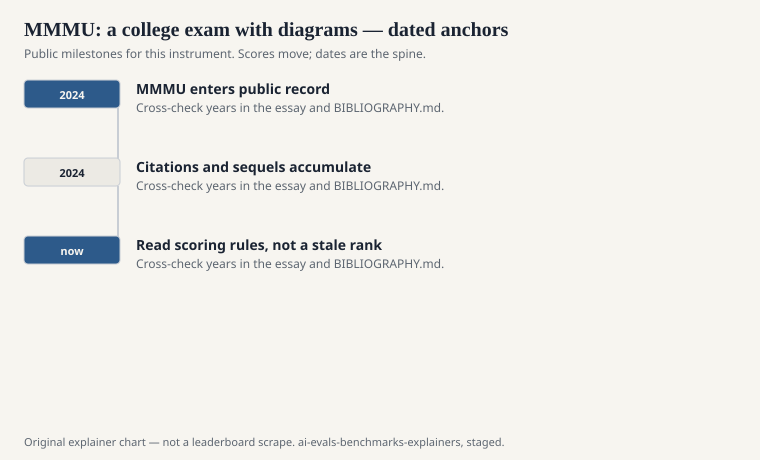
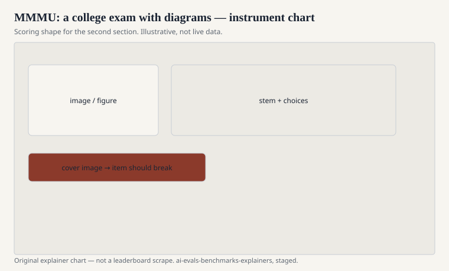

Xiang Yue, Yuansheng Ni, Kai Zhang, Tianyu Zheng, Ruoqi Liu, Ge Zhang, Samuel Stevens, Dongfu Jiang, Weiming Ren, Yuxuan Sun, Cong Wei, Botao Yu, Ruibin Yuan, Renliang Sun, Ming Yin, Boyuan Zheng, Zhenzhu Yang, Yibo Liu, Wenhao Huang, Huan Sun, Yu Su, and Wenhu Chen published “MMMU: A Massive Multi-discipline Multimodal Understanding and Reasoning Benchmark for Expert AGI” at CVPR 2024. The file is a college-level exam that refuses to drop the figures: charts, chemical structures, maps, scores, diagrams that a text-only model cannot honestly see.

The title’s “expert AGI” is a mouthful. The instrument is more modest and more useful: can a multimodal model do the kind of question a human student meets when the answer is in the image and the caption together?

## What an item is

<!-- graphics-pack:v1 -->

<figure class="eval-figure">

<figcaption>Figure 1. Dated public anchors for this piece. Years follow the essay; verify against BIBLIOGRAPHY.md before print.</figcaption>
</figure>

## Why it is not VQAv2

<!-- graphics-pack:v1 -->

<figure class="eval-figure">

<figcaption>Figure 2. Scoring shape for this instrument — protocol, not a weekly rank.</figcaption>
</figure>

## An item in the hand

A chemistry question with a skeletal formula. An art-history question with a painting and a demand that you use what is on the canvas, not only the famous title in the prompt. A medical item with a scan or a chart. Cover the image: the stem should become unfair. If it stays fair, the figure was a poster.

College difficulty means the distractors are not “banana” versus “mitochondria.” They are the near-miss a student writes on a midterm. A vision model that can caption “a graph going up” and cannot read the axis units will look fluent and be wrong. That is the failure MMMU is allowed to catch.

Wenhu Chen’s group also sits on MMLU-Pro. The through-line is exam-shaped measurement with a harder curve. Here the curve includes pixels.

## The AGI adjective

CVPR titles are allowed to reach. This series is not. MMMU does not measure whether a system is a general colleague. It measures whether a system can sit a particular kind of illustrated exam. Treat the acronym as the dataset. Leave the prophecy in the paper’s title.

## How it ages

Images in exam problems leak less casually than pure text, but they leak: papers, blogs, the dataset itself. As models climb, the next sequel will add harder figures or hide the options. Until then, MMMU is the default multimodal college noun, the way MMLU was the default text college noun.

Protocol matters: resolution, how many images you actually feed, whether you describe the figure in text first (a cheat that can also be a legitimate accessibility tool). Name the pipeline.

## How to read an MMMU line

Subject breakdown, multiple-choice versus open, text-only ablation, and the model’s vision encoder identity. A number without the ablation is a rumor about seeing.

Yue and Chen’s group put the diagram back on the exam. That is the whole request. If your system cannot use the diagram, it should not get the college credit. The scorer is willing to be that strict. The card should be too.
