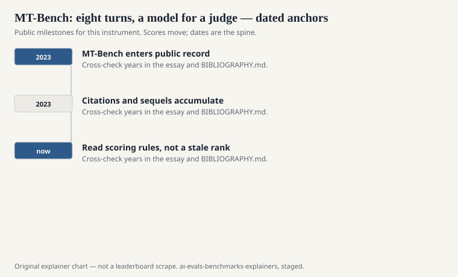
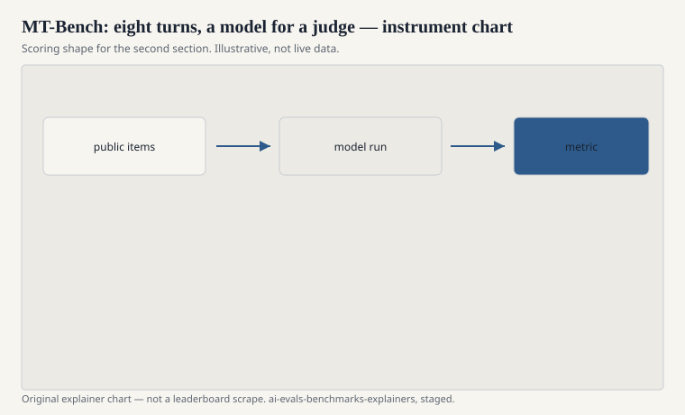

Lianmin Zheng, Wei-Lin Chiang, Ying Sheng, Siyuan Zhuang, Zhanghao Wu, Yonghao Zhuang, Zi Lin, Zhuohan Li, Dacheng Li, Eric Xing, Hao Zhang, Joseph Gonzalez, and Ion Stoica published “Judging LLM-as-a-Judge with MT-Bench and Chatbot Arena” at NeurIPS 2023 (Datasets and Benchmarks). The same circle of people would write the Arena paper. MT-Bench is the file-shaped sibling: a set of multi-turn questions, a rubric, and another language model asked to assign a score.

The title is the warning. They did not only release a bench. They asked whether a model judge is fit for work.

## What the file contains

<!-- graphics-pack:v1 -->

<figure class="eval-figure">

<figcaption>Figure 1. Dated public anchors for this piece. Years follow the essay; verify against BIBLIOGRAPHY.md before print.</figcaption>
</figure>

## Where a judge goes blind

<!-- graphics-pack:v1 -->

<figure class="eval-figure">

<figcaption>Figure 2. Scoring shape for this instrument — protocol, not a weekly rank.</figcaption>
</figure>

## A turn in the hand

Turn one: write a short plan. Turn two: change a constraint and see if the plan updates or the model repeats itself. Or: turn one is a math problem; turn two asks the model to find its own mistake. The second turn is the “MT.” A one-shot answer that looks great and then ignores the twist is a common failure the file was built to catch.

The judge sees the transcript and emits a score. If the judge cannot do the math, it scores the confidence. Zheng’s group measured agreement with people so you would not have to pretend the gavel was invisible. Later cards forgot to name the gavel anyway.

Eighty items is a small N for a default industry number. Variance is part of the weather. Pairwise judging against a baseline, as in AlpacaEval, is a cousin protocol. Do not mix a 1–10 single score and a win rate in one cell.

## How it relates to Arena

Arena is live, pairwise, human. MT-Bench is static, multi-turn, judged. They correlate enough that people used MT-Bench as a poor man’s Arena when votes were scarce. They diverge when the judge’s taste is not the crowd’s taste, and when the eighty questions are not what the crowd asked.

A card that reports MT-Bench and not Arena is choosing a file. A card that reports Arena and not MT-Bench is choosing a room. A card that reports both and pretends they are one number is choosing a press cycle.

## How it aged

Eighty questions leak. Judge models change. A 2023 GPT-4-as-judge number and a 2026 other-judge number are not a time series. If you need a controlled preference file with harder prompts, later work such as Arena-Hard sits in the family. If you need humans, go to the room.

## How to read an MT-Bench line

Name the judge, the prompt template for the judge, pairwise versus single-score, and the date of the file. If the authors of the card are the same org that owns the judge, say so. Eighty multi-turn items and a hired model with a gavel: that is the instrument. The gavel is part of the score. It is not an invisible clerk.
