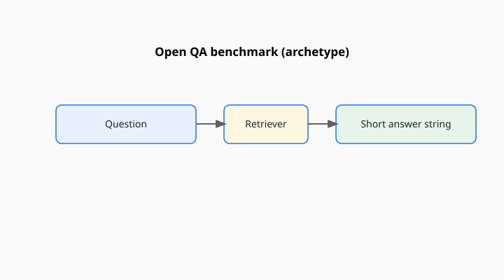

Jason Wei, Karina Nguyen, Hyung Won Chung, Yunxin Joy Jiao, Spencer Papay, Amelia Glaese, John Schulman, and William Fedus published “Measuring short-form factuality in large language models” in 2024 (arXiv:2411.04368; also posted by OpenAI as the SimpleQA paper). The file has 4,326 short, fact-seeking questions. The answers are supposed to be single and indisputable. The grades are three: correct, incorrect, not attempted.

<!-- figure-pack -->
<figure>
  
  <figcaption><strong>SimpleQA.</strong> Short factual questions with verifiable answers—designed to stress hallucination rates under automatic checking.</figcaption>
</figure>

The third grade is the instrument. A model that guesses when it should shut up is not “informative.” It is wrong. A model that shuts up too often is calibrated and useless. SimpleQA wants the pairing: try the ones you know, skip the ones you do not.

## Why short form

Long answers contain many claims. Grading them is a research program (see Wei’s other 2024 line of work on long-form factuality). Short answers let you build a key. The paper is explicit about the bargain. If your product is a briefing, SimpleQA is a floor, not a certificate.

The questions were collected to be hard for a then-current GPT-4: adversarially gathered, not trivia leftovers. That is a timestamp. A later model may find them easier because it is better, or because the file leaked, or both.

## How it differs from older QA

TriviaQA and Natural Questions became easy for large models as memory tests. TruthfulQA tempts you toward a popular lie. SimpleQA asks for a small fact that is true and checkable, and then asks whether you will attempt it. The three-way grade is closer to an honest student than a four-choice exam is.

The scorer in practice may be a model judge comparing a free string to a target. That judge is a cheap stand-in. The paper and OpenAI’s simple-evals repository document the intended path. If you swapped in a different judge, say so.

## An item in the hand

A short question: who won a particular prize in a particular year; what is the capital of a first-order administrative region people confuse; what is a publication date that is not the first Google hit. The target is a string you can check. The model may answer, refuse, or waffle.

Waffle is the interesting failure. A judge that only has correct/incorrect will stuff a hedge into incorrect and call it a day. The paper’s third bucket exists so that a calibrated refusal is not punished the same way as a confident invention. If your implementation cannot see the third bucket, you are not running SimpleQA. You are running a trivia quiz with extra guilt.

Adversarial collection against GPT-4 means the items were chosen because a strong 2024 model already stumbled. That is a gift to later comparisons and a bias: the set is “hard for that student,” not a random sample of world facts. TriviaQA was closer to a dump of what the internet already asked. SimpleQA is closer to a filter on what a particular model got wrong.

## What “indisputable” cannot save

Facts move. Titles change. Populations update. A few items will age. A few will turn out to have been disputable after all. The authors aimed at a single target; they did not repeal the world. When you rerun the set a year later, sample the failures by hand.

The file is also a particular notion of fact: the kind that fits in a short string. Causal claims, legal interpretations, and “what should we do” questions are out of scope. Good.

## How to read a SimpleQA line

Report correct, incorrect, and not-attempted — not a single accuracy that treats a refusal as a zero without comment. Name the judge. If the card only prints one percentage, ask where the refusals went.

Wei and Nguyen’s group built a small, slightly stubborn factuality floor with a third door. Use the third door. A model that never uses it is not brave. It is uncalibrated.

A common mis-citation is to treat SimpleQA as TruthfulQA’s sequel. One asks for a small true fact and whether you will attempt it. The other tempts you toward a popular lie. Run both if you want both. Do not let one noun eat the other.
