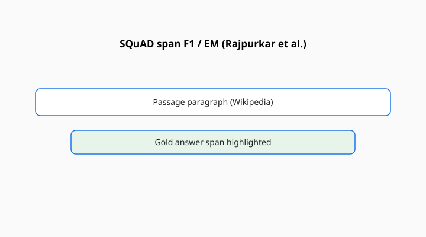

Pranav Rajpurkar, Jian Zhang, Konstantin Lopyrev, and Percy Liang published “SQuAD: 100,000+ Questions for Machine Comprehension of Text” at EMNLP 2016. Stanford. Wikipedia paragraphs. Questions written by crowdworkers. Answers that are spans in the paragraph. Exact match and token F1 against a small set of gold spans.

<!-- figure-pack -->
<figure>
  
  <figcaption><strong>SQuAD (Rajpurkar et al., EMNLP 2016).</strong> Extract a span from a Wikipedia paragraph; exact match and token F1 punish paraphrases that humans would accept.</figcaption>
</figure>

For a few years this was the English question-answering yardstick the way ImageNet was the vision yardstick: a number, a race, a human ceiling printed on the site so you could hear yourself hit it.

## What the 2016 contract was

The answer is in the paragraph. You do not need the rest of the web. You do not need to refuse. You need to highlight. That contract made scoring cheap and made the task smaller than “answering questions.” It is reading as pointing.

F1 forgives a missing article. Exact match does not. Both will punish a correct answer that is not in the gold span list. Both will reward a model that copies a plausible noun phrase and gets lucky. The site’s live leaderboard (the original SQuAD site) made those numbers a sport.

Human performance was estimated from overlapping annotations. When models passed that estimate, the sport needed a new rule.

## SQuAD 2.0, the unanswerable turn

Rajpurkar, Robin Jia, and Liang published “Know What You Don’t Know: Unanswerable Questions for SQuAD” at ACL 2018. Same paragraphs, new questions that look well-formed and have no span. A system that always points will be wrong on a large slice. The new headline is a blend of span accuracy and abstention.

2.0 is the more honest instrument if you care about a reader who sometimes should shut up. It is still a paragraph game. Natural Questions (Kwiatkowski et al., 2019) later asked questions that started from real users, not from a worker reading a paragraph. That is a different door into QA. See [Natural Questions](natural-questions.md).

## An item in the hand

A Wikipedia paragraph about a Super Bowl or a historical figure. A question a worker wrote after reading it. A gold span of a few tokens. Exact match wants those tokens. F1 will forgive “the 1970s” versus “1970s.” Neither will accept a correct paraphrase that is not in the gold list. That sting is why later generative QA needed other judges.

SQuAD 2.0 adds a question that looks well-posed — same style, same paragraph — whose answer is not there. The system should abstain. A pointer that always points will be exposed. A chatbot that always writes will also be exposed if you grade abstention honestly.

The human ceiling on the site was a social object. People trained to beat it. When they did, the instrument had succeeded and expired in the same week.

## What the race did to the field

It produced a decade of architecture papers that can be dated by their SQuAD F1. It also produced a habit of treating “reading comprehension” as span extraction. Dialogue QA, long-document QA, multi-hop (HotpotQA), and open-domain retrieval-plus-read are cousins that had to invent their own names because SQuAD had taken the short one.

The dataset’s Wikipedia source is English, well-edited, and public. Models trained on Wikipedia-heavy crawls are at home here. That is not a scandal. It is a scope.

## How it aged

The original files are saturated for large models in the extractive setup. They remain useful as a teaching tool and as a regression: if you cannot point at a span, your pipeline is broken. They are not useful as a frontier claim.

DROP (Dua et al., NAACL 2019) asked for discrete reasoning over paragraphs — addition, counting, sorting — because pointing was no longer enough. See [DROP](drop.md). The sequel pattern is the same as GLUE to SuperGLUE: when the highlight is easy, change the homework.

## How to read a SQuAD line

Ask 1.1 or 2.0, EM or F1, development or hidden test, and whether the system is extractive or a generative model being shoehorned into a span scorer. A chatbot that writes a sentence and a pointer model that returns offsets are not the same student.

One hundred thousand questions, then a second set that cannot be answered. A human ceiling you could hear approaching. Liang’s group did not need the file to last forever. They needed a shared paragraph and a shared F1. They got both, and then they had to teach the models to abstain.
