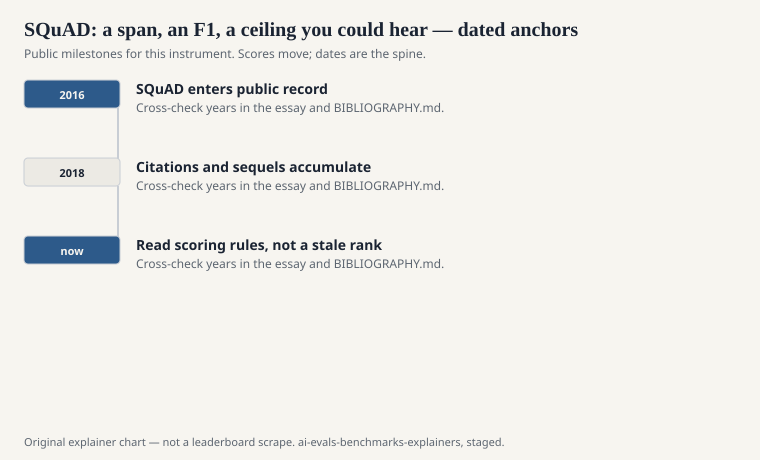
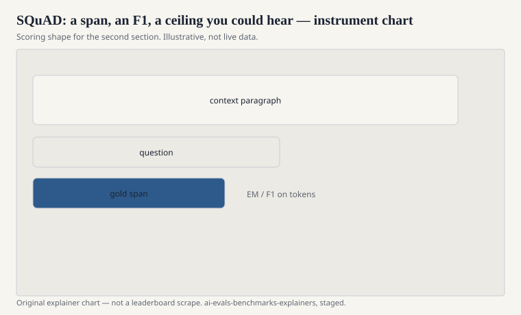

Pranav Rajpurkar, Jian Zhang, Konstantin Lopyrev, and Percy Liang published “SQuAD: 100,000+ Questions for Machine Comprehension of Text” at EMNLP 2016. Stanford. Wikipedia paragraphs. Questions written by crowdworkers. Answers that are spans in the paragraph. Exact match and token F1 against a small set of gold spans.

For a few years this was the English question-answering yardstick the way ImageNet was the vision yardstick: a number, a race, a human ceiling printed on the site so you could hear yourself hit it.

## What the 2016 contract was

<!-- graphics-pack:v1 -->

<figure class="eval-figure">

<figcaption>Figure 1. Dated public anchors for this piece. Years follow the essay; verify against BIBLIOGRAPHY.md before print.</figcaption>
</figure>

## SQuAD 2.0, the unanswerable turn

<!-- graphics-pack:v1 -->

<figure class="eval-figure">

<figcaption>Figure 2. Scoring shape for this instrument — protocol, not a weekly rank.</figcaption>
</figure>

## An item in the hand

A Wikipedia paragraph about a Super Bowl or a historical figure. A question a worker wrote after reading it. A gold span of a few tokens. Exact match wants those tokens. F1 will forgive “the 1970s” versus “1970s.” Neither will accept a correct paraphrase that is not in the gold list. That sting is why later generative QA needed other judges.

SQuAD 2.0 adds a question that looks well-posed — same style, same paragraph — whose answer is not there. The system should abstain. A pointer that always points will be exposed. A chatbot that always writes will also be exposed if you grade abstention honestly.

The human ceiling on the site was a social object. People trained to beat it. When they did, the instrument had succeeded and expired in the same week.

## What the race did to the field

It produced a decade of architecture papers that can be dated by their SQuAD F1. It also produced a habit of treating “reading comprehension” as span extraction. Dialogue QA, long-document QA, multi-hop (HotpotQA), and open-domain retrieval-plus-read are cousins that had to invent their own names because SQuAD had taken the short one.

The dataset’s Wikipedia source is English, well-edited, and public. Models trained on Wikipedia-heavy crawls are at home here. That is not a scandal. It is a scope.

## How it aged

The original files are saturated for large models in the extractive setup. They remain useful as a teaching tool and as a regression: if you cannot point at a span, your pipeline is broken. They are not useful as a frontier claim.

DROP (Dua et al., NAACL 2019) asked for discrete reasoning over paragraphs — addition, counting, sorting — because pointing was no longer enough. See [DROP](drop.md). The sequel pattern is the same as GLUE to SuperGLUE: when the highlight is easy, change the homework.

## How to read a SQuAD line

Ask 1.1 or 2.0, EM or F1, development or hidden test, and whether the system is extractive or a generative model being shoehorned into a span scorer. A chatbot that writes a sentence and a pointer model that returns offsets are not the same student.

One hundred thousand questions, then a second set that cannot be answered. A human ceiling you could hear approaching. Liang’s group did not need the file to last forever. They needed a shared paragraph and a shared F1. They got both, and then they had to teach the models to abstain.
