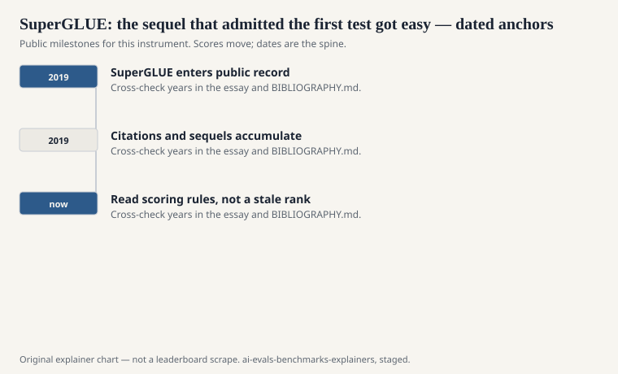
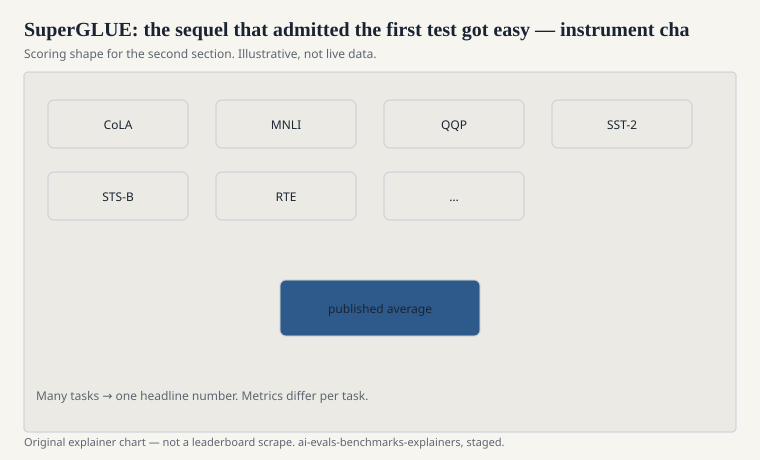

Sequels in evaluation are usually a confession. SuperGLUE is a polite one. Alex Wang, Yada Pruksachatkun, Nikita Nangia, Amanpreet Singh, Julian Michael, Felix Hill, Omer Levy, and Samuel Bowman published “SuperGLUE: A Stickier Benchmark for General-Purpose Language Understanding Systems” at NeurIPS 2019. The title’s adjective is doing work. GLUE had become un-sticky. Models were climbing. The average was losing its ability to hurt.

The authors did not throw GLUE away. They built a smaller, meaner English suite with the same social contract: hidden test labels, a public leaderboard, a single headline number, and a hope that linguistic hardship would return.

## Fewer tasks, more stubborn ones

<!-- graphics-pack:v1 -->

<figure class="eval-figure">

<figcaption>Figure 1. Dated public anchors for this piece. Years follow the essay; verify against BIBLIOGRAPHY.md before print.</figcaption>
</figure>

## What “stickier” meant in 2019

<!-- graphics-pack:v1 -->

<figure class="eval-figure">

<figcaption>Figure 2. Scoring shape for this instrument — protocol, not a weekly rank.</figcaption>
</figure>

## The human ceiling as a character

SuperGLUE’s tables made “human performance” a character in the story. When models later reached or passed that character on the headline average, the sequel had the same problem as the original. The field did not stop. It changed genres: multiple-choice exams (MMLU), preference rooms (Arena), executable tests (HumanEval, SWE-bench). SuperGLUE is the last major moment when “general-purpose language understanding” still meant a pile of English classification tasks with a hidden test server.

If you see a 2024 card reporting SuperGLUE, ask whether anyone still uses the official submission path. Many numbers in the wild are development-set vibes or partial task lists. The paper’s contract was the server.

## What it kept from GLUE

The average. The English-only horizon. The fine-tuning assumption. The diagnostics impulse (SuperGLUE also shipped analysis tools). The NYU-and-friends editorial taste: inference, pronouns, a little common sense, not dialogue, not code, not toxicity.

That taste is not a defect. It is a date. 2019’s “general-purpose” was a sentence about whether one pretrained encoder could be fine-tuned across formats. 2024’s “general-purpose” is a sentence about whether a chatbot can be a colleague. SuperGLUE measures the first sentence. It can only spectate the second.

## How to read it now

Read it as the official admission that GLUE worked. Suites that work get climbed. Climbed suites need sequels or they become folklore. SuperGLUE is the sequel. MMLU is a different sport. HELM is a refusal to keep printing one sport’s average as a worldview.

The stickiness was real for a while. Then the models grew another order of magnitude and the glue — even the super kind — dried in a new way. The paper remains the right citation for the moment the field said, in public, that the first yardstick had become a ruler for a shorter man.
