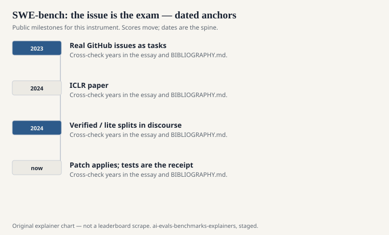
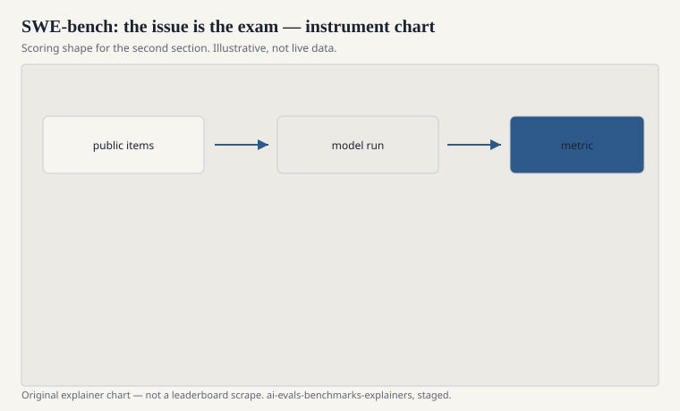

Carlos E. Jimenez, John Yang, Alexander Wettig, Shunyu Yao, Kexin Pei, Ofir Press, and Karthik Narasimhan published “SWE-bench: Can Language Models Resolve Real-world GitHub Issues?” as an ICLR 2024 oral (preprint arXiv:2310.06770). Princeton Language and Intelligence, with Chicago on the line. The hardship is not a docstring. It is a repository at a commit, an issue thread, and a demand for a patch that turns fail-to-pass tests green without breaking the tests that were already green.

The paper’s first public number was small on purpose. Claude 2, in their harness, resolved 1.96 percent of 2,294 issues across 12 popular Python repositories. That integer is a 2023–2024 snapshot. Do not treat it as the live weather. Treat it as the authors saying: this file still hurts.

## How an instance is built

<!-- graphics-pack:v1 -->

<figure class="eval-figure">

<figcaption>Figure 1. Dated public anchors for this piece. Years follow the essay; verify against BIBLIOGRAPHY.md before print.</figcaption>
</figure>

## What “resolved” means

<!-- graphics-pack:v1 -->

<figure class="eval-figure">

<figcaption>Figure 2. Scoring shape for this instrument — protocol, not a weekly rank.</figcaption>
</figure>

## An instance in the hand

An issue in `django` or `scikit-learn` describing a bug in ordinary English, sometimes with a snippet, sometimes with a red herring. The repo is checked out at the parent commit. Tests that the later PR will fix are red. Your agent may grep, read, edit, and run. When it stops, the harness runs the fail-to-pass set and the pass-to-pass set.

A one-line fix that the gold PR also made is a success. A rewrite that happens to go green is also a success. A beautiful patch that misses the test’s exact condition is a failure. Maintainers are not in the loop. The tests are the only reviewer.

Twelve popular Python repos means the field can memorize those twelve personalities. A model that is a Django specialist on this file may be a stranger in a Rust repo. The original paper said software engineering. The file says these twelve.

## Leakage of a special kind

The issues are public. The PRs are public. A code model trained on a 2024 GitHub dump may have seen the answer commit. The authors and later users know this. Filtering by date, hiding tests, or verifying instances by hand are mitigations, not purity. When you read a high number in 2026, ask what the model could have memorized as a pair of (issue, patch).

## Why it reorganized coding evals

Because `pass@k` on a 20-line function had stopped hurting, and because “the model can code” had become a claim about jobs. SWE-bench gave the claim a file. Agent papers needed a file. Companies needed a file they could not immediately saturate with a docstring trick. The incentive is as real as the science.

It also gave the field a new way to cheat in public: tune for the twelve repos, overfit the issue style, or report a subset that is secretly the easy tail. The antidote is the same as everywhere else: name the subset, name the tools (search, execution, browser, multiple attempts), name the date.

## How to read a SWE-bench line

Ask: full, Lite, or Verified? Which repo mix? Which agent scaffold? One shot or a budget of trajectories? Did they run the official Dockered tests? A screenshot of a percentage without a harness is a vibe.

2,294 issues, twelve Python repos, a fail-to-pass key. The ICLR paper asked if language models could resolve real GitHub issues. The honest first answer was: almost none, under that harness, on that date. Later answers are later harnesses. Keep the date on the integer.
