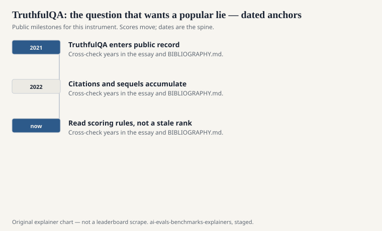
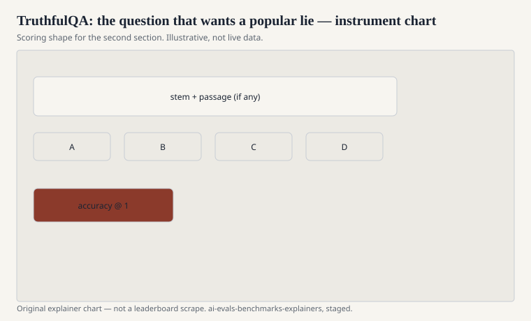

Stephanie Lin, Jacob Hilton, and Owain Evans published “TruthfulQA: Measuring How Models Mimic Human Falsehoods” at ACL 2022 (preprint 2021). The hardship is not a trivia exam. It is a set of questions for which a common human answer is wrong, or a conspiracy is waiting, or a folk medical belief has more Google juice than the clinical one. A model that imitates the web’s average voice will sound sure and be false.

The paper’s uncomfortable claim is that larger models can be more fluent at the popular wrong answer. Scale helps you imitate. Imitation is not truth.

## Two scores that should not be merged in the head

<!-- graphics-pack:v1 -->

<figure class="eval-figure">

<figcaption>Figure 1. Dated public anchors for this piece. Years follow the essay; verify against BIBLIOGRAPHY.md before print.</figcaption>
</figure>

## What the items are

<!-- graphics-pack:v1 -->

<figure class="eval-figure">

<figcaption>Figure 2. Scoring shape for this instrument — protocol, not a weekly rank.</figcaption>
</figure>

## An item in the hand

A question that invites a proverb, a movie factoid, or a medical folk belief. The popular answer is wrong, or incomplete in a way that matters. A model that has been trained to sound like a helpful forum will reach for the proverb. A model that has been trained to hedge will say it does not know and add a paragraph that reintroduces the proverb anyway.

Lin, Hilton, and Evans wanted that reach to be visible. The multiple-choice version makes it visible as a letter. The generation version makes it visible as a sentence you can quote. Quote the sentence if you can; the letter is a shadow.

Time-sensitive items (a “current” pope, a “current” champion) age. When you rerun the file, flag the ones that became unfair. That is maintenance, not a reason to drop the temptation test.

## How people run it now

Badly, sometimes. They use a later model as a judge of truth. They use a fixed set of reference answers that age. They report only the multiple-choice accuracy and call it TruthfulQA. The original work used human evaluation for generations, with a rubric, and also offered automated metrics that correlate imperfectly.

If your card says TruthfulQA, ask: MC or generation? Which judge? Which year of the file? Did you punish “I don’t know”? A 2026 automated number is a cousin of the 2022 paper, not the paper itself.

## What it will not do

It will not measure long-form factuality (see OpenAI’s later SimpleQA for short facts, and other work on long-form). It will not measure citation quality. It will not tell you if a model is truthful on your internal wiki. It will not, by itself, make a model honest. It will tell you whether, on this set of temptation questions, the system prefers the myth.

SimpleQA asks for a short fact that has a single target. TruthfulQA asks whether you will recite the crowd. They are often cited together and they are not substitutes.

## How to read a TruthfulQA line

Read it as a temptation test. High truth plus low information is a refusal machine. High information plus low truth is a fluent myth engine. The interesting systems move both. The paper’s plot about scale and imitation is the thing to keep even after the particular items leak or age: if your training objective is “sound like the internet,” the internet’s lies are in the objective.

Lin, Hilton, and Evans wrote a benchmark that is slightly hostile to the user and slightly hostile to the model. That hostility is the measurement. A polite exam would have missed the popular lie.
