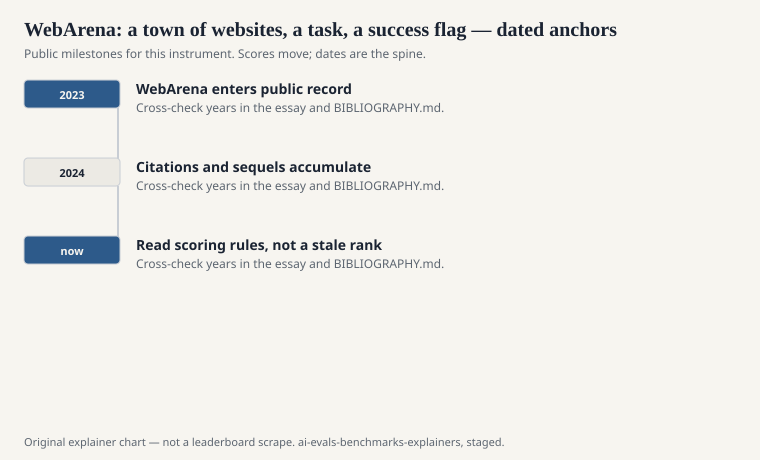
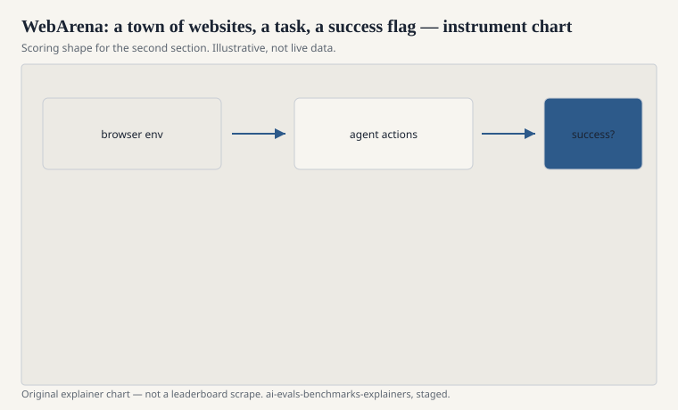

Shuyan Zhou, Frank F. Xu, Hao Zhu, Xuhui Zhou, Robert Lo, Abishek Sridhar, Xianyi Cheng, Tianyue Ou, Yonatan Bisk, Daniel Fried, Uri Alon, and Graham Neubig published “WebArena: A Realistic Web Environment for Building Autonomous Agents” (ICLR 2024; preprint arXiv:2307.13854). Carnegie Mellon and collaborators. The hardship is not a screenshot quiz. It is a self-hosted bundle of sites — shopping, a forum, a GitLab-like service, a map, a content-management stack — and a natural-language task that wants you to click, type, and finish.

The environment is the benchmark. If you run the same words against the live internet, you have built a different, noisier instrument.

## Why a fake town

<!-- graphics-pack:v1 -->

<figure class="eval-figure">

<figcaption>Figure 1. Dated public anchors for this piece. Years follow the essay; verify against BIBLIOGRAPHY.md before print.</figcaption>
</figure>

## How success is scored

<!-- graphics-pack:v1 -->

<figure class="eval-figure">

<figcaption>Figure 2. Scoring shape for this instrument — protocol, not a weekly rank.</figcaption>
</figure>

## A task in the town

“Find the cheapest item in this category that is in stock and add it to the cart.” “Post a follow-up on this issue if the last comment is older than a week.” “Update the store’s return policy page to mention the new window.” The validator looks at the cart, the comment thread, the CMS. A fluent diary of what the agent *meant* to do is worth zero if the flag did not flip.

Observation type changes the student. An accessibility tree is a gift to a language model. A screenshot is a gift to a vision encoder and a headache to a planner. Raw HTML is a swamp. Zhou’s paper is explicit that the action space is part of the bench. Cards that omit it are omitting the bench.

Reset is the scientific luxury. You can start the same task from a clean town a hundred times. The real web will not do that for you. Quote the luxury when you quote the number.

## What the tasks want

They want planning that survives a wrong click. They want to read a page that was not written as a prompt. They want to remember a constraint from the user’s sentence when the UI offers distractions. They do not want a proof. They do not want a GitHub patch in twelve real repos (that is SWE-bench). They want a session in a town.

## Safety leftover

An agent that can post, purchase, and edit is an agent that can spam, mis-buy, and deface. WebArena’s town is a sandbox. The skill you measure will transfer to places that are not. This explainer will not provide recipes. The paper’s own discussion of autonomous web agents is the citation for the risk at the level of institutions and published tasks.

## How to read a WebArena line

Which task split, which observation type, how many actions allowed, success rate versus a partial-credit cousin, and whether the town’s version matches the paper. If the card says “web agent” and the eval was a few hand-written live URLs, it is not WebArena.

A town, a task, a flag in the database. Zhou and Neubig’s group built a place you can reset. Resettable is the reason the number can be science. Not-the-real-web is the reason the number cannot be a deployment certificate.
