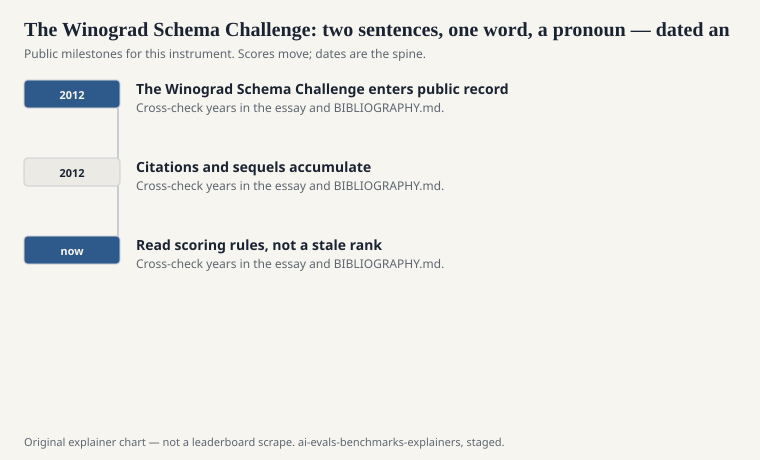
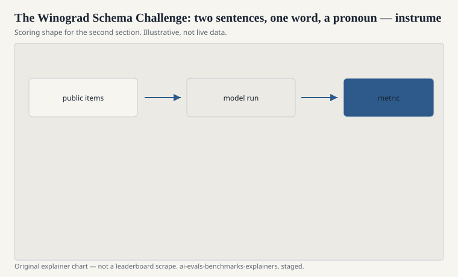

Hector J. Levesque, Ernest Davis, and Leora Morgenstern published “The Winograd Schema Challenge” in 2012 (KR 2012; a widely cited technical report sits beside the proceedings version). The hardship is tiny and handmade. A pair of sentences. A pronoun. One word changed — “because he was so *strong*” versus “because he was so *weak*” — and the pronoun’s referent flips. A statistical system that has not met the world should not know why.

They offered it as an alternative to a loose reading of Turing’s imitation game: less chat, more a crisp test of commonsense that language happens to carry.

## Why a schema

<!-- graphics-pack:v1 -->

<figure class="eval-figure">

<figcaption>Figure 1. Dated public anchors for this piece. Years follow the essay; verify against BIBLIOGRAPHY.md before print.</figcaption>
</figure>

## An item in the hand

<!-- graphics-pack:v1 -->

<figure class="eval-figure">

<figcaption>Figure 2. Scoring shape for this instrument — protocol, not a weekly rank.</figcaption>
</figure>

## What happened to the challenge

It became a noun that other people scaled. WNLI in GLUE recast a sliver and then leaked. SuperGLUE’s WSC sat closer to the original mood. WinoGrande (Sakaguchi et al., AAAI 2020) built a factory of pronoun problems and filtered them so BERT-era models could not coast. If you want N, use WinoGrande. If you want the philosophical object, use Levesque.

Commonsense-as-pronoun is also a narrow object. It does not measure science, ethics, or planning. It measures whether “it” has a world behind it. That was enough for a 2012 argument. It was not enough for a 2024 model card, except as history.

## Turing, without the costume

Levesque’s worry was that a chatty imitation test rewards performance and evasion. A schema rewards a single, checkable commonsense choice. The field, later, built chat rooms anyway (Arena) and exam piles anyway (MMLU). The schema did not lose because it was wrong. It lost because it was small, and because the field wanted numbers that could fill a table.

Both instincts can be right. A handmade pair can still embarrass a system that talks like a person and cannot flip the pronoun. Run the original items if you can do so without pretending they are a large-N law.

## How to read a “Winograd” line

If the N is tens of thousands, it is WinoGrande. If the N is tiny and the citation is 2012, it is the Challenge. If the split is WNLI, it is GLUE’s scar. Say which. The pronoun is the same. The instrument is not.

A common mis-citation is to treat a modern LLM’s perfect score on the original handful as news about commonsense. It may be news about the internet’s memory of a famous exam. If you want N and a filter, go to WinoGrande. If you want the 2012 argument, keep the argument small.

Two sentences. One word. A referent that flips because the world does. Levesque, Davis, and Morgenstern wrote a small exam and asked the field not to confuse talk with sense. The field still confuses them. The schemas are still there, waiting for a careful citation.
