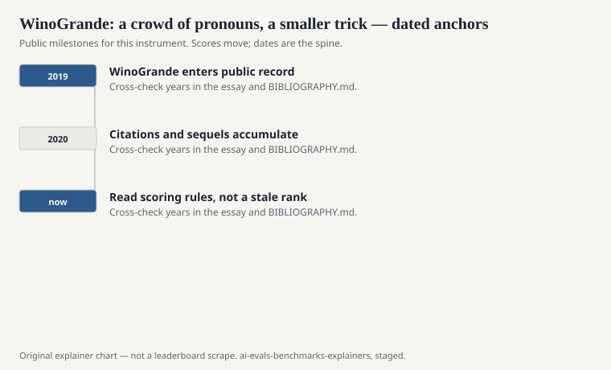
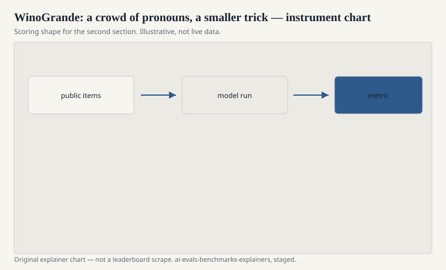

Hector Levesque’s Winograd Schema Challenge (2012) was a small, carefully written set of pronoun problems: two sentences, one word flipped, “it” pointing at a different noun because the world works that way. The set was tiny. Tiny sets die of overfitting and of fame. Keisuke Sakaguchi, Ronan Le Bras, Chandra Bhagavatula, and Yejin Choi published “WinoGrande: An Adversarial Winograd Schema Challenge at Scale” at AAAI 2020 (preprint 2019). Allen Institute for AI. They tried to keep the pronoun trick and lose the smallness.

## What an item is

<!-- graphics-pack:v1 -->

<figure class="eval-figure">

<figcaption>Figure 1. Dated public anchors for this piece. Years follow the essay; verify against BIBLIOGRAPHY.md before print.</figcaption>
</figure>

## Scale versus craft

<!-- graphics-pack:v1 -->

<figure class="eval-figure">

<figcaption>Figure 2. Scoring shape for this instrument — protocol, not a weekly rank.</figcaption>
</figure>

## What it measures

A narrow slice of commonsense: who did what to whom, when grammar is not enough. It does not measure science. It does not measure ethics. It does not measure whether the model can explain the choice. Accuracy on a binary referent is the whole score.

Because many items touch gender, occupation, and everyday roles, a model can pick up social stereotypes and call them commonsense. That is a known weather on pronoun tasks (see WinoBias and Winogender, which were built to measure that weather rather than to ignore it). WinoGrande is not primarily a bias benchmark. It is also not innocent of the same structure.

## An item in the hand

“The trophy does not fit in the suitcase because it is too [large/small].” What is *it*? The original Winograd mood is that flip. WinoGrande’s crowd items are often a bit looser: a workplace, a kitchen, a playground, two candidate nouns, a pronoun. After filtering, the leftover items are the ones a 2019 model could not do with a cheap overlap trick.

The factory shows. Some sentences are elegant. Some are the sentence a tired crowdworker writes at the end of a batch. Both count. When a modern model fails, read the item aloud. If a person would also hesitate, you have found annotation weather, not a commonsense crisis.

Gender and occupation still sneak in as “commonsense.” If your product claim is fairness, run BBQ or Winogender beside this file. WinoGrande will not do that job unless you slice it yourself.

## How it aged

Like HellaSwag, it became a harness default and then a climbed wall. A high WinoGrande accuracy in 2025 is expected of a general model. A low one is a smell. The interesting use is diagnostic: which items still fail, and do they fail because the commonsense is rare or because the item is badly written?

## How to read it

Name the split (the paper’s various training sizes were part of the original study; evaluation cards should use the published test). Do not confuse it with Levesque 2012. Do not call it “reasoning” without the pronoun noun. It is a large, filtered, binary coreference-with-commonsense test. The grande is the point. The Wino- is the inheritance. Keep both halves of the name.

A common mis-citation is a table header that says “Winograd” and a number that can only be WinoGrande’s N. The header should say WinoGrande. The 2012 challenge is still allowed to keep its small, handmade dignity.
