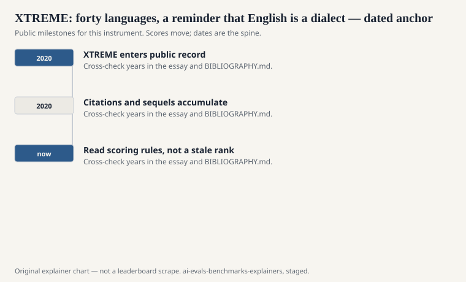
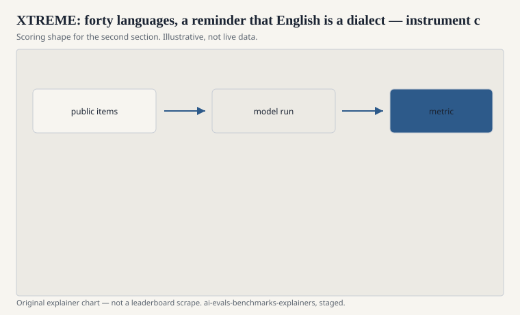

Junjie Hu, Sebastian Ruder, Aditya Siddhant, Graham Neubig, Orhan Firat, and Melvin Johnson published “XTREME: A Massively Multilingual Multi-task Benchmark for Evaluating Cross-lingual Generalization” at ICML 2020. Google, DeepMind, CMU. The hardship is not a new English exam. It is a demand that the same model, or the same recipe, be compared on many languages at once: classification, structure, question answering, retrieval — tasks the paper selects from already-public sets, aligned so that “we ran XNLI” is not the whole story.

The English-only habit of GLUE had become, by 2020, an embarrassment that still printed well. XTREME is one of the public files that made the embarrassment visible in a table.

## What it bundles

<!-- graphics-pack:v1 -->

<figure class="eval-figure">

<figcaption>Figure 1. Dated public anchors for this piece. Years follow the essay; verify against BIBLIOGRAPHY.md before print.</figcaption>
</figure>

Cross-lingual versions of familiar sports: XNLI (Conneau et al.) for inference, named-entity recognition in several languages, POS tagging, a QA set (including TyDi QA’s neighborhood and XQuAD), and retrieval. The languages in the original suite number forty in the paper’s accounting, chosen to span families and resource levels — not equally, because the world of annotated data is not equal.

The scientific question is transfer. Train on English, test on Swahili. Train on many, test on one you held out. A number that is only English has no place to hide.

## What “massively multilingual” cannot hide

<!-- graphics-pack:v1 -->

<figure class="eval-figure">

<figcaption>Figure 2. Scoring shape for this instrument — protocol, not a weekly rank.</figcaption>
</figure>

Forty is not seven thousand. The suite is still a convenience sample of languages with enough existing annotation to support a task. Low-resource does not mean “the languages Google has not productized.” It means “the languages in this table with less data.” A model that looks even across XTREME can still be useless in a language that never had a NER file.

Scripts, morphology, and code-switching will punish a tokenizer that was built for English spaces. Those failures are data. They should appear in the per-language table, not in an average that lets German rescue a collapse elsewhere.

## An item in the hand

Take XNLI. An English premise and hypothesis, then the same pair in Arabic, Swahili, Urdu. The label should not change because the language did. A model that is excellent on the English row and at chance on the Swahili row is not “an NLI model.” It is an English model that was invited to a multilingual table. Hu and Ruder’s suite exists so that row is visible.

Or take a named-entity span in a morphologically rich language. The entity is not a capitalized two-word phrase. A tokenizer that chops the stem from the case ending will look drunk. That failure is more informative than another English GLUE tenth of a point.

Translate-test — translate the foreign item into English, run your English model, translate back if needed — is a legitimate baseline the paper and its cousins discuss. It is also a confession that the “multilingual model” might be a translation pipeline in a trench coat. Name it if you used it.

## Descendants

XTREME-R (Ruder et al.) and later multilingual suites (including MEGA, and the various “M” prefixes on MMLU-style exams) are sequels. MGSM (Shi et al., ICLR 2023) takes the GSM8K idea across languages. MMMLU-style releases take the exam idea across languages. If you ran those, say those. XTREME is the 2020 bundle that made the multi-task, multi-language card a thing.

## How to read an XTREME line

Per-language, per-task, and the transfer protocol (zero-shot cross-lingual versus translate-train versus multilingual fine-tune). An average of forty languages is a political object, like the GLUE average. It is useful as a headline and a liar as a diagnosis.

Hu and Ruder’s group did not need to invent new English puzzles. They needed to stop letting one dialect impersonate language. The table is the argument. Print the table.

A common mis-citation is to say “we evaluated multilinguality” and then report only XNLI-en. That is an English inference number wearing a cosmopolitan coat. If the other thirty-nine languages are missing, take the coat off. Resource level is not a vibe: name the low-resource rows when you claim transfer, and name the transfer recipe (zero-shot cross-lingual, translate-train, or multilingual fine-tune) every time.
