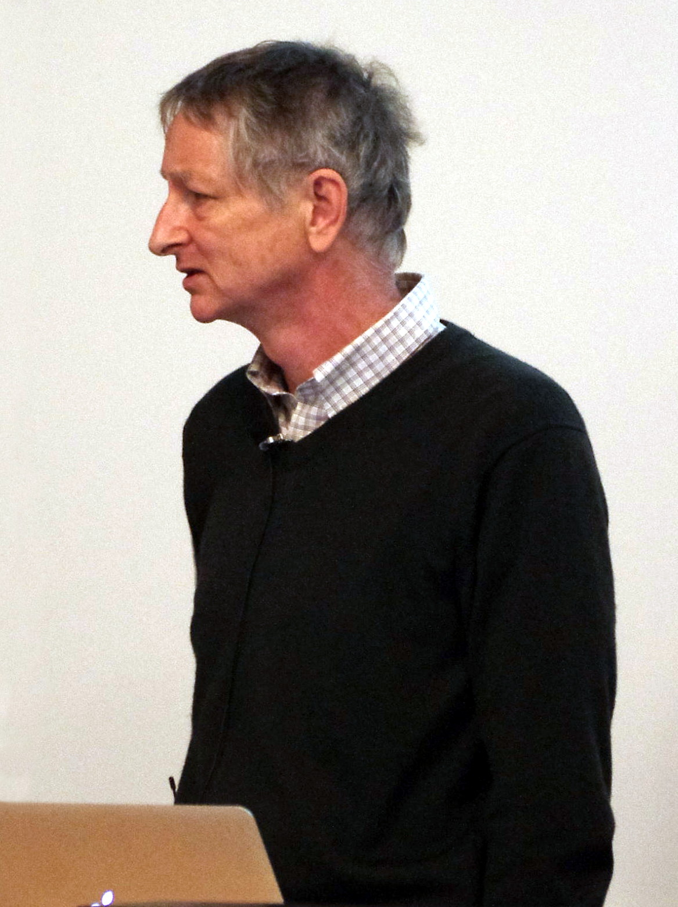

# Photo notes

How this series treats faces.

## Rule

A historical portrait in this folder is either (a) a file we may redistribute under a documented public-domain or Creative Commons (or equivalent museum/government) license, or (b) a **labeled placeholder that is not a photograph**. There is no third option.

We do not commission or accept model-generated “period” faces. A synthetic Turing or McCulloch passed off as a likeness is a forgery, even if the caption hedges.

## Preference order

1. Public domain (U.S. government work; expired copyright; PD-old paintings)
2. Creative Commons with clear author and license URL (BY, BY-SA)
3. Museum or national-lab terms that explicitly allow redistribution with credit (e.g. LANL badge-photo notice)
4. Labeled placeholder

## What we downloaded

Files live in `assets/portraits/`. Full bibliographic rows are in `PORTRAIT_SOURCES.md`. Downloads were taken from Wikimedia Commons original URLs in September 2026, with license metadata from the Commons API (`extmetadata`).

Some Commons files are small scans (Wiener; Michie; the 1958 Newell–Simon chess print). We keep the authentic file rather than “enhancing” it.

## Placeholders

These figures did not have a Commons file we could treat as a clear redistributable solo likeness at staging time:

| Slug | Person | File |
| --- | --- | --- |
| `warren-mcculloch` | Warren S. McCulloch | `assets/portraits/warren-mcculloch.placeholder.svg` |
| `terry-winograd` | Terry Winograd | `assets/portraits/terry-winograd.placeholder.svg` |
| `kunihiko-fukushima` | Kunihiko Fukushima | `assets/portraits/kunihiko-fukushima.placeholder.svg` |
| `allen-newell` | Allen Newell | `assets/portraits/allen-newell.placeholder.svg` |

The SVG says, in words, that it is not a photograph. Walter Pitts appears in a licensed group photograph (`walter-pitts.jpg`, with Jerome Lettvin); McCulloch still has no solo file here.

## Pair portraits

- **Newell & Simon:** The Commons “1958 chess” file is an AAAI anniversary graphic (type burned in). Retired to `assets/retired/`. Use `herbert-simon.jpg` (Rappaport **painting**, 1986, CC BY 3.0) and `allen-newell.placeholder.svg`.
- **McCulloch & Pitts:** Pitts with Lettvin (`walter-pitts.jpg`, real photograph); McCulloch placeholder.
- **Ada Lovelace:** 19th-century painted likeness (Chalon), public domain — a portrait of a historical person, not a photograph.

## Caution flags (do not silently “fix”)

- **John von Neumann** badge photo: Los Alamos National Laboratory terms require the LANL/LANS notice reproduced in `PORTRAIT_SOURCES.md`. Not a generic “public domain, no credit” file.
- **Newell–Simon Commons chess file:** Not used as a portrait. It is a commemorative graphic. See `assets/retired/README.md`.
- **Herbert Simon `herbert-simon.jpg`:** A painting by Richard Rappaport (1986), photographed; caption must say painting.
- **Frank Rosenblatt:** scan released on Commons as CC BY-SA 4.0 via the Heinz Nixdorf MuseumsForum blog. Treat as museum-released, not as a 1950s newspaper work we independently cleared.
- **Living people:** conference and press photographs (Hinton, LeCun, Bengio, Pearl, Li, Hassabis, Gebru, Dwork, Ng, Boden). Credit the photographer. Do not crop out watermarks that are part of the licensed file; our copies are the Commons originals.

## Captions

Body captions name the person, the occasion or year if known, and the license in italics underneath. Example:

```markdown


*Credit: Eviatar Bach. CC BY-SA 3.0. Wikimedia Commons: File:Geoffrey Hinton at UBC.jpg.*
```

## Later replacements

If a better PD or CC file appears (a documented McCulloch studio portrait; a Fukushima lecture still with a conference CC release), replace the placeholder, update `PORTRAIT_SOURCES.md`, and change `portrait_status` in the article front matter. Do not replace a licensed historical photograph with a generated image.
