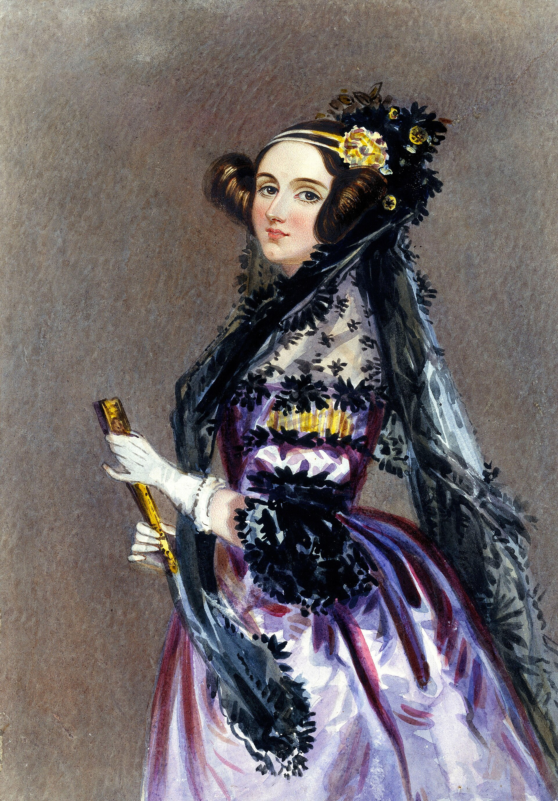

# Portrait sources — AI history retrospective

Rights-hunt pass: 14 September 2026. Independently re-queried Wikimedia Commons `imageinfo.extmetadata` before download. Thumbs capped at 1400 px wide.

**Status key:** `cleared` = redistribution allowed under the stated license. `caution` = license string is allowlisted but provenance is thin or jurisdiction-limited. `placeholder` = no photograph downloaded.

No generative “historical faces.” A placeholder SVG is labeled *Not a photograph*.

| Slug | Person | File | Source URL | License | Author / artist | Credit | Status |
|------|--------|------|------------|---------|-----------------|--------|--------|
| ada-lovelace | Ada Lovelace | `assets/portraits/ada-lovelace.jpg` | https://commons.wikimedia.org/wiki/File:Ada_Lovelace_portrait.jpg | Public domain | Alfred Edward Chalon | Science Museum Group; painted likeness c. 1840 | cleared |
| alan-turing | Alan Turing | `assets/portraits/alan-turing.jpg` | https://commons.wikimedia.org/wiki/File:Alan_Turing_(1912-1954)_in_1936_at_Princeton_University.jpg | Public domain (U.S.; Commons: 1931–1963, copyright not renewed) | Unknown photographer | Princeton University Archives card photograph, 1936 | caution |
| claude-shannon | Claude Shannon | `assets/portraits/claude-shannon.jpg` | https://commons.wikimedia.org/wiki/File:ClaudeShannon_MFO3807.jpg | CC BY-SA 2.0 DE | Konrad Jacobs | MFO photo id 3807 | cleared |
| norbert-wiener | Norbert Wiener | `assets/portraits/norbert-wiener.jpg` | https://commons.wikimedia.org/wiki/File:Norbert_wiener.jpg | CC BY-SA 2.0 DE | Konrad Jacobs | MFO photo id 4520 | cleared |
| john-von-neumann | John von Neumann | `assets/portraits/john-von-neumann.jpg` | https://commons.wikimedia.org/wiki/File:John_von_Neumann_Los_Alamos_identity_badge_photo.jpg | LANL / LANS attribution (redistribution with notice) | Los Alamos Laboratory | Project Y badge photo, c. 1943–1947; LA-UR-22-25508. Reproduce the LANL notice below. | cleared |
| john-mccarthy | John McCarthy | `assets/portraits/john-mccarthy.jpg` | https://commons.wikimedia.org/wiki/File:John_McCarthy_Stanford.jpg | CC BY-SA 2.0 | Flickr user “null0” | Stanford, 13 May 2006; Flickr 272015955 | caution |
| marvin-minsky | Marvin Minsky | `assets/portraits/marvin-minsky.jpg` | https://commons.wikimedia.org/wiki/File:Marvin_Minsky_at_OLPCb.jpg | CC BY 3.0 | Sethwoodworth (en.wikipedia uploader) | OLPC event; transferred to Commons 2008 | cleared |
| newell-simon | Allen Newell & Herbert A. Simon | `assets/portraits/newell-simon.jpg` | https://commons.wikimedia.org/wiki/File:Herbert_A._Simon_and_Allen_Newell_Chess_Match.jpg | Public domain (Commons label; Flickr provenance is thin) | Paolo Massa (Flickr upload) | Dated 1958 on Commons | caution |
| herbert-simon | Herbert A. Simon | `assets/portraits/herbert-simon.jpg` | https://commons.wikimedia.org/wiki/File:Herbert_simon_tan_d.jpg | CC BY 3.0 | Richard Rappaport | Painting/photograph dated 1986 on Commons | cleared |
| edward-feigenbaum | Edward A. Feigenbaum | `assets/portraits/edward-feigenbaum.jpg` | https://commons.wikimedia.org/wiki/File:27._Dr._Edward_A._Feigenbaum_1994-1997.jpg | Public domain (U.S. Air Force work) | United States Air Force | Chief Scientist portrait, 1 Dec 1994 | cleared |
| david-rumelhart | David E. Rumelhart | `assets/portraits/david-rumelhart.jpg` | https://commons.wikimedia.org/wiki/File:DavidRumelhart-IJCNNseattle1991-07-08.jpg | CC BY-SA 4.0 | Rolf Kickuth | IJCNN Seattle, 8 July 1991 | cleared |
| geoffrey-hinton | Geoffrey E. Hinton | `assets/portraits/geoffrey-hinton.jpg` | https://commons.wikimedia.org/wiki/File:Geoffrey_Hinton_at_UBC.jpg | CC BY-SA 3.0 | Eviatar Bach | Lecture, University of British Columbia, 30 May 2013 | cleared |
| yann-lecun | Yann LeCun | `assets/portraits/yann-lecun.jpg` | https://commons.wikimedia.org/wiki/File:Yann_LeCun_-_2018_(cropped).jpg | CC BY-SA 2.0 | Jérémy Barande | École polytechnique / DATAIA, 25 June 2018 | cleared |
| yoshua-bengio | Yoshua Bengio | `assets/portraits/yoshua-bengio.jpg` | https://commons.wikimedia.org/wiki/File:Yoshua_Bengio_2019.jpg | CC BY 4.0 | Maryse Boyce | 18 March 2019 | cleared |
| john-hopfield | John J. Hopfield | `assets/portraits/john-hopfield.jpg` | https://commons.wikimedia.org/wiki/File:John_Hopfield_2016.jpg | CC BY 3.0 | bhadeshia123 | Still from a March 2016 symposium lecture | cleared |
| judea-pearl | Judea Pearl | `assets/portraits/judea-pearl.jpg` | https://commons.wikimedia.org/wiki/File:Judea_Pearl_at_NIPS_2013_(11781981594).jpg | CC BY 2.0 | Better Than Bacon | NIPS 2013, 6 Dec 2013 | cleared |
| frank-rosenblatt | Frank Rosenblatt | `assets/portraits/frank-rosenblatt.jpg` | https://commons.wikimedia.org/wiki/File:Frank_Rosenblatt.jpg | CC BY-SA 4.0 | Anonymous; museum release | Heinz Nixdorf MuseumsForum blog scan | caution |
| joseph-weizenbaum | Joseph Weizenbaum | `assets/portraits/joseph-weizenbaum.jpg` | https://commons.wikimedia.org/wiki/File:Joseph_Weizenbaum.jpg | CC BY-SA 3.0 | Ulrich Hansen | 11 February 2005 | cleared |
| seymour-papert | Seymour Papert | `assets/portraits/seymour-papert.jpg` | https://commons.wikimedia.org/wiki/File:Seymour_Papert.jpg | CC BY-SA 3.0 | Matematicamente.it | From a 2014 CC textbook scan | cleared |
| karen-sparck-jones | Karen Spärck Jones | `assets/portraits/karen-sparck-jones.jpg` | https://commons.wikimedia.org/wiki/File:Karen_Sp%C3%A4rck.jpg | CC BY 2.5 | Markus Kuhn | University of Cambridge attribution on Commons | cleared |
| walter-pitts | Walter Pitts (with Jerome Lettvin) | `assets/portraits/walter-pitts.jpg` | https://commons.wikimedia.org/wiki/File:Lettvin_Pitts.jpg | CC BY-SA 3.0 | Iapx86 (family-album upload) | Group photograph; not a McCulloch portrait | cleared |
| lotfi-zadeh | Lotfi A. Zadeh | `assets/portraits/lotfi-zadeh.jpg` | https://commons.wikimedia.org/wiki/File:Lotfi_Zadeh2005_1.jpg | CC BY-SA 4.0 | BBR100 | Dated 2005 on Commons | cleared |
| raj-reddy | Raj Reddy | `assets/portraits/raj-reddy.jpg` | https://commons.wikimedia.org/wiki/File:ProfReddys_Photo_Cropped.jpg | CC BY-SA 3.0 | Vishnugsr | Hyderabad, 9 Oct 2011 | cleared |
| alexey-ivakhnenko | Alexey G. Ivakhnenko | `assets/portraits/alexey-ivakhnenko.gif` | https://commons.wikimedia.org/wiki/File:Alexey_Ivakhnenko.gif | CC BY-SA 4.0 | Ynosa | Commons upload 28 March 2016 | cleared |
| donald-michie | Donald Michie | `assets/portraits/donald-michie.jpg` | https://commons.wikimedia.org/wiki/File:Donald_Michie_1986.jpg | CC BY-SA 3.0 | Petermowforth | 1 November 1986 | cleared |
| grace-hopper | Grace M. Hopper | `assets/portraits/grace-hopper.jpg` | https://commons.wikimedia.org/wiki/File:Commodore_Grace_M._Hopper,_USN_(covered).jpg | Public domain (U.S. Navy) | James S. Davis | DN-SC-84-05971, 20 January 1984 | cleared |
| fei-fei-li | Fei-Fei Li | `assets/portraits/fei-fei-li.jpg` | https://commons.wikimedia.org/wiki/File:Fei-Fei_Li_at_AI_for_Good_2017.jpg | CC BY 2.0 | ITU Pictures | AI for Good, 8 June 2017 | cleared |
| demis-hassabis | Demis Hassabis | `assets/portraits/demis-hassabis.jpg` | https://commons.wikimedia.org/wiki/File:Demis_Hassabis_Royal_Society.jpg | CC BY-SA 4.0 | Duncan.Hull | Royal Society, 13 July 2018 | cleared |
| margaret-boden | Margaret A. Boden | `assets/portraits/margaret-boden.jpg` | https://commons.wikimedia.org/wiki/File:Margaret_Boden_01.JPG | CC BY-SA 4.0 | Bengt Oberger | 9 December 2015 | cleared |
| cynthia-dwork | Cynthia Dwork | `assets/portraits/cynthia-dwork.jpg` | https://commons.wikimedia.org/wiki/File:Cynthia_Dwork_lectures_at_Harvard_Kennedy_School.jpg | CC BY 2.0 | Edmond J. Safra Center for Ethics | Harvard Kennedy School, 29 Nov 2018 | cleared |
| timnit-gebru | Timnit Gebru | `assets/portraits/timnit-gebru.jpg` | https://commons.wikimedia.org/wiki/File:Timnit_Gebru_crop.jpg | CC BY 2.0 | TechCrunch | TechCrunch Disrupt SF, 7 Sept 2018 | cleared |
| andrew-ng | Andrew Ng | `assets/portraits/andrew-ng.jpg` | https://commons.wikimedia.org/wiki/File:Andrew_Ng_at_TechCrunch_Disrupt_SF_2017.jpg | CC BY 2.0 | TechCrunch | TechCrunch Disrupt SF, 20 Sept 2017 | cleared |

## Placeholders (not photographs)

| Slug | Person | File | Why |
|------|--------|------|-----|
| warren-mcculloch | Warren S. McCulloch | `assets/portraits/warren-mcculloch.placeholder.svg` | Illinois Archives photo (c. 1969, ID 0011113) exists; **copyright holder unknown**. No Commons solo likeness with a clear redistribution license. |
| terry-winograd | Terry Winograd | `assets/portraits/terry-winograd.placeholder.svg` | Living person. No photographer-granted Commons portrait located. |
| kunihiko-fukushima | Kunihiko Fukushima | `assets/portraits/kunihiko-fukushima.placeholder.svg` | Living person. No photographer-granted Commons portrait located. |

## LANL notice (von Neumann badge photo)

Los Alamos National Laboratory requires attribution. Information authored by employees of Los Alamos National Security, LLC, under Contract No. DE-AC52-06NA25396 with the U.S. Department of Energy may be copied if this notice and the statement of authorship are reproduced. Neither the Government nor LANS warrants the information. Credit: Los Alamos Laboratory / LANL, John R. von Neumann badge photo, Project Y.

## Caption formula

```markdown


*Credit: Alfred Edward Chalon. Public domain. Wikimedia Commons: File:Ada Lovelace portrait.jpg.*
```
