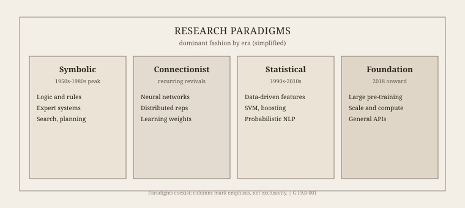

The 1955 Dartmouth proposal is eight typed pages and a conjecture. This series is not those pages again. It is a magazine walk from calculating engines that were never funded, through labs that were, through winters that were accounting events, to the public language-model years that ended up in newspapers and in a European regulation. The last dated objects here are public: papers, prizes, a statute. Nothing private.

Three figures sit under the walk. They are schematics, not proofs. The timeline compresses a century. The paradigm columns overlap in life and are drawn as if they did not. The winter–summer band is qualitative — the caption says so.

*Figure 1. Eras of artificial intelligence — anchor timeline for the retrospective series. G-ERA-001.*

*Figure 2. Dominant paradigms in historical sequence (overlaps simplified). G-PAR-001.*

*Figure 3. AI winters and summers — illustrative schematic, not to scale. G-WIN-001.*

How to read the rest: era essays first if you want weather; profiles if you want a person and a paper. The index is the table of contents. Graphics live under `assets/` with the slugs assigned in `GRAPHICS_INDEX.md`. Portraits are either a documented raster or a labeled placeholder. No generated historical faces.

The series title is *History of AI — Retrospective*. The graphics pack calls the same tree *Long Term History of AI*. They are one folder.
