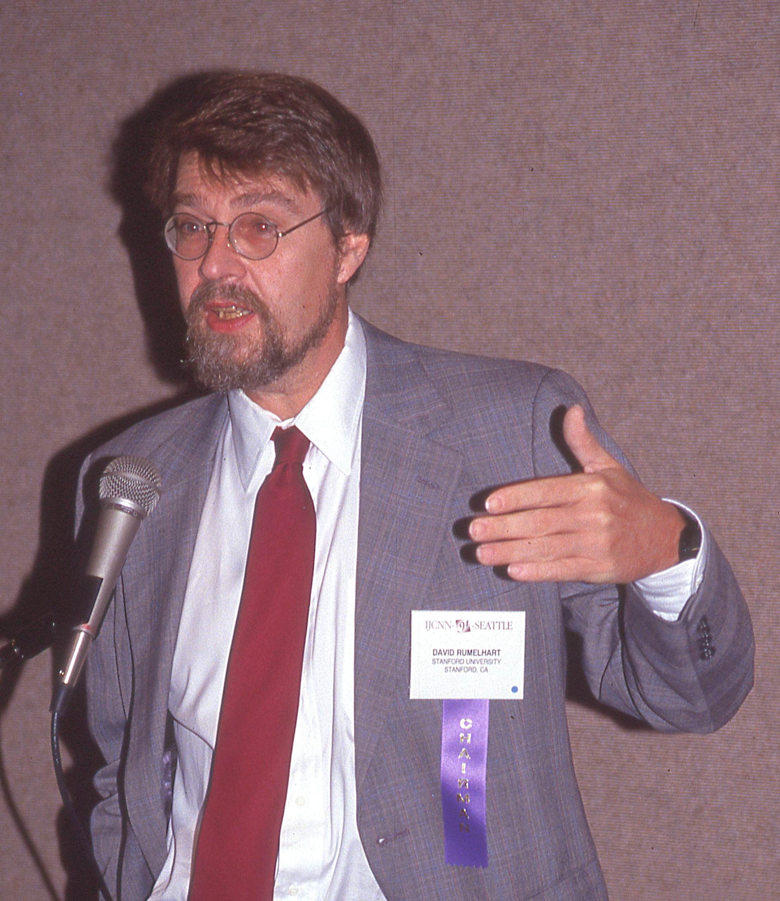

On 9 October 1986, *Nature* published a three-page letter: David Rumelhart, Geoffrey Hinton, and Ronald Williams, “Learning Representations by Back-Propagating Errors.” The algorithm was not new in every particular. Paul Werbos had described a related idea in a 1974 Harvard thesis. Others had pieces of the chain rule for networks. What the *Nature* letter did was put a compact, usable form into a journal that bench scientists actually held in their hands.

*Credit: Rolf Kickuth. CC BY-SA 4.0. File:DavidRumelhart-IJCNNseattle1991-07-08.jpg.*

## Hopfield’s 1982 paper

Four years earlier, John Hopfield’s *PNAS* article of 1982 had given physicists a neural network they could treat as a dynamical system with an energy. Memories as attractors; noise as temperature. The paper licensed a migration. Statistical mechanics people suddenly had a stake in “brain-like” computation. The 2024 Nobel Prize in Physics, awarded to Hopfield and Hinton, is the long echo of that migration, not a claim that the 1982 net was a large language model.

## Two volumes on a desk

The same year as the *Nature* letter, MIT Press issued *Parallel Distributed Processing*, edited by Rumelhart, James McClelland, and the PDP Research Group. The books are a manifesto with homework: past tense, word recognition, distributed representations, a refusal to treat the mind as a Lisp console. They sold into psychology departments as well as computer science.

At Bell Labs and in Paris, Yann LeCun was already pushing convolutional nets toward handwritten digits. In Montréal, Yoshua Bengio would spend the 1990s and 2000s on sequences and language. The “revival” was not a single campus. It was a set of people who had kept working when the 1970s grant weather was ugly.

## Why it did not immediately take over

Backpropagation on 1986 hardware, with 1986 datasets, overfit and crawled. Support-vector machines and boosted trees would win many practical contests in the 1990s. The connectionist return is therefore not a straight line to AlexNet. It is a restoration of permission: you may again treat learning as adjustment of many numbers, and you may again say “representation” without meaning a hand-built frame.

Ivakhnenko’s earlier GMDH nets, and Fukushima’s neocognitron, complicate any English-only origin story. The 1986 event is real. It is not the only event.
