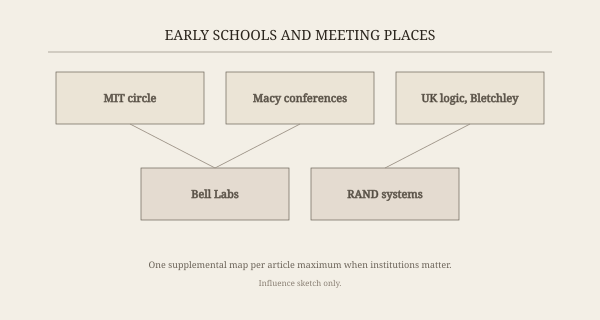

In 1943, Arturo Rosenblueth, Norbert Wiener, and Julian Bigelow published “Behavior, Purpose and Teleology” in *Philosophy of Science*. They wanted a word for machines and animals that steer. A thermostat does not “want” warmth in a human sense. It closes a loop. Wartime anti-aircraft work had made the loop urgent: a gun predicting a plane, a plane jinking, both of them systems with lag.

*Credit: Konrad Jacobs / Mathematisches Forschungsinstitut Oberwolfach. CC BY-SA 2.0 DE. File:Norbert wiener.jpg.*

*Figure 1. Early schools and meeting places — the Macy years sit on this sketch — Long Term History of AI (Retrospective).*

Wiener’s *Cybernetics* arrived in 1948 with a subtitle that still does the work: *Control and Communication in the Animal and the Machine*. The book mixed Fourier integrals, prosthetic limbs, and a warning that information systems would rearrange societies. It sold. It also irritated specialists who wanted their Fourier without the anthropology.

## The Macy Conferences

From 1946 into the early 1950s, the Josiah Macy Jr. Foundation hosted a moving circus of mathematicians, psychiatrists, anthropologists, and engineers. The published transactions — later edited in various forms — show Warren McCulloch in the chair for several meetings, Walter Pitts at the blackboard, Margaret Mead and Gregory Bateson arguing about circular causal systems, John von Neumann present for some sessions, and a running fight over whether the brain was a digital machine.

These were not product meetings. They were an attempt to steal a vocabulary from biology and engineering at once: feedback, homeostasis, information, digital. Claude Shannon’s 1948 communication paper gave “information” a unit. The Macy group spent years arguing about what that unit had to do with meaning.

## Pitts, frogs, and a crack in the digital dream

McCulloch and Pitts’s 1943 “Logical Calculus” had already offered a cartoon neuron that could, in networks, compute any logical function. For a decade it licensed the hope that mind was a switching circuit. Then came the frog.

“What the Frog’s Eye Tells the Frog’s Brain,” published in the *Proceedings of the IRE* in 1959 by Jerome Lettvin, Humberto Maturana, McCulloch, and Pitts, reported that the frog’s retina was already a specialist. Fibers answered to bugs, to edges, to dimming. The eye did not ship a bitmap to a general CPU. It shipped interpretations. That result did not kill cybernetics. It complicated the slogan that the interesting computation waited in a central office.

## Two afterlives

One afterlife is technical: servomechanisms, operations research, early neural nets, Norbert Wiener’s students and readers at MIT. The other is cultural. *The Human Use of Human Beings* (1950) is a moral book. Wiener had refused certain military consulting after the war; he wrote about automation and responsibility in public, not only in classified annexes.

When John McCarthy picked “artificial intelligence” for the 1956 Dartmouth proposal, he was, among other things, stepping around Wiener’s word. “Cybernetics” already belonged to a circuit of people and to a bestseller. “AI” promised a different grant abstract: programs, theorems, chess, language — symbols first.

The Macy years remain the last moment when psychiatrists and relay engineers sat at the same table and thought they were building one science. They were not. They did leave a pile of concepts that later winters and summers would keep rediscovering, usually without the minutes.
