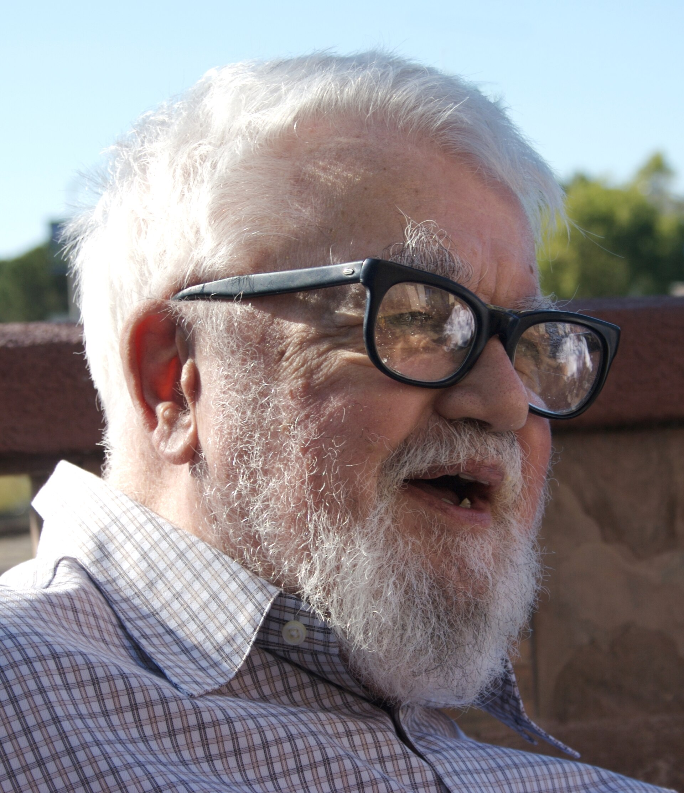

The proposal is dated 31 August 1955. John McCarthy of Dartmouth, Marvin Minsky of Harvard, Nathaniel Rochester of IBM, and Claude Shannon of Bell Labs asked the Rockefeller Foundation to pay for a two-month study at Hanover, New Hampshire. They wanted to proceed “on the basis of the conjecture that every aspect of learning or any other feature of intelligence can in principle be so precisely described that a machine can be made to simulate it.”

That sentence is the founding advertisement. It is also a research program that later winters would treat as a promissory note gone bad.

*Credit: Flickr user “null0.” CC BY-SA 2.0. File:John McCarthy Stanford.jpg.*

## Who came, and for how long

The Dartmouth Summer Research Project on Artificial Intelligence ran roughly from 18 June to 17 August 1956. Attendance was uneven. Shannon came. Minsky came. Rochester came. Ray Solomonoff, Oliver Selfridge, Trenchard More, and others passed through. Allen Newell and Herbert Simon did not camp for the whole summer; they arrived with news from the RAND Corporation and Carnegie Institute of Technology. They already had a program.

The Logic Theorist, running on a JOHNNIAC and also as a hand simulation, had begun to prove theorems from *Principia Mathematica*. Newell and Simon treated Dartmouth less as a baptism than as a place to tell colleagues that the interesting work was already in Pittsburgh and Santa Monica.

McCarthy later said the name “artificial intelligence” was chosen in part because “cybernetics” was Wiener’s and because “automata studies” (the title of a 1956 Shannon–McCarthy volume) sounded too narrow. The name stuck. The field has been arguing with it ever since.

## What they did not settle

No one left Hanover with a working general intelligence. They left with a vocabulary: heuristic search, neural nets (Minsky had already built SNARC with Dean Edmonds at Princeton in 1951), language, randomness, creativity as a grant category. They also left with a social fact. A small set of men, mostly on the northeastern seaboard and at RAND, now had a shared noun and a Rockefeller paper trail.

Women’s names are scarce in the 1955 proposal. That is not an accident of “the times” to be waved away; it is part of who got travel money and faculty titles. Later essays in this series will keep naming the people the public record actually documents — Spärck Jones, Hopper, Fei-Fei Li, Margaret Boden — rather than back-filling Dartmouth with ghosts.

## After Hanover

McCarthy went to MIT, then to Stanford in 1962 to found SAIL. Minsky stayed at MIT and built an AI laboratory with McCarthy that would split, merge, and mythologize itself for fifty years. Shannon returned to information theory and to machines that juggled and wandered. Rochester went back to IBM.

The 1955 conjecture is still readable without nostalgia. It assumes description precedes simulation. A great deal of later statistical learning would invert that order: fit first, explain later, if at all. Dartmouth remains the moment the bet was written down, dated, and signed by four men who could get Rockefeller to open a folder.
