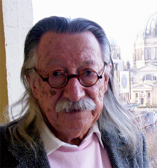

Joseph Weizenbaum published ELIZA in the *Communications of the ACM* in January 1966. The program is a pattern matcher. In the DOCTOR script it reflects pronouns and hunts for keywords. People attributed understanding to it. Weizenbaum, who had written the thing, spent the next decade becoming angry about that attribution.

*Credit: Ulrich Hansen. CC BY-SA 3.0. File:Joseph Weizenbaum.jpg.*

## 1976

*Computer Power and Human Reason* is a moral book with technical chapters. Weizenbaum argued that there are tasks a computer should not be given even if it can be made to perform them — judgment, in his vocabulary, as opposed to calculation. He wrote about his own surprise at secretaries who wanted to be alone with ELIZA. The surprise has been retold until it is folklore. The book is still the primary source.

He was not the only person in the 1970s to doubt the laboratory’s self-love. Hubert Dreyfus’s *What Computers Can’t Do* (1972) came from phenomenology and from a critic’s seat at RAND. The AI community’s replies were often personal. The personal tone is part of the history.

## Privacy as a number

A later ethics, more mathematical, appears in Cynthia Dwork, Frank McSherry, Kobbi Nissim, and Adam Smith’s 2006 TCC paper, “Calibrating Noise to Sensitivity in Private Data Analysis.” Differential privacy is a definition. It does not scold. It tells you what kind of noise you owe a dataset’s subjects. Dwork’s subsequent lectures and the U.S. Census Bureau’s public adoption of related methods put the definition into institutions.

## Datasheets, and a 2021 conference paper

Timnit Gebru and colleagues’ “Datasheets for Datasets” (workshop 2018; *CACM* 2021) asked dataset creators to write down provenance, collection, and recommended uses. “On the Dangers of Stochastic Parrots,” by Emily Bender, Gebru, Angelina McMillan-Major, and Shmargaret Shmitchell (*FAccT*, 2021), argued that scale in language models is not a virtue independent of cost, labor, and the illusion of meaning. Google’s subsequent conflict with Gebru is a matter of public reporting from late 2020. This essay will not restage personnel drama. It will note that the paper exists, was accepted, and is now part of the citation graph a 2023 language-model paper is expected to nod at, or pointedly ignore.

## A single thread

ELIZA is small. GPT-3 is not. The ethical question Weizenbaum posed does not scale linearly with parameters. It repeats: a fluent surface, a human attribution, an institution that would like the attribution to stand. The answers — don’t do that task; add noise; write a datasheet; refuse a scale — are different tools. They share a refusal to treat fluency as a moral credential.
