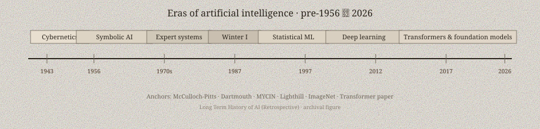

Edward Feigenbaum liked to say that the interesting power was in the knowledge, not in the inference engine. The sentence is a slogan. The laboratory behind it was the Heuristic Programming Project at Stanford, and the first famous patient was a mass spectrum.

*Credit: United States Air Force. Public domain. File:27. Dr. Edward A. Feigenbaum 1994-1997.jpg.*

*Figure 1. Eras of artificial intelligence — the expert-system summer sits on this band (G-ERA-001) — Long Term History of AI (Retrospective).*

## DENDRAL and MYCIN

DENDRAL, begun in the mid-1960s with Joshua Lederberg and Bruce Buchanan, took data from organic chemistry and proposed molecular structures. It was not a general reasoner. It was a chemist’s checklist, encoded. The later papers — including Buchanan and Feigenbaum’s 1978 *Artificial Intelligence* account of DENDRAL and Meta-DENDRAL — are frank about how much of the intelligence had been walked out of a human specialist’s head.

MYCIN, Edward Shortliffe’s Stanford thesis project of the early 1970s, published as a book in 1976, advised on certain bacterial infections and antimicrobial choice. It used certainty factors, a home-grown arithmetic of belief that later probabilists would wince at. In evaluations it could look, on paper, like a competent fellow. It did not become the ward’s boss. Liability, integration, and the mess of actual charts stood in the way.

## XCON on the factory floor

The system that made managers believe was R1, later XCON, built by John McDermott at Carnegie Mellon for Digital Equipment Corporation. The 1982 *Artificial Intelligence* paper describes a rule-based configurer of VAX orders. DEC used it. It saved money and caused a maintenance headache: thousands of rules, each a little treaty with a product line that kept changing.

That headache is the expert-system summer in miniature. Knowledge acquisition was slow. Experts contradicted themselves. The inference engines — OPS5, various commercial shells — were the easy part. Companies bought shells anyway. For a few years in the early 1980s, “AI” in a business magazine meant a workstation and a rule compiler.

## The hangover

By the late 1980s the hangover was public. Specialized hardware firms (Lisp machines, some of the Japanese Fifth Generation adjacent bets) missed their markets. Shells that had been sold as general intelligence were revealed as databases with extra syntax. DARPA’s Strategic Computing program spent large sums and did not produce the autonomous systems of the brochures.

Feigenbaum and Raj Reddy shared the 1994 ACM Turing Award for the design and construction of large-scale artificial intelligence systems. The citation is for work already done, not for a market that stayed up. The summer left behind a durable idea: if you want a machine to behave like a professional, you may have to sit with the professional until the rules hurt. It also left a warning. Knowledge that cannot be maintained is a kind of fiction.

Judea Pearl’s 1988 book would soon offer a different arithmetic of belief. The expert-system decade had already proved that belief, however arithmetized, is cheaper to encode than to keep true.
