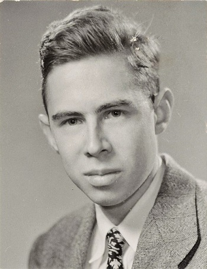

On 8 July 1958 the *New York Times* told readers that the Navy had a device which would one day walk, talk, see, write, reproduce itself, and be conscious of its existence. The device was Frank Rosenblatt’s Perceptron, demonstrated at the Cornell Aeronautical Laboratory. The story is a lesson in what happens when a press office, a laboratory, and a metaphor meet on a deadline.

*Credit: Anonymous photographer; HNF museum release. CC BY-SA 4.0. File:Frank Rosenblatt.jpg.*

## Mark I

Rosenblatt’s 1957 laboratory report and his 1958 *Psychological Review* paper described a probabilistic model for associating stimuli with responses. The Mark I Perceptron, built with Navy money, had a camera, a grid of photocells, and weights that could be trained. It distinguished some simple patterns. It did not walk. It did not reproduce.

The work sat in a line that already included McCulloch–Pitts neurons and, in a different key, the analog learning machines of the same decade. Rosenblatt’s talent was to make the line a machine you could photograph.

## The 1969 book

Marvin Minsky and Seymour Papert’s *Perceptrons* (MIT Press, 1969) is a mathematics book with a social afterlife. They analyzed single-layer perceptrons and showed, among other things, that some predicates — XOR is the classroom example — lie outside that architecture’s reach without additional structure. They wrote as colleagues who thought the hype had outrun the theorems.

Later neural-net histories sometimes treat the book as a crime: the book that killed funding. The funding story is wider. The Automatic Language Processing Advisory Committee (ALPAC) report of 1966 had already chilled machine translation in the United States. In Britain, James Lighthill’s 1973 survey for the Science Research Council was skeptical of a field that promised general robots and delivered specialized toys. Defense agencies continued to pay for some work; other offices closed folders.

Rosenblatt died in 1971, in a boating accident on the Chesapeake. He did not live to see the 1986 return of layered networks with a practical credit-assignment trick.

## What “first winter” names

“AI winter” is a journalists’ and managers’ phrase, popularized later. For the late 1960s and early 1970s it names a real contraction: fewer grand speech systems, more cautious ARPA/DARPA language, a generation of students who learned that perceptrons were a solved negative result.

The negative result was narrower than the myth. Minsky and Papert analyzed a class of machines. Multilayer networks, and the older Soviet work on polynomial nets, were not the subject of a funeral. They were, for a while, unread in the places that wrote English-language grant checks.

The first winter is therefore two stories at once: a genuine limit theorem, and a funding weather system that treated the limit as a season.
